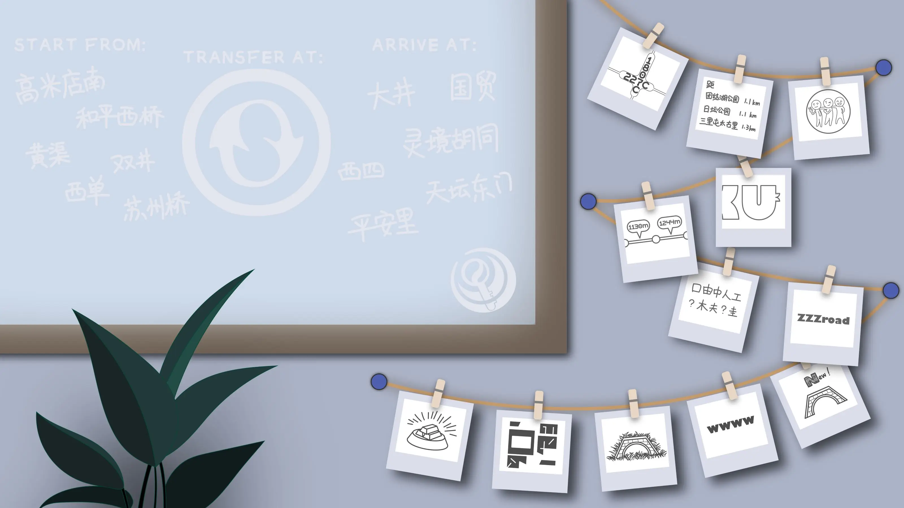

# Meta：冬

## 题面
:::info
[P\&KU2：Meta：冬](https://pnku2.pkupuzzle.art/#/game/miyue/winter\_meta)
:::

_将窗户上纷繁复杂的旅途再度还原，_
_就能与冬天重逢。_

## 答案

SNOW HALATION

## 解析

本题是第一个区域的 meta 谜题。需要用到的小题答案如下：

* WOMAN IN FOREST
* GREAT SILENT SEA
* FINAL OR SEMI
* CURRENT GHOST BAMBOO
* ORME SHOE
* POSTWAR OEDIPUS

题中给出了6个“从某站出发……”和6个“……到达某站。”并且，图片的底部纹理是一个图标，上面有换乘站标志，然而内部的两个箭头构成了一个字母S的字样。

事实上，尝试可以发现，我们可以根据这六个答案以及六个起点、六个终点的信息，将其一一搭配成六条线路；每个线路对应一个答案（而每个站点对应一个字母），并且满足线路的换乘处正好对应 S，并且单词中间的 S 所在的位置必然换乘——也就是说，我们把地铁线路图当成了一个 crosswords 的格纸！

| 答案                   | 起点   | 终点   | 换乘站    |
| -------------------- | ---- | ---- | ------ |
| WOMAN IN FOREST      | 黄渠   | 西四   | 平安里    |
| GREAT SILENT SEA     | 高米店南 | 大井   | 角门西、西局 |
| FINAL OR SEMI        | 和平西桥 | 国贸   | 东单     |
| CURRENT GHOST BAMBOO | 双井   | 灵境胡同 | 角门西    |
| ORME SHOE            | 西单   | 天坛东门 | 东单     |
| POSTWAR OEDIPUS      | 苏州桥  | 平安里  | 西苑     |

然后，填好之后，我们就可以把最下方的图谜对应的地铁站转换成字母，得到答案了。下面的图谜分别是东单、东大桥、人民大学、北京大学东门、大红门、大井、张自忠路、北新桥、西四、草桥、东四、金台路。

* 第一个是东单，227C和1807C都是潘通色号；
* 第二个是东大桥，搜索到各站的距离即可；
* 第三个是人民大学（校徽是三个人）；
* 第四个是北京大学东门（PKU 字母样式的东侧门）；
* 第五个是大红门（站点间距）；
* 第六个是大井（当铺密码）；
* 第七个是张自忠路（张自忠首字母是ZZZ）；
* 第八个是北新桥（北边、新的、桥）；
* 第九个是西四（四个W）；
* 第十个是草桥（长了草的桥）；
* 第十一个是东四（这是两张纸分别把东和四减下来得到的碎片）；
* 第十二个是金台路（金台露）。

对应到 crosswords 里的字母合起来就是答案 **SNOW HALATION**。

## 作者

Winfrid、Potto、Favorski（设计）；Potto（美术）

## 附言

### Winfrid

一开始我做了一个初稿出来，结果当时人傻了把 OEDIPUS 当成了 ODEIPUS，因而导致初稿又是错的。最终 Favorski 出手拯救完成了终稿。地铁也算是 P\&KU 的三大定番（化学、地铁、虚拟歌姬）之一了，每次我都在想着地铁的题材应该如何延伸——而这次应该算是一种新的尝试。

另外 LL 大法好。

### Potto

1. 关于窗户的区域：十分感谢winfrid的点子，现在的效果比我最开始做的要好看多了！赞美winfrid！
2. 关于s：最初winfrid的需求是根据换乘站的标志改出内部含有“S”的图案。于是看了官网线路图里的换成标志之后，决定直接把中间两个箭头内部做出一个s的负形。不过为了保持原本换乘标志的特点，导致中间s负形似乎还是有些抽象了。
3. 关于rebus：甲方没做特别的要求，自由发挥出来的。

### Favorski

我三年级第一次去北京的时候一定没有想到十几年后的一个夜晚我会对着北京地铁图苦思冥想1个多小时。

