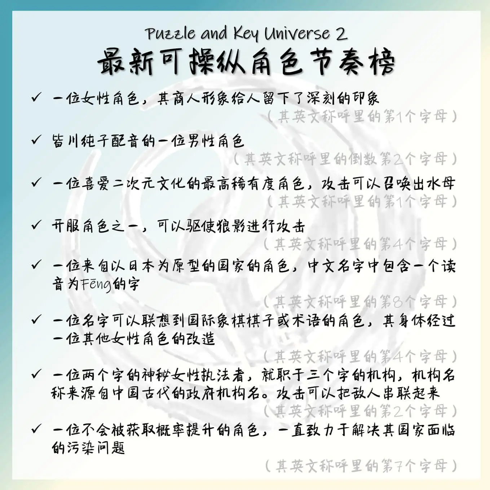

# 后现代文化自信

## 题面
:::info
[P\&KU2：后现代文化自信](https://pnku2.pkupuzzle.art/#/game/miyue/autumn\_01)
:::

_“明眼人都看得出新角色有多超模，攻略组是不玩游戏吗？”_
_“原来攻略组也都是群云玩家啊，这下众人皆醉我独醒了。”_

## 答案

COMPUTER DISORDER

## 解析

题目给出了8个角色的描述，一看就知道应该是什么游戏里面的角色。作一段时间搜索就能发现，其实每个描述在《明日方舟》和《原神》两款游戏**（排序不分先后）**中都有合适的角色！

——当然，大多数玩家肯定在一开始会快速地发现这是其中一个游戏（尤其是对于玩其中一个游戏的玩家而言）。但一旦确认了其中一个游戏之后，就或许会发现这个游戏的第一个字正好也作为题目的文案里某句话的第一个字而存在，这就提示着我们去看另一句话的首字母，于是就可以确认出另一个游戏。（当然，其实并不要这一步，也可以很轻松地意识到）

| 描述                                     | 明日方舟角色     | 原神角色               | 提取 | 提取舟 | 提取原 |
| -------------------------------------- | ---------- | ------------------ | -- | --- | --- |
| 一位女性角色，其商人形象给玩家留下了深刻的印象                | Croissant  | Dori               | 1  | C   | D   |
| 皆川纯子配音的一位男性角色                          | Bison      | xingqiu            | -2 | O   | I   |
| 一位喜爱二次元文化的角色，攻击可以召唤出水母                 | Mizuki     | Sangonomiya Kokomi | 1  | M   | S   |
| 开服角色之一，可以驱使狼影进行攻击                      | Lappland   | Razor              | 4  | P   | O   |
| 一位来自以日本为原型的国家的角色，中文名字中包含一个读音为Fēng的字    | Kazemaru   | Kaedehara Kazuha   | 8  | U   | R   |
| 一位近战角色，身体经过一位其他女性角色的改造                 | Castle-3   | Raiden Shogun      | 4  | T   | D   |
| 一位神秘的女性执法者，就职于三个字的机构。机构名称来源自中国古代的政府机构名 | Leizi      | Yelan              | 2  | E   | E   |
| 一位致力于解决其国家面临的污染问题的角色                   | Purestream | Tighnari           | 7  | R   | R   |

接着，~~注意到题目的边框是两个游戏的主角的主题色（阿米娅蓝和派蒙白）构成的渐变，而左上角是《明日方舟》的阿米娅，右下角为《原神》的派蒙，~~题目文案里两句话分别以“明”和“原”开头，暗示了顺序。所以把得到的两个单词按照顺序排列好，得到答案 **COMPUTER DISORDER**。

## 作者

五月（设计）；Winfrid（美术）

## 附言

### Winfrid

很显然，这道题是模仿了 Silph Hunt 的[这道题](https://silphpuzzlehunt.com/puzzle/handshake)。原题是 dota2 和 lol，但倘若本土化的话，换成什么比较好呢？于是我们就想到了原和舟。事实上，出题组基本没有人玩过其中的任何一部——只有五月玩舟。而整道题也是由五月操刀完成。

### 五月

我不知道，跟我没关系，我理智和树脂满了我不说了。
