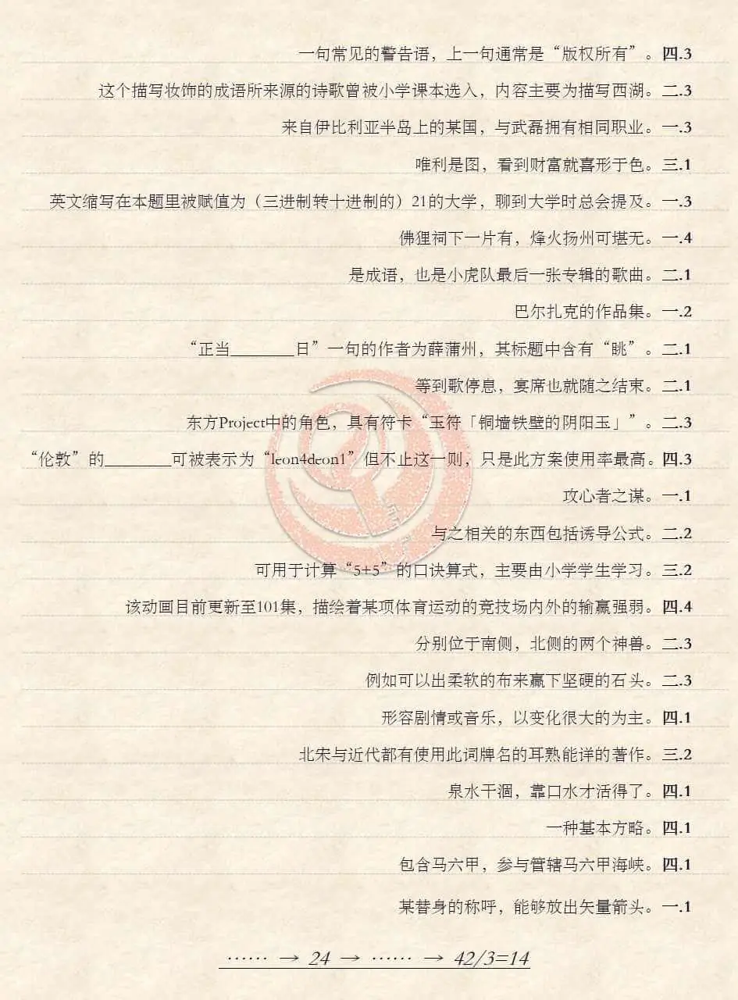

# 在值为二十一的大学里

## 题面

:::info
[P\&KU2：在值为二十一的大学里](https://pnku2.pkupuzzle.art/#/game/miyue/autumn_01)
:::

_三国演义可以，聊斋志异不行！_
_番茄炒蛋可以，青椒肉丝不行！_
_如月千早可以，天海春香不行！_
_有机化学可以，无机化学不行！_

## 答案

BE DREAM INVADER

## 解析

题目给出了24条描述以及对应的如“一.1”的数对。经过简单的探索之后，我们能够意识到这些描述的答案应该都是中文，而“一.1”则代表着取第几个汉字的拼音的第几个字母。

但是这些线索都比较含糊，只有少数的几个能够确认：例如“包含马六甲……”的是马来西亚，除此之外还有“违者必究”“人间喜剧”“稀神探女”“灌篮高手”等等。到此时，再联系上总共24条线索，我们能够发觉这一层面上的关键的信息：**所有答案不仅是四字词语，而且这四个字的声调正好遍历了一二三四声**。

在这一基础上，我们就可以进一步确认每个线索的结果。不过直接按顺序读是读不出合理的句子的，考虑到全排列的背景，我们要按照声调排序（康托尔排序）排列成如下形态：

| 描述                                                                           | 答案     | 声调 | 索引 | 提取 |
| ------------------------------------------------------------------------------ | -------- | ---- | ---- | ---- |
| 泉水干涸，靠口水才活得了。                                                     | 相濡以沫 | 1234 | 四1  | m    |
| 东方Project中的角色，具有符卡“玉符「铜墙铁壁的阴阳玉」”。                      | 稀神探女 | 1243 | 二3  | e    |
| 与之相关的东西包括诱导公式。                                                   | 三角函数 | 1324 | 二2  | i    |
| 一种基本方略。                                                                 | 依法治国 | 1342 | 四1  | g    |
| 分别位于南侧，北侧的两个神兽。                                                 | 朱雀玄武 | 1423 | 二3  | e    |
| 形容音乐，以变化很大的为主。                                                   | 跌宕起伏 | 1432 | 四1  | f    |
| 巴尔扎克的作品集。                                                             | 人间喜剧 | 2134 | 一2  | e    |
| 佛狸祠下一片有，烽火扬州可堪无。                                               | 神鸦社鼓 | 2143 | 一4  | n    |
| 某替身的称呼，能够放出矢量箭头。                                               | 觉醒三叶 | 2314 | 一1  | j    |
| 一句常见的警告语，上一句通常是“版权所有”。                                     | 违者必究 | 2341 | 四3  | u    |
| 是成语，也是小虎队最后一张专辑的歌曲。                                         | 如梦初醒 | 2413 | 二1  | m    |
| 来自伊比利亚半岛上的某国，与武磊拥有相同职业。                                 | 罗纳尔多 | 2431 | 一3  | o    |
| 等到歌停息，宴席也就随之结束。                                                 | 曲终人散 | 3124 | 二1  | z    |
| 在本题里值为（三进制转十进制下的）21的大学，其在人们谈论大学常会被提及。       | 北京大学 | 3142 | 一3  | i    |
| 包含马六甲，参与管辖马六甲海峡。                                               | 马来西亚 | 3214 | 四1  | y    |
| 例如可以出柔软的布来赢下坚硬的石头。                                           | 以柔克刚 | 3241 | 二3  | u    |
| 北宋与近代都有使用此词牌名的耳熟能详的著作。                                   | 水调歌头 | 3412 | 三2  | e    |
| “正当**\_\_**\_\_日”一句的作者为薛蒲州，其标题中含有“眺”。                     | 海晏河清 | 3421 | 二1  | y    |
| 其来源的诗歌曾被小学课本选入，内容主要为描写西湖。                             | 淡妆浓抹 | 4123 | 二3  | u    |
| 攻心者之谋。                                                                   | 动之以情 | 4132 | 一1  | d    |
| 目前更新至101集，由东映改编制作的一部动画。                                    | 灌篮高手 | 4213 | 四4  | u    |
| 唯利是图，看到财富就喜形于色。                                                 | 见钱眼开 | 4231 | 三1  | y    |
| 可用于计算“5+5”的口诀算式，主要由小学学生学习。                                | 二五一十 | 4312 | 三2  | i    |
| “伦敦”的**\_\_**\_\_可被表示为“leon4deon1”但不止这一则，只是此方案使用率最高。 | 粤语读音 | 4321 | 四3  | n    |

我们得到了一句话：meigefenjumoziyueyuduyin（**每个分句末字粤语读音**）。这个时候，我们会发现它很好和前文的“粤语读音”的线索相联系起来了：通过那条线索的示例，我们能够意识到采用的粤拼方案是哪一条。在确认了方案后，就可以按照指示去寻找每个分句最后一个字的粤语发音了。

值得注意的是，原题中的顺序并非字母序等既定的顺序，但这一顺序到现在还未使用。因此我们偏向于使用原题顺序考察粤语发音，于是就会发现所有末字的粤语拼音的最后一个字母都是 p k u 之一。此时我们联想到题目中的“pku=21”，就能够察觉应该把p、k、u视作2、1、0，以采用三位三进制转译。另外，总共有42个分句，而下面的提示说明最后需要有14个字母，也能证明这一点。

| 描述                                                                           | 每个末字最后一个字母 |
| ------------------------------------------------------------------------------ | -------------------- |
| 一句常见的警告语，上一句通常是“版权所有”。                                     | uu                   |
| 其来源的诗歌曾被小学课本选入，内容主要为描写西湖。                             | pu                   |
| 来自伊比利亚半岛上的某国，与武磊拥有相同职业。                                 | kp                   |
| 唯利是图，看到财富就喜形于色。                                                 | uk                   |
| 在本题里值为（三进制转十进制下的）21的大学，其在人们谈论大学常会被提及。       | kp                   |
| 佛狸祠下一片有，烽火扬州可堪无。                                               | uu                   |
| 是成语，也是小虎队最后一张专辑的歌曲。                                         | uk                   |
| 巴尔扎克的作品集。                                                             | p                    |
| “正当**\_\_**\_\_日”一句的作者为薛蒲州，其标题中含有“眺”。                     | uu                   |
| 等到歌停息，宴席也就随之结束。                                                 | kk                   |
| 东方Project中的角色，具有符卡“玉符「铜墙铁壁的阴阳玉」”。                      | kk                   |
| “伦敦”的**\_\_**\_\_可被表示为“leon4deon1”但不止这一则，只是此方案使用率最高。 | ku                   |
| 攻心者之谋。                                                                   | u                    |
| 与之相关的东西包括诱导公式。                                                   | k                    |
| 可用于计算“5+5”的口诀算式，主要由小学学生学习。                                | kp                   |
| 目前更新至101集，由东映改编制作的一部动画。                                    | pk                   |
| 分别位于南侧，北侧的两个神兽。                                                 | ku                   |
| 例如可以出布来赢石头。                                                         | u                    |
| 形容音乐，以变化很大的为主。                                                   | k                    |
| 北宋与近代都有使用此词牌名的耳熟能详的著作。                                   | k                    |
| 泉水干涸，靠口水才活得了。                                                     | ku                   |
| 一种基本方略。                                                                 | k                    |
| 包含马六甲，参与管辖马六甲海峡。                                               | pp                   |
| 某替身的称呼，能够放出矢量箭头。                                               | uu                   |

连起来可以得到uup ukp ukk puu ukp uuk kkk kuu kkp pkk uuk ukk ukp puu，p=2 k=1 u=0 可得 002 012 011 200 012 001 111 100 112 211 001 011 012 200，从而得到 **BE DREAM INVADER**。

## 作者

esc、榆木华、Winfrid（设计）；Winfrid（美术）

## 附言

### esc

偶然在找粤语读音的时候想到了用韵尾的-p -t -k三进制提取的思路。恰好P\&KU的题还没出完，就想着只需微调就能做成PKU主题相关了。关于四个声调全排列的部分则是一直想用中文声调做谜题，再结合“北京大学”恰好可以用来暗示PKU三进制。不过据说四个声调全排列的思路之前已经有人用过了？反正如有雷同纯属巧合hhhh

回过头来看，其实这题的本质就是多次找共同点然后用某种方式提取。 最初版本凑答案凑得很艰辛，因为原本提取出来二十四个字母是"last character in cantonese"，然后需要四字词语的末尾全部满足"-p -k -u"的形式。下面是一些自认为比较有趣的被去除的原始题目：

- 都什么年代了，还在玩\[\_\_\_\_]？给你看看什么是现代足球。
- 日本流行小说家的出道作，小说中男主的兴趣是去大阪看这尊奇怪的雕像
- K2TiF6

当然，这也导致了很多答案硬凑的痕迹明显。现在草佬和木华佬改过的版本很巧妙，不仅避免了“答案只有8个字母”的限制，而且还有种“原来最终答案就藏在题面中”的奇妙感觉，而且需要很好的语文水平才能让这些凑的句子读起来很通顺。

### 榆木华

感觉是用到了两个很酷的拼音点子的普通 hunt 题（鸣谢 esc），一二三四声都有的词语算是一个大家都会接触但是不一定每次都能注意到的点子了。很久以前学而思放的元首的愤怒视频里就提过“高等数学”四声都有之类的，我就觉得很妙，之后还发现了“三国演义”之类的按顺序的词。最无聊的一次还是在学校里把东方里的人物名都枚举了一遍结果发现只有四个人物是四声都有的。（还有一个比较巧合的是“番茄炒蛋”和“威严扫地”都是一二三四声的（逃））&#x20;

总之就是对前半段的点子还挺有兴趣的，于是就忙上了。工作的话一如既往地打了辅助，找了很多四声的词，这其中各个类型的词都有尝试。剩四五个的时候实在不想找了就跑了个程序把剩下的都用成语填上了。然后发现描述是真的难凑，不会粤语还得去找音节表来翻，还有大部分的字是根本放不到句子的结尾的。干了几个小时之后等草佬帮忙收尾了（

### Winfrid

> 干了几个小时之后等草佬帮忙收尾了（

——专业凑答案一百年。

出这道题的时候为了让出题简单一点，staff 们从 esc 的原题慢慢改到了“最后一步用描述里的字眼转译”。虽说从信息传递的角度，现在这样的确不够严谨，但总之让出题者和做题者都很开心不是吗？甚至好像这个梗有和 P\&KU1 的“刺猬脆”一样流行的势头呢。

除了题目里有的和esc、榆木华刚刚提到的，另外还有一些有趣的、符合条件的描述（但因为无法凑出需要的内容而落选了），在此记下以飨读者：

- maybe。
- 海的味道。
- 温符瑞的登场作。
- 最凶最恶的双子。
- 与牛顿有关的学科。
- 东方永夜抄的敌机。
- 八冠王柯洁认定的新型围棋。
- 中国职业台球著名选手的美称。
- 御坂美琴的应援弹幕中的形容词。
- 粤菜中的一道传统名菜，皮脆肉嫩、色泽红亮、鲜香味美。
- 这个成语典出曹操的《短歌行》——“明明如月，何时可掇”，常用来比喻事物看起来很近却无法得到。（×）
