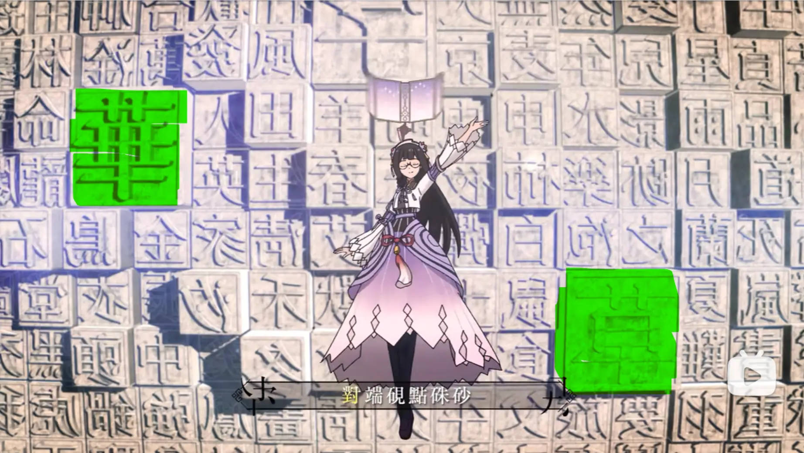

# 无饵钓钩桦边垂

## 题面

:::info
[P\&KU2：无饵吊钩桦边垂](https://pnku2.pkupuzzle.art/#/game/miyue/autumn_03)
:::
_如果要以“札”为谜底，难道就没有更简单的标题了吗？_

    
点此展开歌词

    **原曲：《横竖撇点折》**

    **作曲：papaw泡泡**

    **重填词：饿半肚 Winfrid**

    **翻唱：起礼**

    **调教和混音：盐水是言和水**

    &#x20;

    期盼天明

    也盼不知失措得到修订

    一言诉己听

    是否到了白头也要比拼

    石穿之功艺登顶

    勘不破千丝万缕 时常恐动凡心

    学游鱼半辈清静

    负上包袱田下直行

    &#x20;

    车入荒径

    满眼晓岚山却不见踪影

    无心恋浮名

    酒干后看翠羽回归天庭

    功穷力尽

    得陇蜀何缺

    纵得胜一生飘零

    &#x20;

    起稿作谜润毫悠扬荡尘埃

    笔砚淋漓挥墨蒸腾化云彩

    藏木于林答案与此题面同入海

    玄机无垠纵言说犹留白

    歌中锁钥相扣非诗不易裁

    名垂千梦渺然引人复徘徊

    绘得一曲乾坤相形亦狭窄

    经年婵娟未改

    纬萧之人何在

    &#x20;

    迂不灵动

    也让谁的左右变得空洞

    闭口不归咎

    使你别离江湖失去刀锋

    当下便对又何用

    亲自判是非曲直 何止十两之重

    最后时辰带刀纵

    昂首远去杆秤在胸

    &#x20;

    云川江涌

    水上煮酒相约一勺敬奉

    卿不现柳中

    唯见雀儿低飞绝无彩虹

    树后日融

    疑与冷冰同

    知恩心上留火种

    &#x20;

    对错正误是非黑白终掩埋

    句读诗书恩怨悲欢生新苔

    交错思绪相织如网真相汇万脉

    辉光摇坠月悠悠空千载

    谜面幽微枝杈葳蕤皆杳蔼

    底色作幕时异事殊也难再

    落尽繁华惟余霜松与雪柏

    棋声敲碎冬霾

    盘空中有燕来

    &#x20;

    我且作谜以种栽

    春至 花开 众看官 自撷摘

## 答案

BEYOND PUERTO

## 解析

首先，标题的谜底是**“札”**：无饵钓钩形似竖弯钩，而“桦边”为木，合起来是“札”。听歌识曲可以发现，给出的音频是歌曲《横竖撇点折》的重填词翻唱，而也正好暗示了**“横竖撇点折”**（“横竖撇点折”是笔画输入法的“札字五法”）。

因此，需要先去看看原曲中的奥秘。通过[原视频](https://www.bilibili.com/video/av78977736/?p=1)的评论区或弹幕，以及部分[解析](https://www.bilibili.com/read/cv4468832)，可以发现其实原曲就另有玄机：

- 两段主歌部分的歌词中，每句都是一个中文字谜。如此一来，30个字谜构成了一副对联。
- 两段副歌部分的首字构成了另一副藏头联。

于是，按照类似的思路，我们先解出主歌部分的所有字谜。值得注意的是，文案里的“更简单的”暗示了这里的字谜全都是以简体字理解，与此同时，所提供歌词都是简体版本，也印证了这一点。解析如下：

| 主歌歌词                    | 字谜谜底 | 字谜解析                                               |
| --------------------------- | -------- | ------------------------------------------------------ |
| 期盼天明                    | 其       | “期”里的“月”因为“天明”而消失                           |
| 也盼不知失措得到修订        | 所       | 真正的成语是“不知所措”而非“不知失措”                   |
| 一言诉己听                  | 记       | “言”作“讠”，和“己”合在一起得到“记”                     |
| 是否到了白头也要比拼        | 皆       | “白”头添“比”                                           |
| 石穿之功艺登顶              | 若       | “石穿”得“右”，“艺登顶”是“艹”                           |
| 勘不破千丝万缕 时常恐动凡心 | 红       | “千丝万缕”即“纟”，“恐”动了“凡心”就是“工”               |
| 学游鱼半辈清静              | 鲱       | “半辈”是“非”，加上“鱼”则为“鲱”                         |
| 负上包袱田下直行            | 鱼       | “负上”是“⺈”，加上“田”，“下直行”意思是底下的一横       |
| 车入荒径                    | 轻       | “径”因为“荒”而少了双人，加上“车”                       |
| 满眼晓岚山却不见踪影        | 风       | “岚”的“山”“不见踪影”                                   |
| 无心恋浮名                  | 亦       | 无“心”的“恋”                                           |
| 酒干后看翠羽回归天庭        | 醉       | “酒”因为“干”而少了三点水，得到“酉”，失“羽”的“翠”是“卒” |
| 功穷力尽                    | 空       | “功”“穷”的“力”少了，剩下的部分合在一起是“空”           |
| 得陇蜀何缺                  | 望       | 成语“得陇望蜀”缺失了“望”字                             |
| 纵得胜一生飘零              | 月       | “胜”的“生”飘零了                                       |
| 迂不灵动                    | 于       | “迂”少了灵动的“辶”                                     |
| 也让谁的左右变得空洞        | 他       | “谁”去掉左右两边，加上“也”                             |
| 闭口不归咎                  | 处       | “咎”的“口”闭上了                                       |
| 使你别离江湖失去刀锋        | 另       | “别”失去了“刂”                                         |
| 当下便对又何用              | 寻       | “当”下为“彐”，和失去“又”的“对”结合                     |
| 亲自判是非曲直 何止十两之重 | 新       | “十两”为“斤”，和“亲”一起组合                           |
| 最后时辰带刀纵              | 刻       | “最后时辰”为“亥”，加上“刂”                             |
| 昂首远去杆秤在胸            | 印       | “昂”的首离去了，中间多了一横                           |
| 云川江涌                    | 流       | “氵”“云”“川”稍作组合就是“流”                           |
| 水上煮酒相约一勺敬奉        | 绪       | “煮”因为“水”而少了四点底，“约”去掉“勺”是“纟”           |
| 卿不现柳中                  | 即       | “卿”少掉了“柳”的中间                                   |
| 唯见雀儿低飞绝无彩虹        | 纱       | “雀”的低处飞走了，“绝”没有彩虹的颜色                   |
| 树后日融                    | 时       | “树”的后部是“寸”，和“日”融在一起                       |
| 疑与冷冰同                  | 凝       | “冷冰”的相同部分是“冫”，和“疑”在一起得到“凝”           |
| 知恩心上留火种              | 烟       | “恩”心上是“因”，和“火”结合                             |

通过解主歌的部分，我们得到的对联为：

> **其所记皆若红鲱鱼 轻风亦醉空望月\*\***于他处另寻新刻印 流绪即纱时凝烟\*\*

其大致意思是：这里解出的谜底内容**本身**都是解谜路上的无意义的东西，或者说歧途。解题者需要在别的地方找到新的痕迹。除此之外，还给了七个字的后半句，如其所说确实不存在任何意义。

于是，我们查看副歌部分的首字，又得到一副对联：

> **起笔藏玄 歌名绘经纬\*\***对句交辉 谜底落棋盘\*\*

这句则更困难一些。首先，“棋盘”暗示了棋盘密码，而划分其各个坐标的经纬线则是“歌名”，也就是“横竖撇点折”，这意味着我们需要让横=1、竖=2、撇=3、点=4、折=5。其次，“起笔藏玄”告知了我们只需要关注各字的第一笔。最后，“对句交辉”意味着在转译时，是上下两联的每个字两两搭配着转换。那么需要用到的素材，当然就是刚刚主歌部分的谜底得到的30个字的对联了。

| 字    | 字的第一笔 | 对应的数字 | 棋盘密码转换 |
| ----- | ---------- | ---------- | ------------ |
| 其 于 | 横 横      | 1 1        | A            |
| 所 他 | 撇 撇      | 3 3        | N            |
| 记 处 | 点 撇      | 4 3        | S            |
| 皆 另 | 横 竖      | 1 2        | B            |
| 若 寻 | 横 横折    | 1 5        | E            |
| 红 新 | 撇折 点    | 5 4        | Y            |
| 鲱 刻 | 撇 点      | 3 4        | O            |
| 鱼 印 | 撇 撇      | 3 3        | N            |
| 轻 流 | 点 点      | 1 4        | D            |
| 风 绪 | 撇 撇折    | 3 5        | P            |
| 亦 即 | 点 横折    | 4 5        | U            |
| 醉 纱 | 横 撇折    | 1 5        | E            |
| 空 时 | 点 竖      | 4 2        | R            |
| 望 凝 | 点 点      | 4 4        | T            |
| 月 烟 | 撇 点      | 3 4        | O            |

因此，我们得到了 ANS BEYOND PUERTO。所以 **BEYOND PUERTO** 就是这道题的答案。

## 作者

饿半肚、Winfrid（设计）；盐水是言和水（制作）

## 附言

### 饿半肚

首先非常荣幸能得到 Win 兄的邀请在 P\&KU2 上出题，感谢 Win 兄提供了这次机会！

我在创作这篇字谜的时候，力图让它能形成一个故事。经过一番努力之后，有幸如愿地在初稿完成的那一刻心中就形成了一个故事。虽然跟 Win 兄确认过，“作者的话”是不限篇幅的，但我并不打算在这里讲述有关这个故事的内容。这是因为，如果每个人都有属于自己心中的那个故事，岂不妙哉？祝愿大家心中的那个故事都有一个圆满的结局。

### Winfrid

《横竖撇点折》的确是一首极其适合制作谜题的歌曲，而且大家对于这首曲子谜题化的呼声也很高。在 P\&KU1 制作之中，我就极度想要加以包装，但最终却因为想法不够成熟而放弃。

这次的设计也同样是一个妥协后的产物：“横竖撇点折”适合棋盘密码这一点，是一个很早的想法，但**如何提取笔画**确实是一个困难的问题。一个非常简单也非常 hunt 的想法是，构造新歌词和原歌词在同样位置有同样的汉字，然后用这一点去提取笔画——但这一点不但是 mitmh2021 里的中文字谜里已有的想法，而且也是《再起一行的自由》里的对应关系的简化版本。因此最终加以舍弃。

另一个困难的问题在于**副歌在谜题里的尴尬地位**。原曲中是变成了藏头联，但这副对联在这道谜题中有什么意义呢？于是最终，我决定把一些指示性的文字放在藏头联里。于是，这两个问题都最终解决了。

接着的困难在于写词。Winfrid 的文学水平太过拙劣，所以参考了很多工具才勉强写出了带有实际含义的两副对联——光这一个工序就花费了两天时间。（其实最主要的困难在于，第一笔的限制对写作对联的影响比想象中更为猛烈……我无法想象如果我真的要弄成“第n笔是横”这种内容，会是怎样的体验）所以要在此声明：所有的歌词都没有任何字面意义，请不要深究啦。

下面就是字谜本身了。这部分内容全部由饿半肚老师贡献，大家可以关注他的微信公众号“饿半肚”，上面有极其多优质的中文相关谜题！

