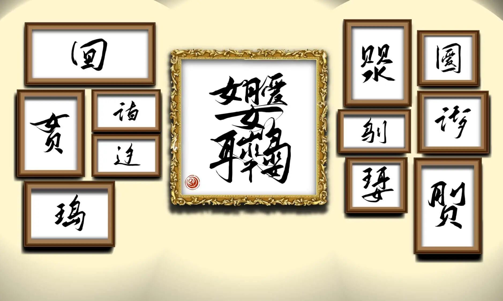

# 造字是门化繁为简的艺术

## 题面
:::info
[P\&KU2：造字是门化繁为简的艺术](https://pnku2.pkupuzzle.art/#/game/miyue/autumn\_04)
:::

_提笔写就的一方汉字居然可以表达出如此深厚的意蕴啊_
_——在书法展上，如是感慨。_

除了是作品名称外，它还是一种对于 **? . . . . . . ?** 的比喻

该长篇小说中的故事讲述者是 **. . . . 　. ? ? . . . 　. . . . ?**

该作品中的故事讲述者是 **? ? . . ? . . . . . ? .**

其标题指代的人物是 **. ? ? ? . . .**

其中主角一行人来自 **? ? . . . . ? .**

这幅画的创作者是 **. ? ? . . . 　. . . . . . . . . .**

这幅画现在位于的博物馆是 **. ? . ? ? . . . . . .**

这首日语歌的词作者是 **. ? . ? .**

这一建筑的设计者是 **. . . ? 　. . ? . ?**

这一现实中不存在的概念的提出者是 **? . . . ? . . 　. . . . .**

这一英国长篇小说的创作者是 **. . ? . . . 　. . ? ? . 　. . . . . . . . .**

## 答案

ATE A BUZZARD

## 解析

首先，给出的每个字其实都表示着某个知名的专有事物。这一点可以从这些字的部件来直接得到，也可以通过后续的 clue 交叉验证从而得到。这些专有事物和不完整的 clue 们结合在一起，就可以得到空着的横线代表着什么。

一个细节是，这些生造汉字的构件数量正好与问号数量一致。这可以帮助确认。

| 汉字   | 汉字对应的事物    | 对应的缘由                                 | 匹配的线索                               | 线索的空缺部分               | 提取字母 |
| ---- | ---------- | ------------------------------------- | ----------------------------------- | --------------------- | ---- |
| 月刂贝  | 《威尼斯商人》    | 戏剧里是由割（刂）肉（月）的赌注（贝）引发的。“贝”也可以视作商人的代名词 | 它的标题指代的人物是.???...                   | Antonio               | nto  |
| 辶夕   | 《向夜晚奔去》    | 向夜晚（夕）奔（辶）去                           | 这首日语歌的词作者是.?.?.                     | Ayase                 | ys   |
| 讠十日  | 《十日谈》      | 十日（十日）谈（讠）                            | 其中主角一行人来自??....?.                   | Florence              | flc  |
| 囗日   | 戴森球        | 戴森球是包裹（囗）住恒星（日）的人造天体                  | 这一现实中不存在的概念的提出者是?...?.. .....       | Freeman Dyson         | fm   |
| 鸟刂   | 《杀死一只知更鸟》  | 杀（刂）死一只知更鸟（鸟）                         | 书中的故事讲述者是.... .??... ....?          | Jean Louise Finch     | ouh  |
| 贝贝水  | 悉尼歌剧院      | 悉尼歌剧院宛如坐落在水（水）上的一串贝壳（贝）               | 这一建筑的设计者是...? ..?.?                 | Jørn Utzon            | nzn  |
| 囗爱   | 《围城》       | 婚姻是一座围城（囗），城外的人想进去，城里的人（爱）想出来。        | 除了是作品名称外，它还是一种对于?......?的比喻         | Marriage              | me   |
| 王耳女  | 《戴珍珠耳环的少女》 | 珍珠耳环（王耳）的少女（女）                        | 它现在位于的博物馆是.?.??......               | Mauritshuis           | ari  |
| 王岛   | 《金银岛》      | 有着很多金银宝藏（王）的岛（岛）                      | 这一英国长篇小说的创作者是..?... ..??. ......... | Robert Louis Steveson | bui  |
| 女贝   | 《维纳斯的诞生》   | 画面上，维纳斯（女）站在贝壳（贝）上                    | 这幅画的创作者是.??... ..........           | Sandro Botticelli     | an   |
| 讠千一夕 | 《一千零一夜》    | 书中是一千零一（千一）个夜晚（夕）的故事（讠）               | 书中的故事讲述者是??..?.....?.               | Scheherazade          | schd |

下一个很自然的发现是，这里的每一个汉字部件都对应着一个字母。如下所示：

| A | B | C | D | E | F | H | I | L | M | N | O | R | S | T | U      | Y | Z |
| - | - | - | - | - | - | - | - | - | - | - | - | - | - | - | ------ | - | - |
| 女 | 山 | 讠 | 千 | 爱 | 日 | 一 | 王 | 十 | 囗 | 贝 | 刂 | 耳 | 夕 | 月 | \[乌字头] | 辶 | 水 |

那么，有了这个简略的对应表，我们就可以意识到，最后的这个极其复杂的生造字的部件按照引导线（“连笔”）的顺序，是“女月爱女山\[乌字头]水水女耳千”，也就是 **ATE A BUZZARD**.

## 作者

Winfrid（设计）；Potto（美术）；魔法Mako（汉字题写）

## 附言

### Winfrid

这道题，原先是五月为可能存在的 event 准备的一个小游戏，原来的形式是一种“你画我猜”：给出一个概念，要求将其用一个生造字表现出来。但是这个“仓颉造字”的概念简直十分有趣，而且和 CCBC12 的某道题有同曲异工之妙。所以我决定将其从 event 中解放出来，而作为一道题目呈现给解题者。

但问题也随之而来：该如何提取？这个问题本不该成为一个问题的，毕竟我们原来的打算是将其的英文长度直接给出然后 index。但如果提取落到这种地步，这道题也只会是个平淡无奇的题。这个难题萦绕许久，直到一次我想将其与《中国汉字听写大会》的素材一起出一道题的时候，才突然意识到它的 logo 正像是一个巨大的生造字！于是我们就想让生造字和字母的一一对应，以让这个 logo 作为最后的提取。——最后，因为《汉听》的 logo 的部件种类太多，转换成答案实在太过困难，我放弃了那个 logo，但依旧保留了前面大致的思路。

另一个问题在于，我们一开始设置的造词释义大多是“可乐”“沙发”这样的词汇，但这种词语太少了，而且也不具备什么特别好玩的特质。后来，我突然间在为“威尼斯”造字的时候意识到，“威尼斯商人”其实是一个更适合用一个字表示的内容——于是我们转而从一些普遍的物体转向专有名词。于是，参考了很多《一句话看完世界名著》《emoji 猜歌，但是术力口》之类的视频后，这道题也终而诞生。

在出题的时候，我顺带接触了生造字圈和汉听圈，也算是一种意外之喜吧。

顺带一提，这题的美工真的是太精湛了——用连笔的设计来作为最后的顺序指引，的确是一种极其强大的构思。吹爆 Potto。

### Potto

这道题美工只是画上了背景、画框，处理了一下中间大汉字什么的。我个人对中间连笔的处理挺满意的，这让各个部件之间的连接看起来自然与优美（？

另外有个小插曲是在最初的版本里，我把所有“女”字的末笔都画在了く这一笔上，甚至在很长一段时间里自己都没发现，这不禁让我对自己的文化水平感到堪忧。
