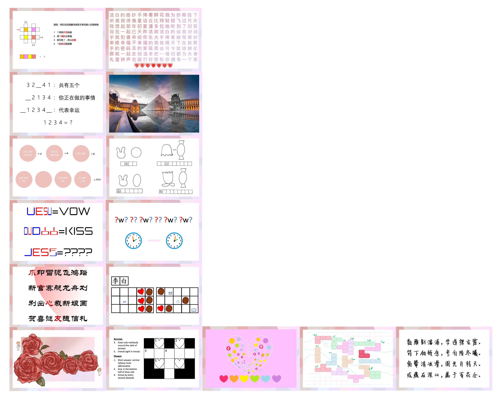
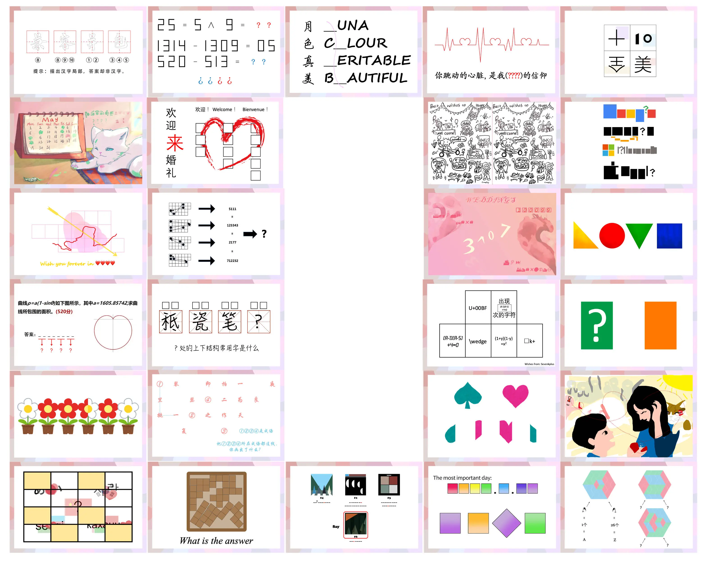
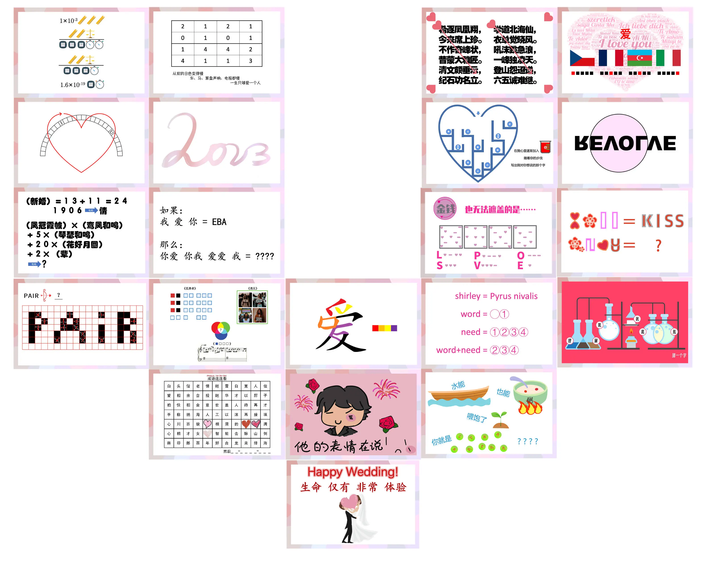
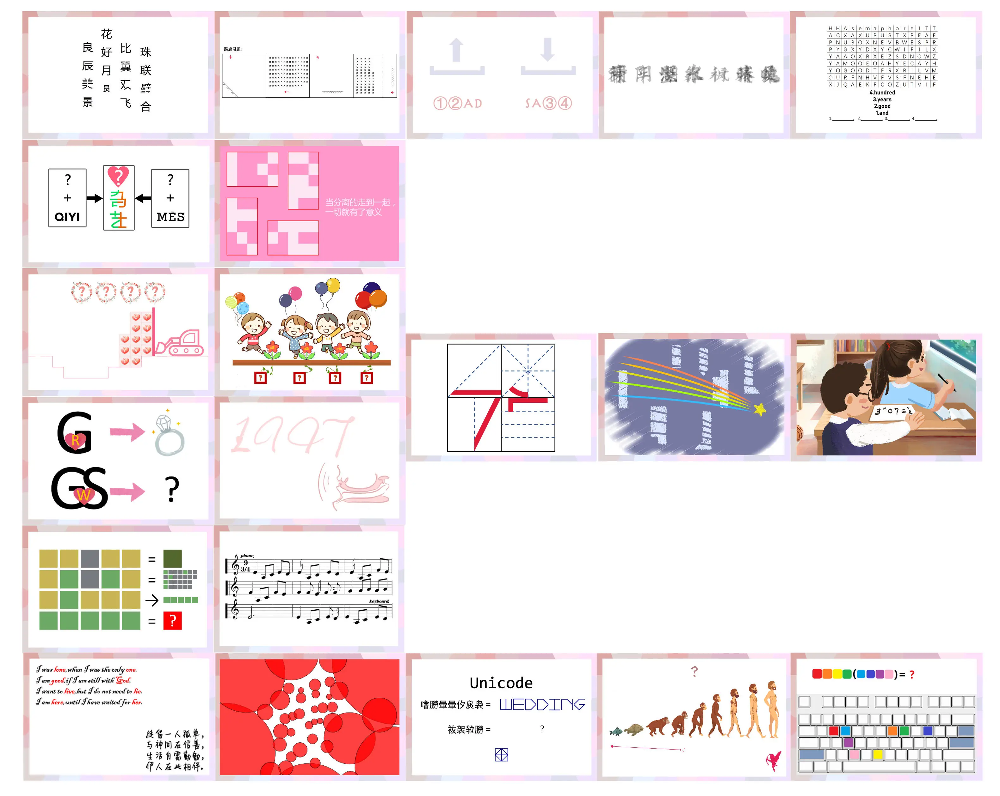

# 爱的八十三张明信片

## 题面
:::info
[P\&KU2：爱的八十三张明信片](https://pnku2.pkupuzzle.art/#/game/miyue/autumn\_04)
:::

_“求救，我已经快想爆了。”_
_“看不懂的一律按表白处理。”_

附注：

五月（P\&KU2 的编写者之一）即将于今年的 6 月 17 日举行婚礼。并计划设置一个让所有人感受到婚礼的喜悦与快乐的环节，一个通过解谜让所有人参与进来的环节。
为此，五月邀请解谜圈的朋友们，出了很多明信片大小的题目，用这些题目拼成了一个明信片墙。
值得一提的是，所有征集的题目，答案都限定为“爱”或“LOVE”。

## 答案

TO SPREAD YOUR WINGS

## 解析

在这八十三张明信片里，四张图中各有一张明信片的答案不是“爱”或“LOVE”，它们的位置分别是第一张图的第四行第二列、第二张图的倒数第二行倒数第二列、第三张图的第四行倒数第二列、第五张图的第一列第四行。答案分别是 to、spread、your、wings。合在一起就可以得到这道题的答案。

> 这四张明信片的简要解法：* 第一张图的第四行第二列：图中是 two to two to two two（一点五十八到两点零二）* 第二张图的倒数第二行倒数第二列：黑桃是spade，红心是heart。图中给的是黑桃的前两个1/5、红心的第四个1/5、红心的第二个和第三个1/5、黑桃的第四个1/5，因此是sp、r、ea、d，就是spread。* 第三张图的第四行倒数第二列：第一行是Shirley=雪梨，那么可以知道是英文的中文空耳，那么接着word=我的=my，need=你的=your，word+need=我们的=our，提取字母得到your。* 第五张图的第一列第四行：第一行是R在G里面，所以是R in G，对应右侧的戒指。第二行是W在GS里面，所以是wings。

所有明信片的解请参见下方：（正在施工）

### 1

（等待施工）

### 2

（等待施工）

## 作者

五月（设计）；ES、HS300、爻、榆木华、Hauru、黄老九、Taiga、Ventus、D3D4、Evangelina、兰扎特、大灰狼、荆哲、兰儿、月下彼岸、毛弗栗栗子、豚鼠豚鼠、Vladimir、超高校级的希希希希希希希希希、山南、万有引力、Cipher Two、x、Fivero、东君、威震四方、饿半肚、八卦郭嘉、傅韬、JOJO\_YKS、Bithiah、LostSou1、水沁心、落葉子、VinstaG173、探宝之旅大魔头、Winfrid、Potto、欣、萝北、小昊、雪儿、秋水仙素、穆桂英抱着锁麟囊、孔孔、姜镇、Pegasus、生煎、COL、又饭饼了、The Celestial F、美恒、风影紫苑°、小莩、Sevenkplus、兔三月、Lorraine、Sonic酱、泡、Caiji、卷子、JCarlson、友人A、风雨兼程、乱世-小熊（题目供稿，按题目设计时间顺序）

## 附言

### 五月

首先！五月要强调一点！我是真的真结婚，不是用结婚这个噱头骗大家给我出题！

这个LOVE墙的点子，也是我在很久以前就为我自己的婚礼构思的（当然不包括其中藏着的题）。对于不认识五月或者不知道这个活动是怎么回事的，我在这里简单再解释一下—— 五月的婚礼上，会有一面装饰墙，墙上贴满了明信片，而每张明信片都会是朋友们出的以LOVE为答案的题目。

然后我灵机一动，是否这面墙也能作为载体，成为PKU2中的一道题呢？如果可以，不就在这个比我个人公众号影响力更大的场景上，让所有人都可以看到每位朋友充满祝福的创作了吗？

很自然的，想到了既然这一面墙上都是LOVE，那如果有几个不是LOVE的题目混入其中，自然就能够成为被突出出来的。由于我们希望这题能够更多的成为展示功能而不要搞得太复杂，所以也就没有添加其他的要素。 感谢所有为这道题出题的朋友。这是我知道的，出题参与人数最多的一题HUNT题目。是每个人的努力让这道题得以成立，谢谢大家。

就像我在题目整理里说的，五月、肥咪矩阵、以及P\&KU，都希望能将每一份解谜的快乐汇聚，又将这种快乐传递给更多的玩家朋友。

\*对了，因为五月的婚礼其实是在六月（笑），所以LOVE题征集活动还在继续中，具体情况可以在通关群中了解到。

### Potto

大家好啊，我是“解谜圈的大家”里的一个。

### 生煎

大家好啊，我是“解谜圈的大家”里的一个。

### 榆木华

大家好啊，我是“解谜圈的大家”里的一个。

### Winfrid

大家好啊，我是“解谜圈的大家”里的一个。

