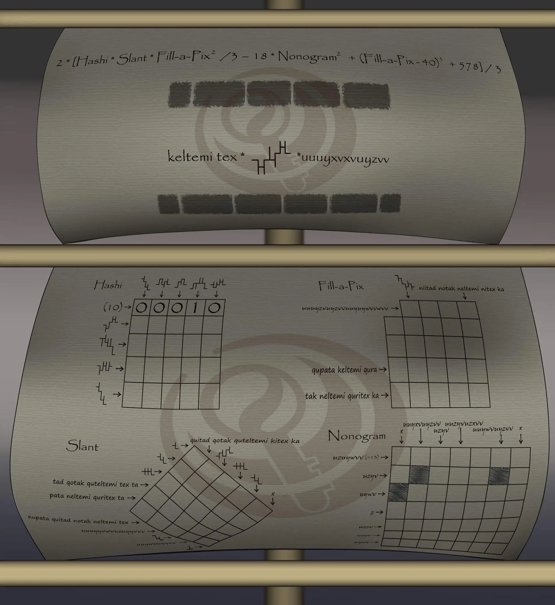
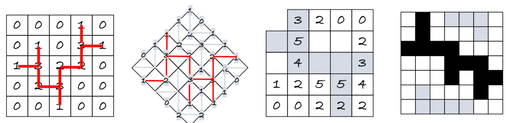
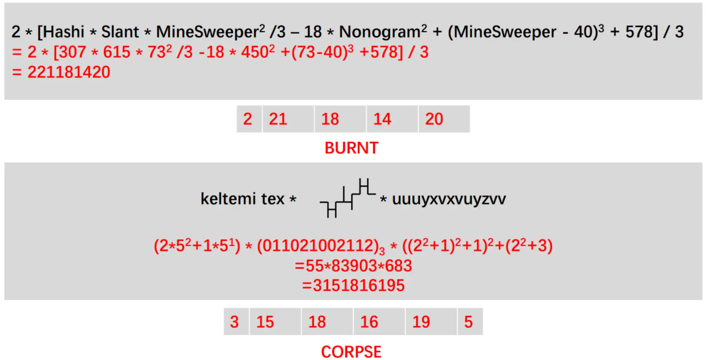

# 他乡帆布船

## 题面
:::info
[P\&KU2：他乡帆布船](https://pnku2.pkupuzzle.art/#/game/miyue/autumn\_06)
:::

_在与三个异国的交界处，写在帆布上的谜题非常离奇地受到大家的欢迎……_
_尽管这几个国家连计数的方式都完全不一样。_

## 答案

BURNT CORPSE

## 解析

题目给出了一系列纸笔，然而其中的线索都是标在了一行格子或一列格子的旁边，使得这些纸笔在符合它们自己的规则之前**首先是一个 cross number**。然而，所有的数都是由总共三种不同的虚构语言书写的，因此我们应该在推进纸笔谜题的同时对于这些计数系统的原理加以理解和认知。

详细的推理过程见此 pdf 文件。

（文件缺失）

总之，我们能够得到这三种语言的计数规则：

* 看起来很像迷宫的符号实际上是一套九进制（也可以说三进制）的系统。通过横杠在对应竖线上的落点，分别对应0、1、2三个数字。而有趣的是，这套系统的最低位在左侧，最高位在右侧。
* 诸如“niitad notak……”的语言实际上是一套五进制的系统。从最高位到最低位落位书写，六个数位分别为 pata、tad、tak、temi、tex、无。而2、3、4基本都由 k-、n-、q-开头。
* 仅由uvwxyz构成的计数系统里，uABv是一种基于A和B的运算，其等于 A^2+B，这个计数系统所有的数都由最基础的wxyz演化而来。其中 w=0，x=1，y=2，z=3。

根据这些信息得到了四个纸笔的盘面之后，就可以解出如下答案：

不难发现，这些纸笔的答案都是第一种计数系统里的图案。它们分别是307、615、73、450.因此我们可以解出第一个算式的值为221181420，第二个算式的值为3151816195。

最终可以得到答案 **BURNT CORPSE**。

## 作者

Winfrid（设计）；Potto（美术）

## 附言

### Winfrid

这道题的灵感来自[这套题目的B题](https://ailo.adaptcentre.ie/wp-content/uploads/2015/01/AILO-team-questions-1.pdf)。然而单单的 cross number 实在是缺乏趣味，于是又想着利用盘面进行更多的操作。思考了一天多、又制作了半天，才有了现在的题目样貌。——但语言学的确不止这么一点有趣的地方，未来还会尝试用更加绮丽的方式展现出其诱人的一面的。

### 生煎

喜欢纸笔和语言学题，更喜欢它们的内在逻辑互相提供的约束。

