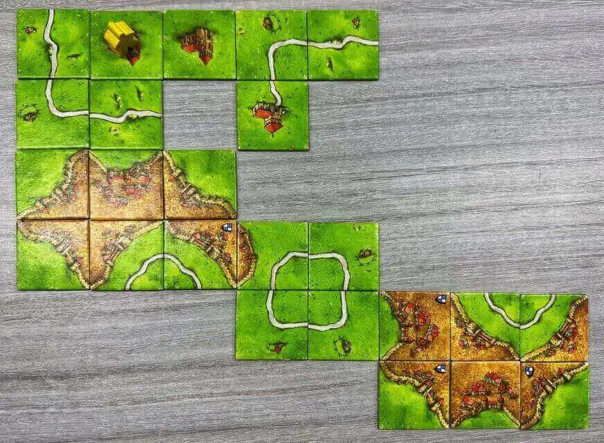
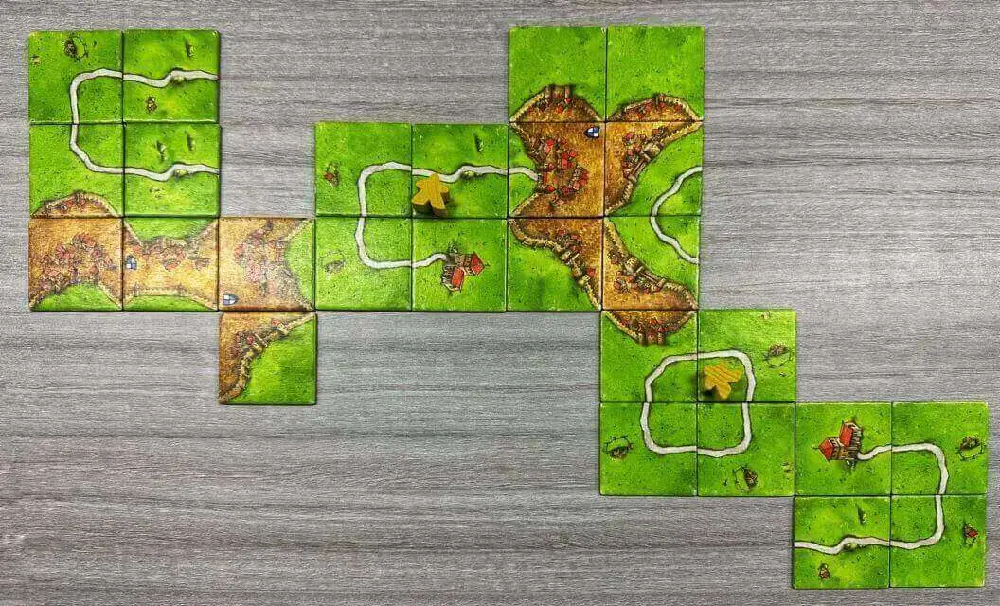
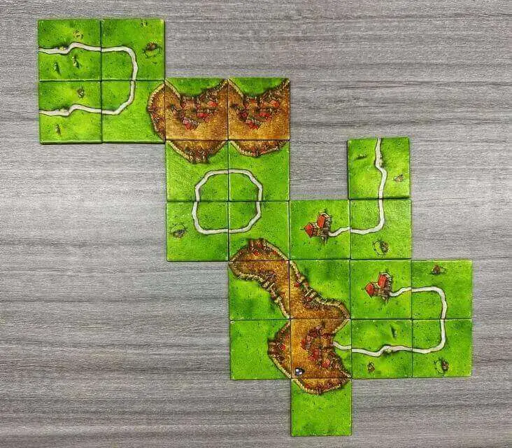

# 谜与卡卡颂

## 题面

:::info
[P\&KU2：谜与卡卡颂](https://pnku2.pkupuzzle.art/#/game/miyue/autumn_07)
:::

_那么，首先从城堡出发……_

## 答案

LIVES FOUND DEAD

## 解析

题目给了桌游卡卡颂的三张游戏图片。查询积分规则，会发现三张图片上六块城堡的得分分别是 16、9、7、16、5、14. 转换成字母得到 pigpen，也就是“猪圈密码”。

接着我们会发现，三张图上，每张图的白色道路都形成了一个猪圈密码的图样，其中如果有棋落在道路的对应位置，则视为一个“点”。从而可知三张图分别是 lives、found、dead。连在一起即可获得答案。

## 作者

五月（设计与拍摄）

## 附言

### 五月

在出题进入中后期（剩余天窗不足1/4）的时候，就不得不考虑每个题目的功能了。如各位所看到的，我们需要出一道简单的单层的密码题，作为大家做题中途短暂休息的驿站。

更进一步说，猪圈是一个还没被使用过的密码形式，且Winfrid提及猪圈可以使用道路来表示。我自然地联想到了卡卡颂这个桌游（推荐还没有体验过这个桌游的朋友们去桌游店试一试，还是非常经典的），并几乎是立刻就确定了这个题目如今的形态。

过程中我们也有讨论过是否添加更深的规则、是否添加其他的桌游或密码、是否添加更多的实物要素（比如照片中会拍到一杯奶茶，而奶茶的消耗，暗示了几张照片的实际拍摄顺序），但最终我们还是保留了最干净的状态。

对于熟悉解谜的玩家，应该是不需要经过城堡得分=PIGPEN这一步、直接就可以看出道路的异样。这也是符合我们的预想的。我们只是希望给予熟悉解谜与熟悉桌游的玩家两条不一样的解题路线，同时也让整个画面看上去丰富一些。

如今的呈现效果，自然不敢说是一道充分使用了桌游形式、实物形式的题目，不过好在卡卡颂本身的美术相当经典，只是简单的拍照也显得还挺好看的。

对了，这题虽然不难出，但其实成本也挺高的，为了去桌游店拍这个，花了两个人110块钱呢。

### Winfrid

跟五月去桌游店拍这道题的题图，拍完之后玩了几个小时十几种桌游二十几局，没有一把是赢的。
