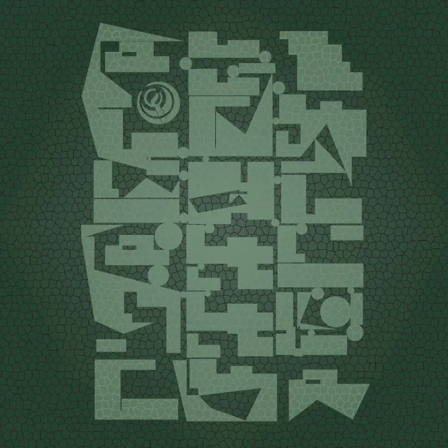
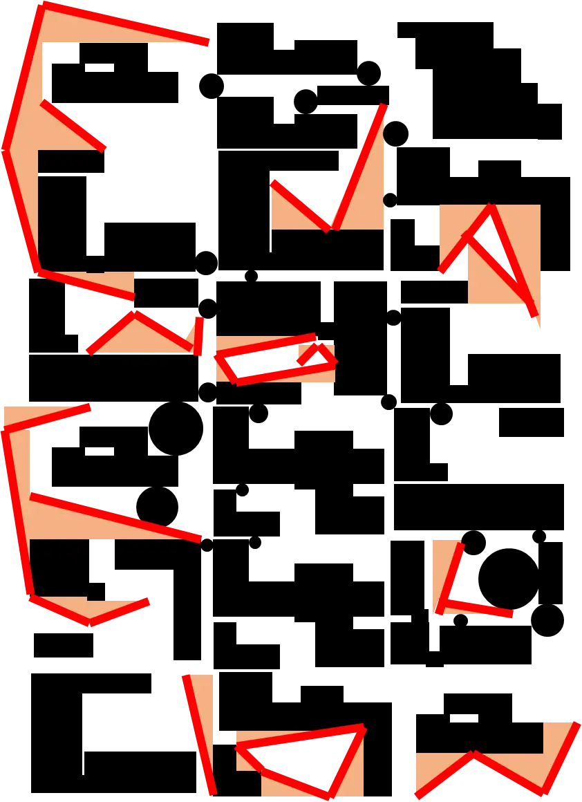
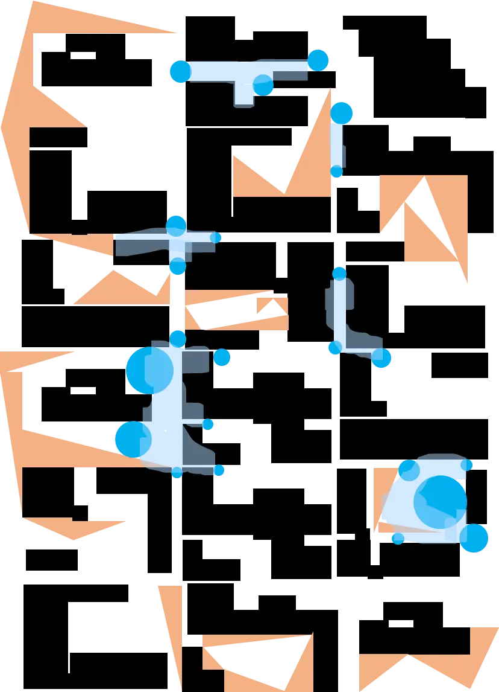
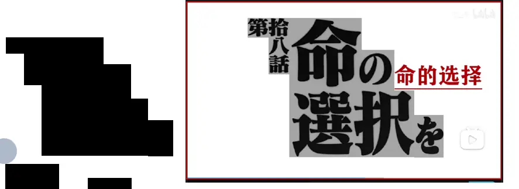

# 几点疏雅

## 题面

:::info
[P&KU2：几点疏雅](https://pnku2.pkupuzzle.art/#/game/miyue/summer_05)
:::

_斜的、圆的、方的_
_剔透玻璃。_
_咦？刚才不是还有人在这里吗？_

## 答案

STRANGE MASKED KINGS

## 解析

在整个图形里，有非常多规整的矩形，夹杂着一些直角三角形与圆。分析完这些之后，根据题目文案的指示，我们来找到直角三角形的斜边（也就是不水平不垂直的线），如下图所示，勾勒出了 **EVANGELION**。

接着，我们根据指示来看圆。值得注意的是，这些圆往往在一些狭窄地带的关口，它们的存在让一部分空间变成了封闭图形。于是，我们注意围成的封闭图形，得到 **TITLES**。

最后，我们可以去考察“方的”，也就是剩下的内容。根据前面的指示 EVANGELION TITLES 和搜索，我们会发现 eva（新世纪福音战士）的标题卡片非常具有特色（甚至还衍生出了以此为基础的eva风格标题生成器等）。联系到这里的方格，我们就会想到，**其实这里的方形都是 eva 某集标题的排版。**例如，右上角的那部分，就是第十八话的标题排版。

从而，我们会发现剩下的内容其实分别对应 eva 第 19、20、18、01、14、07、05、13、01、19、11、05、04、11、09、14、07、19 集的标题卡片的排版。而 eva 正好有26集，因此可以把每个数转换为对应的英文字母，得到答案 **STRANGE MASKED KINGS**。

## 作者

Winfrid（设计与美工）

## 附言

### Winfrid

在后期，感觉觅月区有很多可以被简要地归结为hunt、cipher、纸笔类型的类型的题了，于是尝试性地出一点基于观察的题，而芈雨区又太多从文字角度出发，于是打算放一道从图形入手的、纯粹的观察题。

说到这道题的内容本身，EVA 的标题是我自己早已经注意到而且诧异于为什么没人出的素材，而如果出成单层题违和感就有点强，于是试图用在上面垫一两层的方式来营造柳暗花明之感。

反响意外地还不错。
