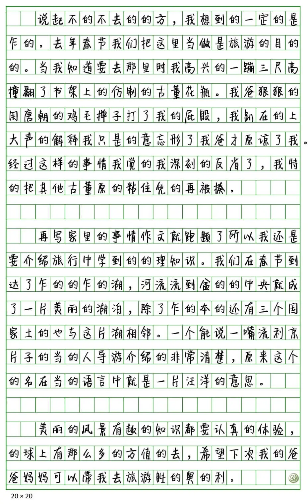

# 零分作文

## 题面
:::info
[P\&KU2：零分作文](https://pnku2.pkupuzzle.art/#/game/miyue/summer\_05)
:::

_请以《不得不去的地方》写一篇作文，要求：_
_0：写一篇600字以上的记叙文。_
_1：文中不要出现真实地点。_
_2：作文中不得有错别字。_

_“这么烂的作文只配送去碎纸机你知道吗？”_

## 答案

SHARING NATIVE LAND

## 解析

在这篇作文里，非常明显地能发现， 文中的“的、地、得”发生了混用，一律用“的”表示。不仅是修饰的短语如此，而且“乍得”这种词里面的“得”也变成了“的”！于是，我们把所有的“的”挑出来，来判断其应该是“的、地、得”的何者。

完成这一步之后，注意到题目文案里标注了 0、1、2 三条要求，并且每条要求里都有“的、地、得”之一，因此我们能反应过来，应该把“的、地、得”转换为0、1、2。在完成这一步之后，就可以利用三位三进制，转换得到答案 **SHARING NATIVE LAND**。

## 作者

五月、榆木华（设计）；五月（美工）

## 附言

### 五月

Winfrid有一个灵感集，里面林林总总写了大几十条成型的或者不成型的点子。的地得就是从里面翻出来的。

点子本身是很干净的，但问题在于出成题很无聊。十几个句子有啥意思嘛。后来在kinami和榆木华的集体智慧下，想到把造句扩展成小作文，并且是很蠢的作文。通过作文句子中卖蠢来制造笑点，冲淡题目的枯燥，效果挺好的。

### 榆木华

这题的空位一直留到了夏区的几大神兽都出来为止，那么群里的大家自然而然地就开始想出简单题了。五月当时拾起了早期的地得三进制的想法，然后提出可以塞到一篇小作文里。我就想到考试作文的要求不就有个123嘛，改成012之后又明显又自然地有线索，在三点要求里分别插入的地得三字就可以很好地点出三字与三进制的对应。然后既然作文语法写得这么烂后面五月说多加点包袱也很自然了。后面帮五月撰写并润色了几句笑话，于是题目变成了炎炎夏区的一小块凉爽之地，挺开心的。
