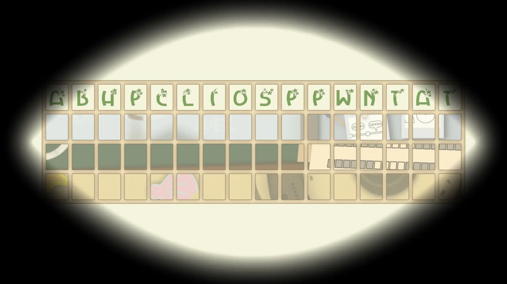

# Meta：春之密约

## 题面

:::info
[P\&KU2：Meta：春之密约](https://pnku2.pkupuzzle.art/#/game/miyue/spring_meta)
:::

_将其余的绚烂多姿的季节视而不见，_
_就能与永恒的春天重逢。_

## 答案

BE SPRING

## 解析

本题是觅月区域的 metameta 谜题。其中给了一个表格，表格上方写了若干字母，而表格有三行，每行的格子里分别是此前冬天、秋天、夏天的 meta 的背景。

“视而不见”暗示了盲文——而如何提取盲文呢？事实上，直接根据“该行对应的答案有没有包含该字母”，就可以在表格内填涂，最终识别出答案 **BE SPRING**。

## 作者

Winfrid（设计）；Potto（美工）

## 附言

### Winfrid

其实，metameta 及前面的三个 meta 分别对应了四个季节的设定，是在出到一半的时候临时加入的——从而让“春天”从气氛上多了一丝和其它三季对立的感觉，和后续的 eternal universe 又有所照应。

五月的吐槽：

> abhpcliosppwntat：P\&KU2 生造词，含义为：累了毁灭吧
