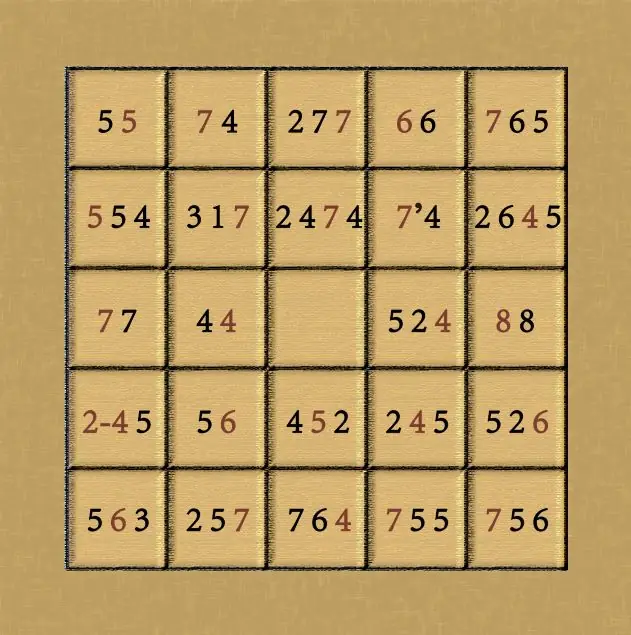

# 二十四番花信风

## 题面
:::info
[P\&KU2：二十四番花信风](https://pnku2.pkupuzzle.art/#/game/final)
:::

## 答案

WARP AND WEFT TURN PUZZLES AND KEYS INTO ETERNAL UNIVERSE

## 解析

本题是 finalmeta。给出的正方形的边框是在 芈雨的 finalmeta **《春之秘语》**里出现的边框。

在芈雨区的 finalmeta 里，全部填入后的诗句如下所示：

|         |         |         |         |         |
| ------- | ------- | ------- | ------- | ------- |
| 离颜带笑欢   | 不是冲泥送行客 | 村南村北行人绝 | 三春负锄相识  | 穷谷晞阳犹未春 |
| 更不轻离拆   | 酒酣不识关西道 | 琵琶拨尽四弦悲 | 此景竹林人   | 一笑相欢    |
| 一种清孤不等闲 | 屡欲传情    | 欲尽此情书尺素 | 情随湘水远   | 人焕衍兮欢心逸 |
| 闲倚柴门看倦  | 衣素裳绿    | 几尺湘波    | 书空漫惆怅   | 一杯得杏花村  |
| 槐阴添绿    | 敕赐深之能几许 | 自许风流丘壑  | 付与溪声自在流 | 说与鸣鸠一任忙 |

而在这里，每个格子都包含着若干数串，其中每个格子里有一个数标红了：

|           |           |             |           |             |
| --------- | --------- | ----------- | --------- | ----------- |
| 5 **5**   | **7** 4   | 2 7 **7**   | **6** 6   | **7** 6 5   |
| **5** 5 4 | 3 1 **7** | 2 4 **7** 4 | **7** 4   | 2 6 **4** 5 |
| **7** 7   | 4 **4**   |             | 5 2 **4** | **8** 8     |
| **6** 5   | 5 **6**   | 4 **5** 2   | 2 **4** 5 | 5 2 **6**   |
| 5 **6** 3 | 2 5 **7** | 7 6 **4**   | **7** 5 5 | **7** 5 6   |

不难发现，除了中间的格子，其实每个格子都暗示着一个觅月区的小题答案（数组是其各单词长度）：

|                      |                      |                          |                         |                          |
| -------------------- | -------------------- | ------------------------ | ----------------------- | ------------------------ |
| HELLO **VODKA**      | **CUTTING** TOOL     | GO AGAINST **SQUALLS**   | **BEYOND** PUERTO       | **STRANGE** MASKED KINGS |
| **LIVES** FOUND DEAD | ATE A **BUZZARD**    | NO MORE **TURNING** BACK | **DWARVES'** MENU       | TO SPREAD **YOUR** WINGS |
| **POSTWAR** OEDIPUS  | ORME **SHOE**        |                          | FINAL OR **SEMI**       | **COMPUTER** DISORDER    |
| **EZ-LINK** CARDS    | BURNT **CORPSE**     | GIVE **INPUT** TO        | HE **LEFT** AGAIN       | WOMAN IN **FOREST**      |
| GREAT **SILENT** SEA | BE DREAM **INVADER** | SHARING NATIVE **LAND**  | **SUNDOWN** OPERA HOUSE | **CURRENT** GHOST BAMBOO |

这样，就得到了两个区各自24个小题答案的一一对应关系！

接下来，我们要从“二十四番花信风”出发，考虑这东西和题目有什么关联：百花集中开放的季节，从“小寒”开始，到“谷雨”结束，跨了八个节气、二十四个候应，古人为每候选了一种花做代表，从而就有了24个按顺序排列的花的名称：

1. 小寒：一候梅花、二候山茶、三候水仙；
2. 大寒：一候瑞香、二候兰花、三候山矾；
3. 立春：一候迎春、二候樱桃、三候望春；
4. 雨水：一候菜花、二候杏花、三候李花；
5. 惊蛰：一候桃花、二候棠梨、三候蔷薇；
6. 春分：一候海棠、二候梨花、三候木兰；
7. 清明：一候桐花、二候麦花、三候柳花；
8. 谷雨：一候牡丹、二候荼蘼、三候楝花。

而与二十四番花信风相关的，必然也就是在芈雨区的二十四个中文诗词句答案了。非常容易就能发现——甚至早在此前解题者可能就已经发现了，这二十四个诗词句的同篇内都有二十四番花信风之一！而且，含有二十四番花信风之一的那句话的汉字个数与这个中文答案对应的英文答案的加粗单词的字母个数是相同的。基于这种规律，我们就可以加以提取：

例如，“一种清孤不等闲”出自《山中雪后》，同篇有“梅花”，即“檐流未滴**梅花**冻”。然后，与“一种清孤不等闲”相应的觅月区答案，被加粗的单词为 POSTWAR，它和“檐流未滴**梅花**冻”的长度相等，根据梅花的位置提取 WA 。最后，梅花是二十四番花信风的第一个，因此放在第一位。

| 对应的觅月答案                  | 对应的羋雨答案 | 所在作品                            | 对应的羋雨答案的含花信风的同篇诗句 | 提取 | 花信风序 |
| ------------------------ | ------- | ------------------------------- | ----------------- | -- | ---- |
| **POSTWAR** OEDIPUS      | 一种清孤不等闲 | 郑板桥《山中雪后》                       | 檐流未滴**梅花**冻       | WA | 梅花   |
| BURNT **CORPSE**         | 衣素裳绿    | 吴潜《疏影》                          | 偏爱**山茶**雪里        | RP | 山茶   |
| **STRANGE** MASKED KINGS | 穷谷晞阳犹未春 | 郑愔《人日重宴大明宫恩赐彩缕人胜应制》             | 池开冻**水仙**宫丽       | AN | 水仙   |
| **DWARVES'** MENU        | 此景竹林人   | 黄裳《满江红·东湖观莲》                    | **瑞香**乱翟红相倚       | DW | 瑞香   |
| HE **LEFT** AGAIN        | 书空漫惆怅   | 蔡伸《风流子·韶华惊晼晚》                   | 畹**兰花**减          | EF | 兰花   |
| **CUTTING** TOOL         | 不是冲泥送行客 | 杨万里《雨中入城送赵吉州器之二首其一》             | 栏路**山矾**香杀人       | TT | 山矾   |
| TO SPREAD **YOUR** WINGS | 一笑相欢    | 郭应祥《柳梢青·两邑大夫鞭春之集，城南主人张澧州有词，次其韵》 | 饯腊**迎春**          | UR | 迎春   |
| GIVE **INPUT** TO        | 几尺湘波    | 王安礼《潇湘忆故人慢》                     | 方**樱桃**弄色         | NP | 樱桃   |
| ATE A **BUZZARD**        | 酒酣不识关西道 | 王昌龄《别辛渐》                        | 却**望春**江云尚残       | UZ | 望春   |
| **EZ-LINK** CARDS        | 闲倚柴门看倦  | 释绍昙《六言山居》                       | 野**菜花**飞胡蝶        | ZL | 菜花   |
| WOMAN IN **FOREST**      | 一杯得杏花村  | 邓肃《南归醉题家圃二首其一》                  | 一杯得**杏花**村        | ES | 杏花   |
| SHARING NATIVE **LAND**  | 自许风流丘壑  | 戴复古《满庭芳·楚州上巳万柳池应监丞领客》           | 桃**李花**傍          | AN | 李花   |
| HELLO **VODKA**          | 离颜带笑欢   | 吴宽《送金德润主事改选南京便养》                | 路指**桃花**渡         | DK | 桃花   |
| **BEYOND** PUERTO        | 三春负锄相识  | 庾信《小园赋》                         | 有**棠梨**而无馆        | EY | 棠梨   |
| GREAT **SILENT** SEA     | 槐阴添绿    | 晁端礼《雨霖铃·槐阴添绿》                   | **蔷薇**花下曾记        | SI | 蔷薇   |
| **CURRENT** GHOST BAMBOO | 说与鸣鸠一任忙 | 范成大《病起初见宾僚，时上疏丐未抱陆务观云：春初》       | 迟日温风护**海棠**       | NT | 海棠   |
| ORME **SHOE**            | 屡欲传情    | 史达祖《解佩令·人行花坞》                   | 澹月**梨花**          | OE | 梨花   |
| **COMPUTER** DISORDER    | 人焕衍兮欢心逸 | 夏竦《奉和御製幸金明池》                    | 风樯桂楫兮**木兰**船      | TE | 木兰   |
| NO MORE **TURNING** BACK | 琵琶拨尽四弦悲 | 周邦彦《浣溪沙·争挽桐花两鬓垂》                | 争挽**桐花**两鬓垂       | RN | 桐花   |
| GO AGAINST **SQUALLS**   | 村南村北行人绝 | 白居易《村夜》                         | 月明荞**麦花**如雪       | AL | 麦花   |
| **SUNDOWN** OPERA HOUSE  | 付与溪声自在流 | 方岳《又用胡尉韵》                       | 杨**柳花**飞狐白裘       | UN | 柳花   |
| **LIVES** FOUND DEAD     | 更不轻离拆   | 杜安世《杜韦娘》                        | 初**牡丹**谢了         | IV | 牡丹   |
| BE DREAM **INVADER**     | 敕赐深之能几许 | 杨万里《尝荼蘼酒》                       | 月中露下摘**荼蘼**       | ER | 荼蘼   |
| FINAL OR **SEMI**        | 情随湘水远   | 谢逸《千秋岁·咏夏景》                     | **楝花**飘砌          | SE | 楝花   |

（注：“更不轻离拆”在柳永的《征部乐·双调》也出现过，但其中没有花信风）

从而，finalmeta 的答案也就是 **WARP AND WEFT TURN PUZZLES AND KEYS INTO ETERNAL UNIVERSE**……

这也正是命运冥冥之中将芈雨和觅月的谜题织成的宏大的悬念的答案：两人相逢后的经历织成的经纬，已经将芈雨的谜语和觅月的密钥紧密地束缚在了一起，凝成了永恒的宇宙。

> 视谜语密钥于此经纬交织，绽出未解的神谕。

## 作者

山南（设计）、Winfrid（设计与美工）

## 附言

### Winfrid

Finalmeta 的创作在 PV metas 这个概念之后，而且它其实原先并没有成为我们刻画的重心：在起初的设想里，玩家在解出 PV metas 后获得的体验感应该是远高于解出 Finalmeta 的（毕竟后者更加常规一些）。

那么在这一基准确认了之后，我们就尝试着用一个概念串联起所有的题目。当时想到了“花”，又苦思冥想了数天后，请来了花理学家山南，他提出了“二十四番花信风”这个想法。而24作为小题数量又太少，于是我们打算扩充到48。后来确认了提取方式和排序之后，就打算从对应关系上入手——为了保证 finalmeta 本身干净利落，这里就打算用 callback 的手段来完成对应，于是就有了芈雨区的拼图的构想。

这次的觅月区的答案受到了小 meta、pv meta、finalmeta 的三重制约，而芈雨区的答案本身需要是古诗词，同时还得满足芈雨的 finalmeta 和这里的 finalmeta——可以说是极其困难了。下次再也不这么凑了，实在是伤身体……

### 山南

想不到8个月前抛的砖最终引出如此宏大又精巧的璞玉。看着大家将一个有趣的点子一步步变成一个丰富多彩同时又具有极高完整性和一致性的puzzle的过程让我感到震撼同时又从中受益匪浅。赞美Winfrid和各位staff！
