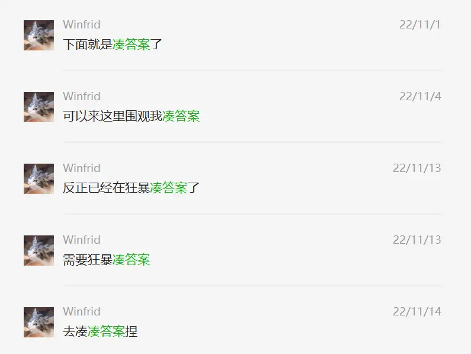

# 谜题结构

:::info

这篇文章是有关谜题活动 P&KU2 的谜题结构的。本文包含了 P&KU2 的重要剧透，请谨慎观看。

本文由 Winfrid 作于 2023 年 5 月 7 日。

:::

在一切开始之前，先对于这篇文章的题目标注作一个说明：

- 芈雨区的 Final Meta 是“Meta：春之秘语”，
- 觅月区的 Meta 是“Meta：冬”“Meta：秋”“Meta：夏”，
- 觅月区的 Meta Meta 是“Meta：春之密约”，
- 觅月区的 PV Meta 是“Meta：春风衔笺”，
- 觅月区的 Final Meta 是寻觅最终信笺的过程，
- 整个 Hunt 的 Final Meta 是“二十四番花信风”。

## 一、PV Meta 的理念设计

P&KU2 的整体结构始于一个点子：**把所有小题答案全部切碎重组，并且把这些 meta 的题面都藏在一个视频中**。

这个想法，在 P&KU2 的谜题制作组的群聊还没完全建起来的时候，就已经逐渐明晰了。
不过当时的整体思路更为繁杂，在几度删改之后，只留下了这个支撑起 P&KU2 高潮的点子，而如今也就是《春风衔笺》的那道 Meta。不
过这个名为 Meta sorting 的点子在西方的 Puzzle Hunt 里似乎已经使用了很多次（应该是吧？），
比如 MITMH 2021 的 students 区域、GPH 2017、rojak 的 Meta 们、ecph 的 puzzle box 单题等等，或许只是去年 8 月的我还比较地阅历短浅，
没有怎么见过这种类型的点子，才拿起它作为核心构建起了这么一个 Puzzle Hunt。

大约半个月后我意识到，这个 Meta sorting 点子更像是 P&KU1 的 Final Meta 的变奏
：**混沌的信息宛如一团逐渐聚集的蒸汽，随着信息的增多，蒸气压也逐渐超出饱和的临界值，而只需要一点微弱的摩擦作为演奏的开幕，
就能在瞬间凝结为坠落的雨点，奏出属于终章的乐曲**。
在 P&KU1 中，这个摩擦是名为“北岛”的箴言，而在 P&KU2 里则是一支视频。
在 P&KU1 里，最后的雨点是重解每个区域的 Meta 得到的，而在 P&KU2 里，雨点则还需要先重构每个区域的小题。

意识到这点之后，我就开始觉得这个形态其实比起 P&KU1 多了一丝刻意：
那点“摩擦”不够微弱，同时蒸气压也没有那么饱和（因为还要重构每个区域的小题），
P&KU1 更像是一个自信的魔术家，而当时的 P&KU2 只能算是遮遮掩掩的魔术师。

所以，我决定让这支视频事先放出——也就是成为一支宣传 PV。
从而，所有的信息在“Meta：春风衔笺”这一行字到来的前夕已经全部给出，宛如推理小说里设置的挑战读者页，预示着一场信息公平的对决的到来。
Puzzle Hunt 里的谜题是一种信息不公平的对局，但是如同 P&KU1 一样，PV meta 的设计是公平的，
因而有一种反派角色在漫画的最后给主角一把剑以进行宿命对决的美感。这或许同时也是大家自发地更青睐 Pure Meta 而非 Shell Meta 的原因吧？

确定了这个 philosophy 之后，接下来的设计虽然也很麻烦，但总的来说还是顺理成章的。直到——

## 二、寻找信笺的理念设计

书接上文，我想到 Meta sorting 的 PV Meta 之后，一个比较现实的问题在于，Meta sorting 的答案该是什么呢？

GPH 2017 的思路是这样的（包含剧透，请谨慎阅读；另外由于没有切身体验过，所以可能会存在偏差 orz）：

> GPH 2017 有 25 个独立的小题，和 5 个 Meta。前三个 Meta 需要把 25 道题进行 Meta sorting 分为三类，
> 而这三个 Meta 的答案分别对应着石头、剪刀、布，所以相当于是为每一个答案赋予了一个标签。
> 第四个 Meta 需要从 25 道题里面选出合适的 9 个进行操作，而第五个 Meta 则要用到剩下的 16 个答案，进行石头剪刀布的单败淘汰赛。

尽管我觉得这个点子相当有趣，但是我完全不想步其后尘，所以又想到了异曲同工而又更加具有“饱和信息感”的思路：
如果一切的一切早就可以察觉，Meta sorting 也没有任何意义，只是**经过解题过程所需的“划分”之后，隐藏的脉络逐渐明晰起来**，呢？

想到这里，脑海里又突然浮现起了早期的 brainstorm 时的 “invisible final meta” 的思路，于是两相结合，才有了现在的寻找信笺的设计。

## 三、Final meta

有了“寻找信笺”的设计之后，我就试图将其包装成整个 hunt 的核心。但是仅仅在此束尾，又会显得整个 hunt 有 meta 而无 final，于是，我们又需要有一个足够支撑起 final 的 meta。

因为本身不需要这个 final meta 足够惊艳，所以我决定用常见的密码本思维去构建这样的 meta。当时由于想要根据剧情，把答案设定为具有控制欲色彩的 **“紫罗兰永恒花笼”** 的答案（紫罗兰的某种花语是“永恒的爱”），而因此试图寻找含有花的密码本。尝试了许多或偏门或小众或没有既定答案的密码本之后，最后咨询了山南老师，我们确认了“二十四番花信风”作为这次的隐藏主题。

而随着最后剧情从黑深残变得正面而阳光，答案也不再和紫罗兰沾边，而只是“命运的经纬相互束缚”而已。但是“二十四番花信风”的密码本却留存了下来。

## 四、双区域的设计

在一切的设计之前，我们就试图设置有一个答案全都是中文的区域，以满足对于中文谜题的构想。具体的关于中文设计的内容会在一个别的设计手稿里提到。

而最后敲定为双区域，其实原因很简单：我们试图上题目数量是 24 的倍数。但是二十四题有点少，还是四十八题比较合适。于是，我们就设置了两个区域。

而解锁路径是一道芈雨区的信开一道觅月区的信，这个也是 9 月左右一经商讨就确认的结果，因此并没有太多的更多考虑。不过现在回想起来，这种设计的确在最初的时候提供了非常高的自由度，延续了 P\&KU0 和 P\&KU1 的一贯风格。但这个自由度的提供究竟是好是坏，就不得而知了。但总之，我知道面对着三四道不会的题，一道都做不出来而无法推进的感觉是非常痛苦的。

## 五、凑答案、凑 PV metas

凑答案是一个痛苦的过程。总体的设计理念早就在 8 月底陆续结束，但是凑答案则到 11 月份才开始。这期间的空窗期基本就是快乐交流小题灵感，而这种快乐在 11 月 1 日终结了。整个答案也直到 12 月份中旬才逐渐凑好。

和凑答案同时的是确定 PV meta 的内容。当时 PV metas 的设计理念有三个——

**第一点，这些 meta 应该尽量靠近 pure meta 的那一方，也就是不要在画面上留下太多的信息。**毕竟，我们想要把其作为宣传 PV，倘若画面上塞更多的信息，那么很难不被人直接察觉。

**第二点，四个 metas （更早是五个）的角度应该各不一样。**例如某个 meta 应该是简单地基于答案形态，某个 meta 应该考虑答案共性，某个 meta 应该让答案整体对应一个概念，某个 meta 应该解出一个 clue phrase，而某个 meta 可以只是每个答案平衡地提取若干字母。

**第三点，这些 meta 对于答案的要求应该尽量是比较明显的，但不应该明显到不需要 PV （也就是过饱和蒸汽所需的那点微扰）就可以看出来。**因为需要进行 meta sorting，所以需要能够让人一眼看出这些答案至少都应该属于同一类。所以最后的设计上，四个类别都还是比较符合这一条件的——三个词、相同的长度、两个长度相等的词且都有 o、和白鸟过河滩里的句子冥冥相合，都是那种不点则很难发现、一指出就很容易察觉的特征。

但除此之外，还有很多 PV meta 的想法被我们废弃了。原因在于其实还有最为重要的第四点——

**第四点，PV meta 应该对于小题答案的束缚没有那么强烈。**目前的设计上也的确如此。

一个小题答案服务于多个 meta，最为困难的问题就在于多重 meta 对于小题答案的束缚之和不能太高。在这一点上，ccbc12 在 final meta 对小题答案的束缚上有所妥协，P\&KU1 和 ccbc11 对于区域 meta 的束缚有所妥协，而很多外国 hunt 则压根没有考虑过某个小题在 final meta 再使用一次，即便有，也只是对于个别答案的简单复用罢了。

而，P\&KU2 需要的是三重束缚，于是在凑答案这点上，我们在限制 PV meta 对于小题要求的同时，也透支了小题答案的人话程度，同时也已经对于“答案和题面具有相称的美感”选择了放弃治疗。

这点是否是值得的？每个人或许都有自己的答案。但小题、meta、 final meta，三者本身对于答案的要求正如历史上相权和君权的争夺，是 P\&KU 设计里永恒的疑难。

只能说，P\&KU2 **选择**了其中的一条路径，以使得大家至少在做完 hunt 的时候是会更开心一些的。

## 六、剩余 Meta 的补全

那既然有 meta sorting，如果没有前戏的 meta 掩人耳目的话，那也太容易被看出来了吧！所以，我们在 PV meta 之前则又设计了三个区域。而三个区域的主题分别是冬秋夏，则是边凑边想到的。

而与之对应的这三个 meta 本身没有什么设计目标，唯一的设计目标就是“对答案没有什么要求”。但是最后呈现出来的时候，它们还是挺像一个好的 meta 的。纵然是镣铐舞者，却也已经达到了很多国外 hunt 不戴镣铐跳舞能跳出的风姿。于此我相当满意。

在完赛的问卷中，有人质疑 meta meta （春之密约）存在的意义。可是，你能对 1+1 要求什么意义呢？它存在的最大意义就是在尽量降低自己的存在感的同时，给 meta 答案一个派上用场的地方。

在设计 final meta 的时候，我很希望让它像是一个 pure meta（虽然最后没能成功），所以就试图通过两个散落在 hunt 不同位置的拼图来暗示两个区域各自信笺（小题）的一一对应关系。而其中一个拼图是芈雨送给觅月的最终礼物，另一个则散落在觅月区的某个小题里。最后，后者因为对于对称感的追逐而被否定了，但是前者的概念却保留了下来。**而为了追逐“答案无意义”的概念，所以我们就打算设置一个预先张扬的答案，来贯彻这一理念的实现。**

就暂时写到这里吧。感谢您能凑出一点时间欣赏我的碎碎念和流水账，希望 P\&KU3 和大家见面的时候，还能够有维持着相同水准的谜题结构！
