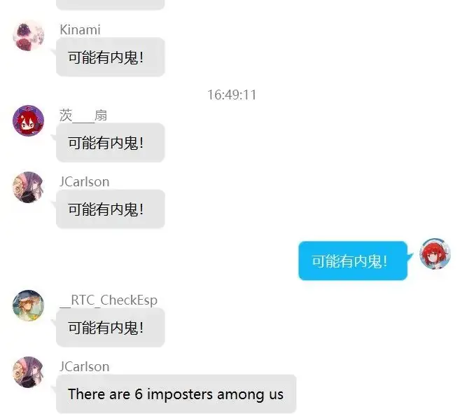

# 内测组

:::info
这篇文章由 Winfrid 在 2023 年 4 月 25 日发布于 Rivenux 公众号。

赛后回首这篇文章，真是别有一番风味。
:::

在 4 月 15 日，解谜活动 P&KU2 的赛前内测组开始了他们的内测，并在 70 余小时后完成了全流程。于是，Winfrid 抓住了他们来为大家剧透一些劲爆的信息。

可是，知道了剧透，又有什么意义呢？

> **首先，请简要地给大家做一个自我介绍吧。**

- **生煎**：成分为 follow up 单刷组，用时间弥补能力。
- **JC**：成分为端茶倒水的。
- **TCF**：成分为萌新解谜玩家。
- **Inferno**：纯在摸鱼。
- **落风**：成分为解谜萌新。
- **Caiji**：成分为解谜苦手萌新。

> **让我们用第一个问题作为餐前甜点：请预测一下第一个通关的队伍所用的通关时长吧！**

- **生煎**：猜测和c12差不多。
- **JC**：我不知道。（笑）
- **TCF**：30-40h。
- **Inferno**：20h 不到吧？感觉六个人肯定会比c12快。
- **落风**：40h左右，理想的话42h。
- **Caiji**：全力做的话 12 小时，正常作息 16 小时？

> **请评价一下这次的难度与测试的总体感受。如果用一个词/一句话来评价，你会用什么词？**

- **生煎**：最难的题也是最好的，一定要体验一下啊
- **JC**：我去，\<FILTERED>
- **TCF**：难度略高于 C12，一句话评价就是很 WINFRID
- **Inferno**：基本上和 c12 持平 而且因为难度分配 后期题比c12要艰难一点 大概就是循序渐进的感觉
- **落风**：P&KU 系列中最高的一次，做的比较过瘾
- **Caiji**：简单的题很简单，困难的题很困难，体感上方差很大。

> **Staff 们希望 P&KU2 能够让新人玩家也有较好的游戏体验，您认为是否达到了这个目标？**

- **生煎**：有温馨引导、前期蛮多简单题、一次能开的题更多，觉得可以
- **JC**：滋瓷。我 Hunt 经验属于萌新，没有其他大佬那样身经百战见得多了，尽管如此我也收获了很多欢乐。P&KU2 赛高
- **TCF**：对新人玩家来说怎么样不知道，对老外玩家是降维打只因
- **Inferno**：非常好指引 爱来自内测组
- **落风**：以下为我猜的：新人：哇塞好厉害，老玩家：好！！！
- **Caiji**：引导非常友好，而且能很快开出足够广的题目，倾向于认为达到了。

> **在 P&KU2 中，五月担任了大概小一半题目的实际出题工作，您觉得五月的题目是否有效的融入进了 P&KU 的系列风格中，同时是否为 P&KU2 带来了一些变化（好的或坏的）？**

- **生煎**：觉得五月和 Winfrid 风格比较互补，类型上带来了纸笔和日谜，风格上最大的感觉是轻松自然流畅。轻松可能从日谜里比较好体会。
  下面小题进一步描述了下自然流畅：【数据删除】。这种衔接用到的是事物本身的性质，会觉得比较生活化、细致、逻辑通顺。
- **JC**：谜题的格式非常的新颖和大胆，很多题做着学到很多。从简单题到困难题都有涉及，非常平衡。
- **TCF**：只能说五月的题很明显。
- **Inferno**：非常明显。很多很日谜以及带 subpuzzle 的题大概率就是五月出的。
- **落风**：May 的比较明显，也可能是我看五月老师出的多了，反正五月老师的加入让我有种眼前一新的感觉，尤其是五月和福瑞的搭配，让我做这次 P&KU2 时的感觉上升了。
- **Caiji**：因为和解谜接触较少，对 P&KU 作为一个系列的感知其实没有那么强，不过看出题目的出题人并不困难。
  五月老师的题在整体感觉上更加轻松愉快，但纸笔难度较高。个人体验而言有五月老师出的题使整体体验更加优秀了，但很有可能有我过于偏爱纸笔的原因。

> **在 P&KU2 中，我们也希望能尽可能探索中文、汉字、汉文化在解谜中的可能性，您认为 P&KU2 是否实现了这一点？这种探索对您的实际体验是加分的还是减分的？**

- **生煎**：【数据删除】，这些分开看都是好题甚至超好题，但同时出现就觉得画风有点重复了，都是考【数据删除】的题：
  如果探索的结果是必须用到某些固定的形式才能把中文题出好，是不是说明可能性不多？
  【数据删除】。感觉是太在意反而受限了。倒是觉得 Winfrid 说的“有两三道题寻找到了传统 hunt 定番在汉语语境下和汉字的连接点”的这些题会很好。
- **JC**：汉字在 P&KU2 中占了相当重要的地位，虽然这可能会对外国友人不是特别友好，但从个人角度我认为比语文考试有趣多了（
- **TCF**：实现的很好，我要是老外再也不参加中文hunt了，加分还是减分要看题，总体还是增添了很多可玩性。
- **Inferno**：作为开创者我觉得非常非常优秀。不仅是把整个ph圈子的惯性思维打破了，还增加了很多只有中文可以做到的提取方式，
  非常合理，以至于我一段时间都不知道英文hunt该怎么提取了。在我心目中非常加分。
- **落风**：怎么来说，都是一种很新颖且成功的尝试，反正我觉得有了汉字的出现，让这场比赛变得更加有趣，让我们见识到了汉文化在解谜中的发展空间。
  而且实际上加分项会多于减分项，是一种很好的尝试，也让我以后对“汉”解谜有了更多的考虑。
- **Caiji**：体验来说是相当正面的，P&KU2 对于汉语题的各种尝试无疑是十分成功的，有不少想法让人眼前一亮，和传统 Puzzle Hunt 题型的结合很有趣味。
  即便如此，还是有着很多没有探索的角落，相信未来的 P&KU 会更加出彩。

> **剧情一直是 P&KU 系列中非常重要的一环。目前剧情的呈现方式对于解题有影响吗？有哪些影响？**

- **生煎**：对于小题好像没什么，只想起来【数据删除】。影响最大的还是架构吧？
- **JC**：剧情好长啊——
- **TCF**：太长没看）
- **Inferno**：没有吧。但是谁不喜欢看女孩子贴贴呢
- **落风**：对于我一个剧情向解谜党来说，太好了

> **P&KU2 相比 P&KU1 来说，有哪些值得注意的变化？（太明显的除外）以及结合近两次 P&KU 和近两次 ccbc 来看，两者的差异主要体现在哪些地方？**

- **生煎**：P&KU2 和 P&KU1 是同主创，比起一年一换主创的 CCBC 来说更有追求个人体系的累加完善的感觉：
  架构、剧情、筹备已久的主力题等肯定都来自追问和个人一直在找的表达，于是觉得 P&KU2 更偏向艺术作品。
  具体表现的其中一个可能是架构和剧情是专门为对方设计的，结合得更紧密的感觉。
  具体题目的差异跟个人风格有关，比如可以想象 Winfrid 不太会选择出五月的日谜、yyao 的数学思维题等等，就看主创都有谁就知道题目风格了。 
  三届 P&KU 的纵向比较而言，各个维度都在往华丽走，包括 Winfrid 的题目本身，注重执行、维持 idea 鲜明有效的同时似乎更建筑/结构化。
  目前觉得 Winfrid 的追问和个人表达方向是意识向上、接近真相的，其中的道路是“变强”一挂的，觉得很好。
- **JC**：没亲自参与过 P&KU1 以及 CCBC 于是就不评价了（
- **TCF**：比 P&KU1 体量大，差异之前说了就是多了很多五月元素以及对外国队更加不友好了
- **Inferno**：网站的搭建。感觉美工清爽了很多，主题曲也是下了功夫的。中文题的加入对本土解谜者会有很多会心一笑的时刻。
- **落风**：相对于 P&KU1 其实我的看法上是解谜形式组成成分更多了，题量加大了，以及中文的加入，对中国解谜爱好者来说是好事，但对于外国解谜爱好者来说我不好评价。

> **（来自 Q 群@冇 的提问）想知道对题目有趣程度的总体评价如何呢？（包括但不限于来自出题元素的有趣程度，来自题目设计的有趣程度，来自剧情的有趣程度等等）**

- **生煎**：P&KU2 应该会被夸好多年吧
- **JC**：大部分都不错，有几道题的设定和美工很明显用心了。WARNING: 有极少数题目做起来有点掉 SAN
- **TCF**：有趣程度方面只能说只要你能做到后面是不会让你失望的
- **Inferno**：绝大部分题做起来是有趣大于痛苦的，题目解锁的设置也不会有那种死磕在几道题上的情况，希望组队的大家能够多线开工互相交流能够更好体验谜题的乐趣。
- **落风**：对于 P&KU2 整体，我只能说，你坚持下来，可以体会到解谜的乐趣，不会让你失望，对于剧情，如果你跟我是一个剧情向解谜党，我可以负责任的告诉你，你会狂喜。
- **Caiji**：杂食对感受解谜乐趣帮助很大，像“啊！这个我知道！”这样的，如果有着较为频繁的国内互联网使用经验的话可能能对很多梗会心一笑。
  剧情的话，因为我不太会汉语，有些不好评价。另外，试解人还有一大乐趣其实是围观出题人修题，推荐大家都来看看。

**感谢各位测试组的 dalao 们结合采访！既然大家都已经说了这么多了，那 Winfrid 就代表 Staff 们简单地透露一点点额外信息吧——**

- 这次相比 P&KU1，美工变好了，感谢 potto；网站变好了，感谢 kinami；有日谜纸笔了，感谢五月；有一些制作比较豪华，感谢木华。
- 总体难度而言，每次都是这样：出的时候觉得“已经很难了我们就控制一下难度吧”，然后结果出完了发现总体其实并没有那么困难。
- 这次会涉及**一个队伍影响另一个队伍的解答**的谜题。
- 我们这次加入了队内动态提示，你可以轻松地发现谁在偷偷秒题、谁在浪费体力值（这次叫作**墨汁**）了！
- 这次值得记忆的题应该会更多。虽然这次有了几道题融入了一些奇妙的点子，但是还有很多疯狂的点子没有在 P&KU2 里体现出来，那么 P&KU3 再会吧~
