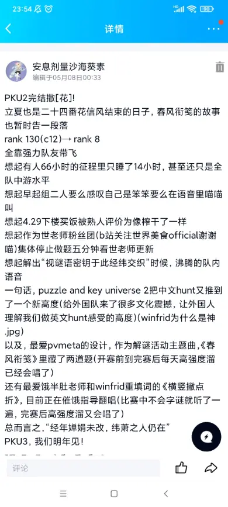

# 世界美食Official

### 认真总结一下？

River:&#x20;

解谜简历添上浓墨重彩的一笔。

PKU1 #35/187.2h/1.5人 -> CCBC12 #18/77.76h/3.5人 -> PKU2 #8/66.67h/5.5人

只能说，人多还是有好处的，好耶！

这次比赛不仅收获了超可爱的帕帕老师和五草哥，还收获了不错的排名（但是牺牲了鱼人的寿命）！也许之后鱼人有一天不在队里了卖命担当就是我了罢。(鱼：你猜猜C13有没有我？)

感觉团队气氛十分愉快，大家功利心都有但是没有那么强，是正好适合快乐解谜的状态。

对题目的评价：真的好精美啊呜呜呜，希望以后也能做到这么好的中文谜题！我吹爆Winfrid和五月老师以及各位STAFF！

瑕疵？还真没有什么大的瑕疵，都是部分孬题（的的赋太难顶了）或者为了meta呈现的孬答案，感觉也都能理解。

要说有什么可惜的地方，大概是没抢到手刹吧，当时有机会抢首杀的题还挺多的，翻译考试、爱慕猫体、的的赋、meta冬，但是当时人手不够了，平均分到一道题的就一两个人，所以当时决定全都allin翻译考试了，没想到做得差不多了卡最后一步的时候被其他队伍手刹了，可惜。哎呀猫体居然都没抢到手刹，感觉群友还是了解我的成分的，按理来说做这道题会比其他人快的qwq结果还卡了12h，太可惜了。

完赛之后当了几天STAFF，感觉被问的最多的题目是数回、字谜（又称中文cryptic）以及的的赋。感觉跟我自己的感受差不多，这种不好验证中间答案的题目确实比较难顶，而且这三道的难度其实都非常高。

茶唱星：懒得再写，于是截图

再次赞叹，winfrid是神。

最后表白队友们，大海啊全是水，队友啊全是腿!

kks:

首先这次puzzle的体验真的很开心！

和队友齐心协力解出题来很开心，独自瞪了很久的题突然找到思路得到aha moment很开心，深夜迷迷糊糊地在语音里和大家卡题也很开心！

以及这次的puzzle给我更多的是关于“美”的体验。

现代诗简短有力扣人心弦的文字、汉字和谐巧妙的结构，古诗寥寥数语勾勒出一幅画卷的震撼人心的表现力……这些都是我在繁忙的日常生活中无数次擦肩而过的、忽视掉的美好，pku让我重新拾起它们、感受它们。

以及美工的技术力真的很强大啊！

至于题目我觉得真的没什么孬题，至少我解的那几道题都很elegant。我个人不是很会从客观角度判断好题坏题(除了那种孬得人神共愤的)，什么题目都吃，不挑食不挑食ԅ(¯ㅂ¯ԅ)

最后，感谢队友带飞！没有大伙带我组队我也不会收获这么多puzzlehunt的快乐！感谢river顶包鱼人五草哥帕帕！无论以后是否在同一个队了大伙都是kks非常珍贵的好朋友！(⑉°з°)-♡

最后的最后期待pku3！感谢出题组的米娜！

鱼：活着的意义不过如此吧，寿命什么的也没啥。
