# 做题别买盗版书

## 题面

:::info
[P&KU2：做题别买盗版书](https://pnku2.pkupuzzle.art/#/game/miyu/prob_13)
:::

_“这纸也太薄了，我都能隐隐约约看到后面一页了。”_

_“可不是嘛。我都已经做完了，居然还能看见最后一页的字……”_

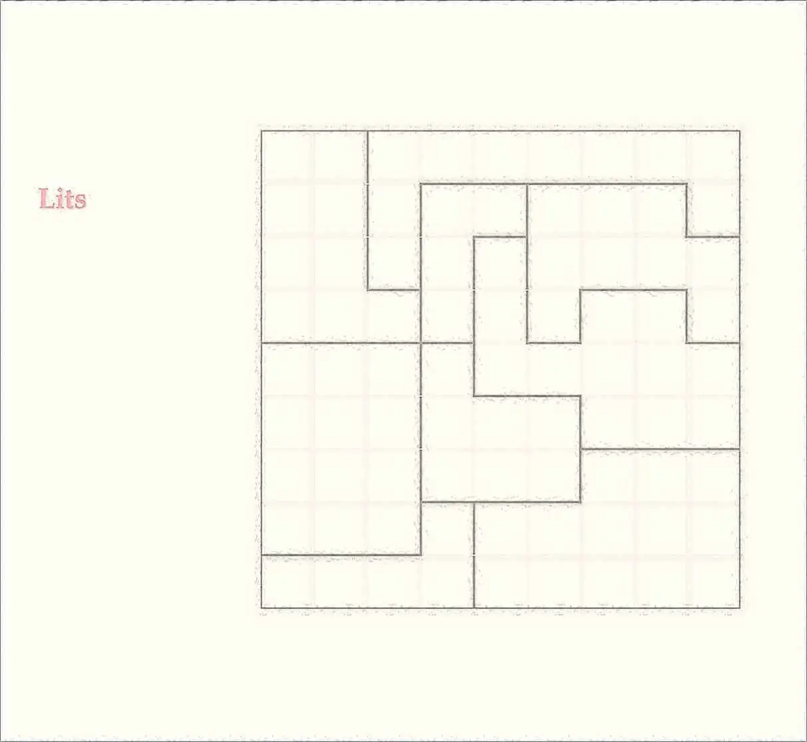

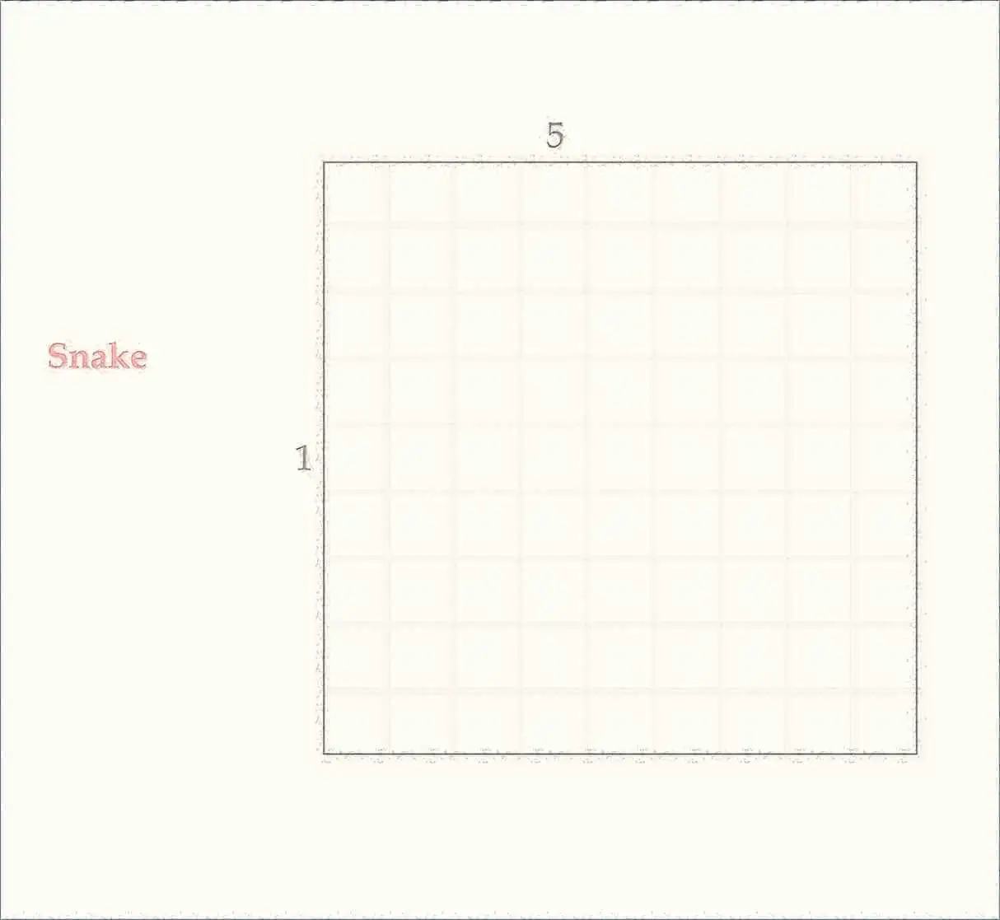

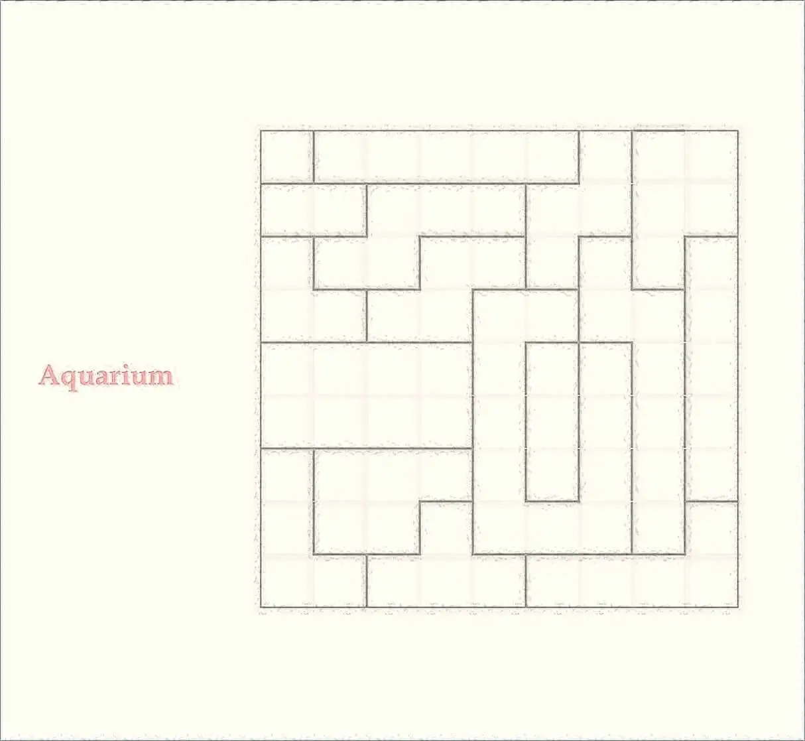

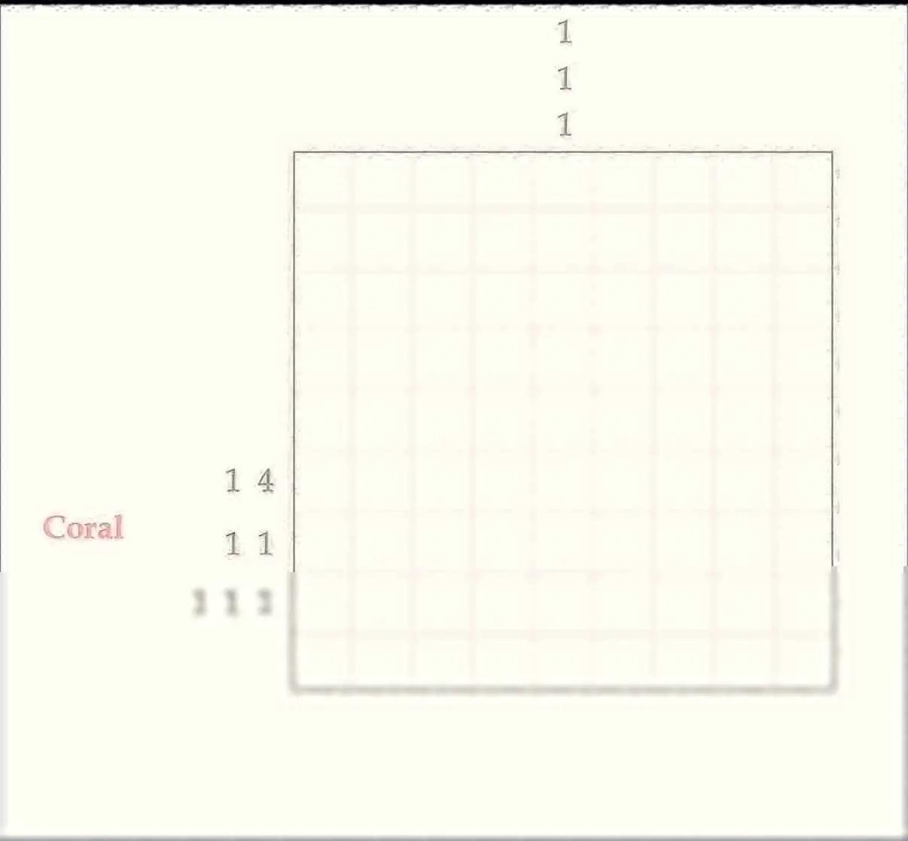

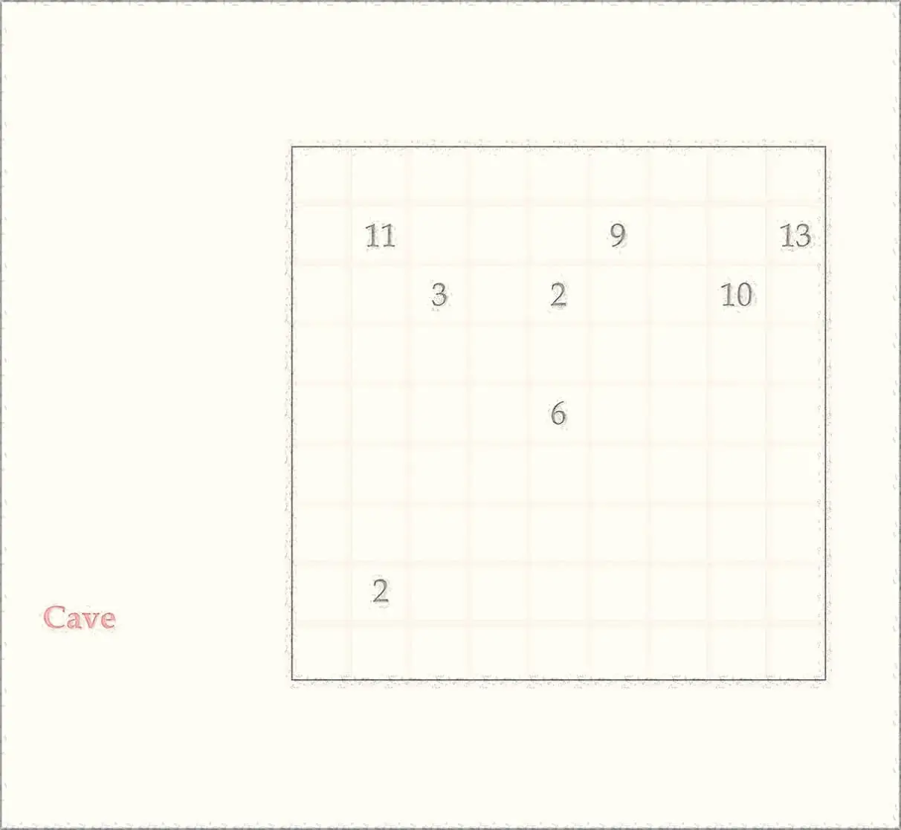

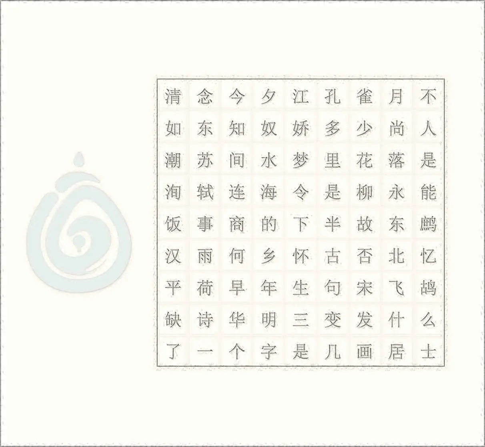

## 答案

付与溪声自在流

## 解析

题目中共有五个纸笔谜题，但它们单独都是不可做的（Snake 非常明显）。根据题目文案（flavor text）的提示，需要把相邻两题叠在一起看，同时使用两题的规则和线索，这样能得到 LITS+Snake，Snake+Aquarium，Aquarium+Coral，Coral+Cave 四个题目。

答案分别如下：

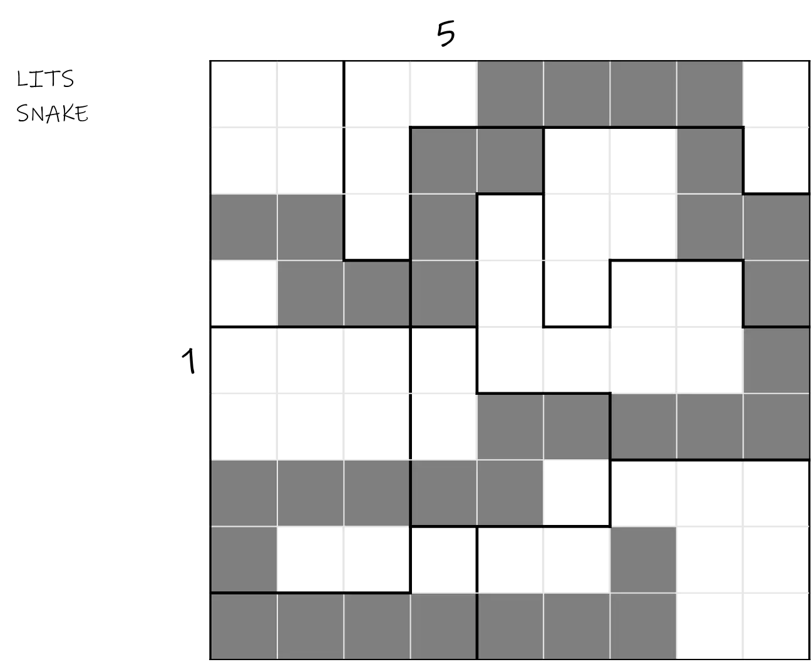

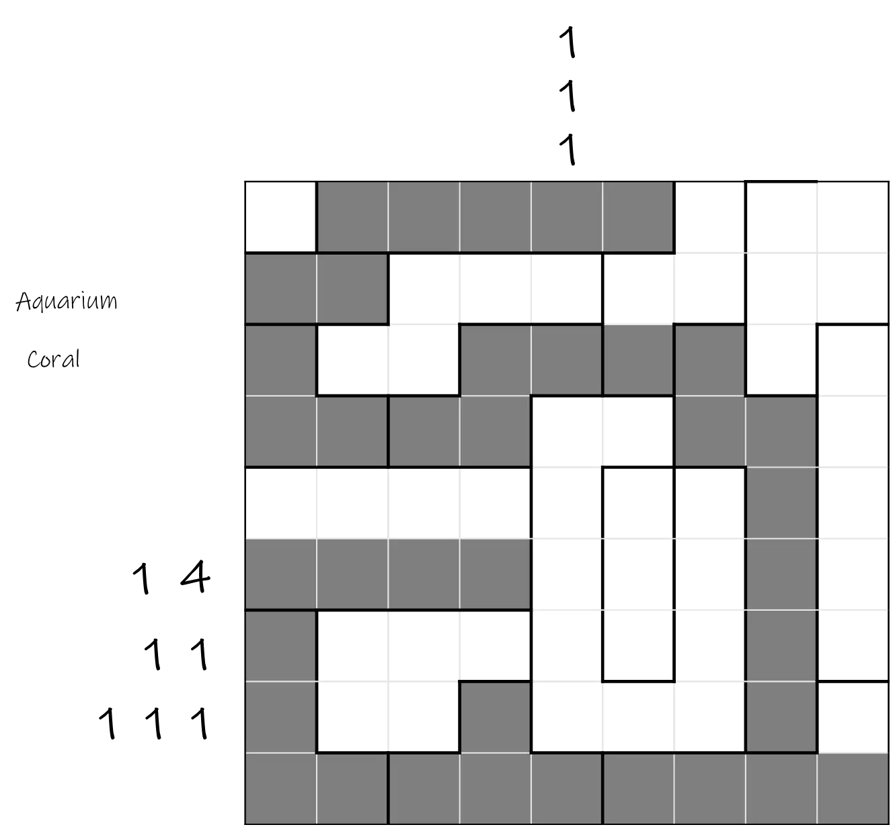

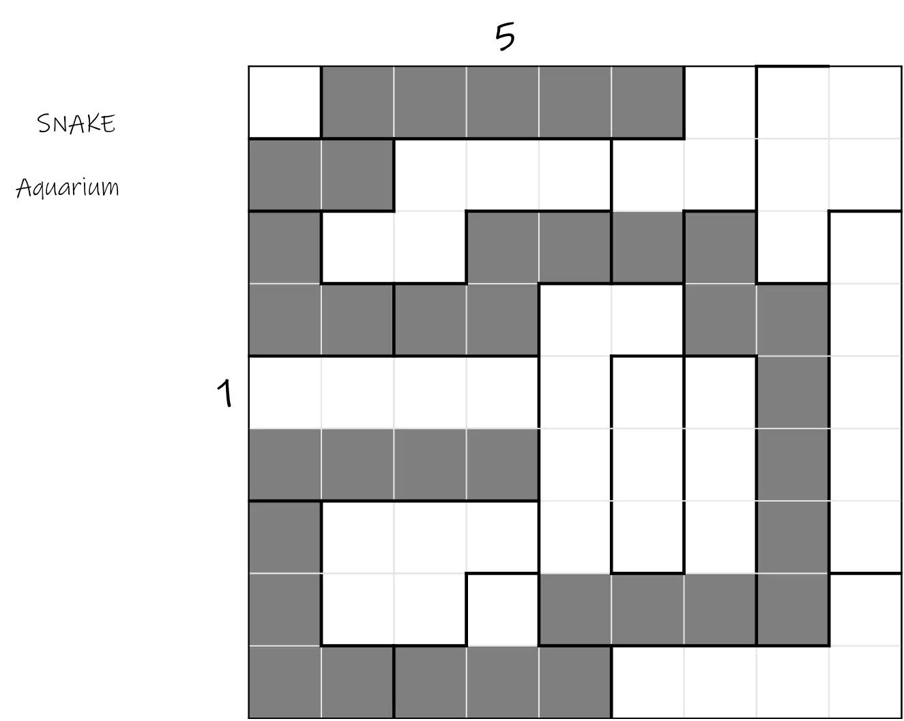

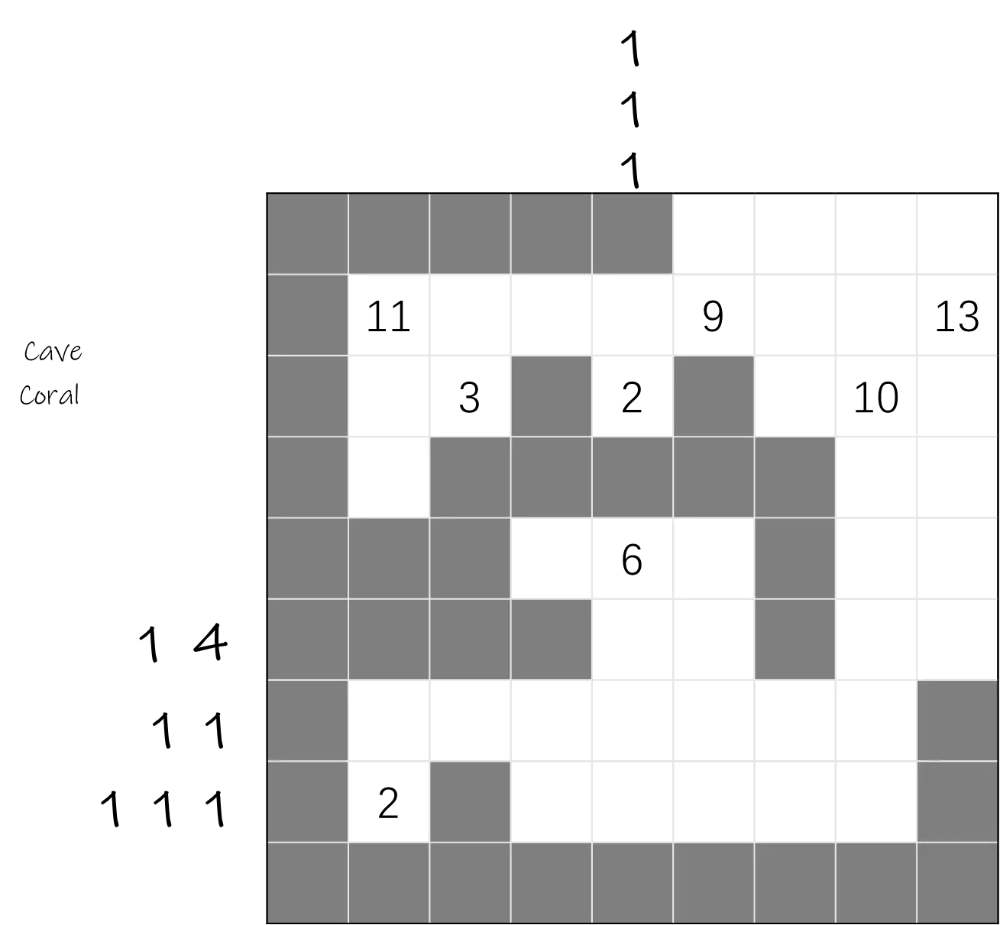

仔细观察可以发现，这四个谜题（五个规则）的共同点是，都是需要将一些格子涂黑。而最后一页不是纸笔谜题而是一个字阵，字阵与前面的题目大小刚好相同。

根据一般规律，我们应该读没有被涂黑的格子，并且题目文案（flavor text）里也写道“我都已经做完了，居然还能看见最后一页的字……”，因此本题需要读的是在四题中都没有被涂黑的格子，得到线索：**不知人间多少事的下半句宋诗**。答案是“**付与溪声自在流**”。

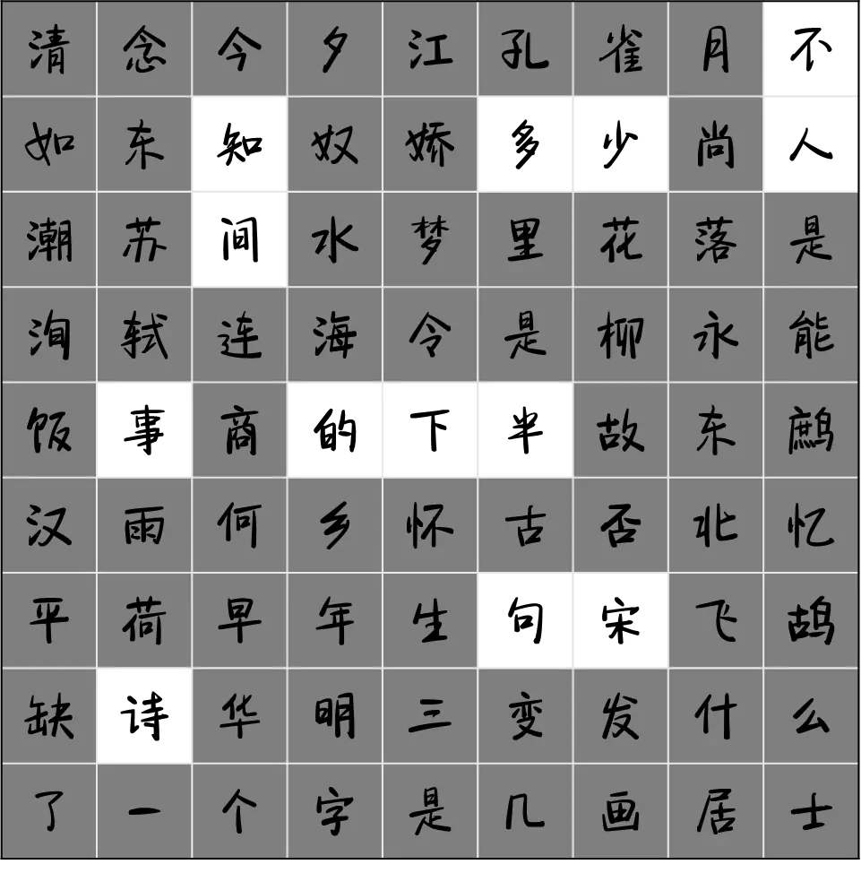

## 作者

五月（设计）；Winfrid（美工）

## 附言

### 五月

【明信片】与【做题别买盗版书】是姊妹题，作者的话一并完成。

有很多的纸笔谜题，是两种基础规则加在一起形成一个变种题。那么，如果我把这两个规则放在两页纸上，并且把叠在一起看，不也是同样的效果？从上述的出发点入手，既然 1、2 页是一道题，那 2、3 页是不是也能是一题？这样 2 页的规则在两道题里都被使用了。到提取部分，我还是使用了我自己比较擅长的手法——在字阵里取字。既然已经确定主题是“纸太薄”，那最后一页全叠在一起提取没有被挡住的字，就很自然。

在讨论设计思路时，Winfrid提出了另一个想法——

> 一个 2n×n 的单面盘面，不可做，只有找到某个手段折两道痕迹，这样正反两面就都有 n×n，各自可做。

这点子最后没采用，不过“折纸”给了我一些启发。我立刻联想到通过折纸能得到答案的一种思路，即【明信片】的最后一步。

讨论到这个阶段的时候，其实两个中谜都已经很成熟了，于是一不做二不休干脆都出。那配合折纸的小谜应该是什么样的呢？就是现在大家看的这样了，一些小题，答案都是能添加山/谷且带颜色的词。

### 生煎

觉得呈现形式比较自然流畅：想体现混合规则所以使用纸很薄作为解释。就像破碎的竹简，成语里有很多表示方位的字，就借助方位把目标字圈起来。这种衔接用到的是事物本身的性质，会觉得比较生活化、细致、逻辑通顺。
