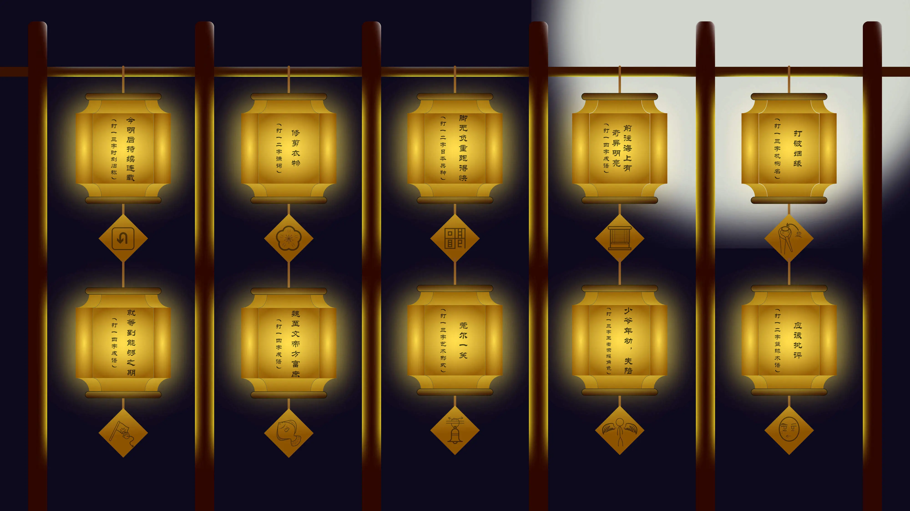

# 合格的灯谜

## 题面

:::info
[P&KU2：合格的灯谜](https://pnku2.pkupuzzle.art/#/game/miyu/prob_21)
:::

_出灯谜不难，出合格的灯谜才难。_

## 答案

更不轻离拆

## 解析

根据标题和题目，可以发现这是标准的灯谜，而且是有“谜格”的灯谜（这也正是标题“合格的灯谜”的来源）。谜格以图画的形式给出。认清谜格后可依次解开十个灯谜如下：

| 谜面               | 谜格   | 谜目         | 谜底         | 简析                     |
| ------------------ | ------ | ------------ | ------------ | ------------------------ |
| 今明后持续连载     | 调头格 | 旧称时刻     | 三**更**天   | 【更三天】调换一二字     |
| 就等到能够之期     | 移帜格 | 成语         | **更**待何时 | 【便待可时】单人旁移位   |
| 修剪衣物           | 梅花格 | 谦称         | **不**才     | 【布裁】的谐音           |
| 魏至文帝方富庶     | 比目格 | 成语         | **不**一而足 | 【丕而足】丕拆为不一     |
| 脚无负重跑得快     | 回文格 | 日本兵种     | 足**轻**     | 【足轻、轻足】           |
| 莞尔一笑           | 系铃格 | 艺术形式     | **轻**音乐   | 歪读为【轻音乐（le4）】  |
| 前往海上有奇异明亮 | 卷帘格 | 成语         | 光怪陆**离** | 【离陆怪光】反着读       |
| 少爷年幼，失陪     | 展翼格 | 王者荣耀角色 | 公孙**离**   | 【公子小离】子小合为孙   |
| 打破姻缘           | 鹤顶格 | 机构         | **拆**迁办   | 【拆牵绊】后二字取谐音   |
| 应该批评           | 半妆格 | 篮球术语     | 挡**拆**     | 去掉相同偏旁后为【当斥】 |

重新关注题目图案，十个灯谜两两相连，且相连的灯谜谜底均恰好有一字相同。提取这些字，得到答案：**更不轻离拆**。

## 作者

五月（设计）；Potto（美工）

## 附言

### 五月

此题完成于元宵节前后。

我没有什么道理的认为，既然 PKU2 的一区是一个以中文作为主要谜题基础的谜题大区，理所当然的应该有一些“自古以来大家有什么解谜活动”的探索。而灯谜就是其中之一。现代的灯谜已经逐渐式微，变成了跟谜语差不多的东西，不过我脑海中总是忘不了小时候家中那本介绍灯谜的书，书中写了很多各种各样的谜格，让我记忆犹新。倒没有复兴灯谜的打算，不过如果能借这道题目，为大家介绍介绍“老祖宗们是这么玩文字游戏”的，那就也挺不错。

出题过程要感谢 Winfrid。我能想到的点子就是比较直白的一个灯谜然后提取某一个字。是 Winfrid 提出了【使用两个答案的交】这个方案，这个方案绝对对于整个题目的可解性，以及对各种谜格的探索度，都有了极大地提升，让这个题目质量上升了不止一个量级。我对于这些属于 HUNT 的出题 technique 掌握的非常差，在出题过程中确实学会了很多。

### Potto

这道题其实在大年后没多久我就拿到了，但是制作得很晚（大概在内测的时候才做出来）。

### Winfrid

（这个附言写作于赛后五月份做纸笔走火入魔深刻反思的时候）

并没有谁规定 puzzle hunt 里一定要纸笔或者重逻辑的题目，并没有谁规定 puzzle hunt 里一定要有 crossword 和 cryptic clues，并没有谁规定 puzzle hunt 里一定要有音频/视频/交互，这一切都是出于出题人喜好而决定的。

~~所以我宣布下一届全都是灯谜。~~

严肃说起来，其实灯谜的谜格已经囊括了很多“英文 hunt 里的这个 wordplay 迁移到中文里会是怎么样呢”了，另外 cryptic clues 本身也与探骊格有一定的相似之处。中文 puzzle hunt 生搬硬套那些文字游戏是真的真的没有出路的……还不如直接出灯谜呢！

另外，这些灯谜囿于答案而很难称巧，还是成句作谜面能称得上妙，所以我觉得这里“莞尔一笑”的灯谜是最有趣的。
