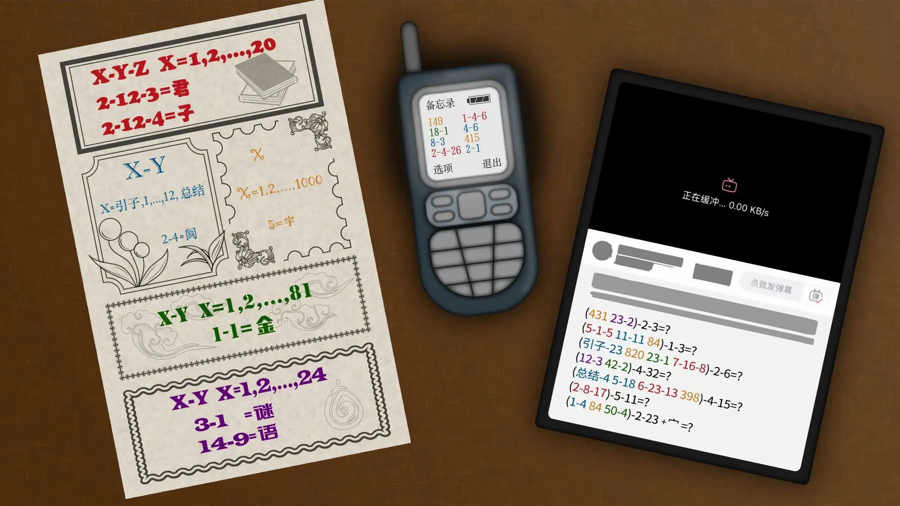

# 书虫的进化

## 题面

:::info
[P&KU2：书虫的进化](https://pnku2.pkupuzzle.art/#/game/miyu/prob_21)
:::

_都什么年代，还在看传统书籍？_

## 答案

不是冲泥送行客

## 解析

首先，这些其实都是 book cipher 的变种。如果 book 是字典，那么我们会用页数、列数、在该列中的次序这三个数来表示这个位置点。但是这里的 book 明显不像是字典，**我们需要自己去寻找密码本是什么**。所幸，题目给出了这五种坐标的表示里，某个数的取值范围以及一些例子。从而我们就可以逐渐意识到这些密码本是什么：

- 有二十章，且在其中存在相连的“君子”二字的，有很大可能是《论语》；
- 有不太常见的“阆”字，且是 12 个加上引子与总结为一系列的，很有可能是《红楼梦》里的组曲，且“阆”是“一个是阆苑仙葩”里的字；
- 有 81 个，并且第一个字是“金”，很容易联想到《西游记》的九九八十一难，第一难的确是“金蝉遭贬”；
- 只有一层索引，那么意味着这里 1-1000 的单位是“字”，有一千个字，明显是《千字文》，“宇”则是“宇宙洪荒”的字；
- 有 24 个为一组，尽管更有迷惑性的选项是二十四节气等，但事实上这是羋雨区的 24 个小题的标题构成的密码本。

理解了这部分之后，中间的部分就很轻松了。根据颜色以不同的密码本破译出来，能够发现这八个字都是数字，合起来是“四三五三三二六一”，联系旁边的九键密码暗示，可以得到 **ilem**。搜索之后可以发现，这是一位中文 VOCALOID 原创音乐人。

接着破译右侧的密码，可以转换成下面的内容：

- 飞虫-2-3
- 长名字-1-3
- 怀旧金曲-2-6
- 浊水-4-32
- 家养动物-4-15
- 酒-5-11
- 金字塔-2-23

而通过搜索不难发现，**这些词语在意义上都对应着 ilem 的某首歌**：“飞虫”对应《苍蝇》，“长名字”是《达拉崩吧》，“怀旧金曲”是《欧菲香》，“浊水”是《泥汤》，“家养动物”是《写给我家狗的歌》，“酒”是《大氿歌》，“金字塔”是《埃及方块》。

而了解了这一点之后，我们发现把歌词作为密码本是徒劳无功的，从而我们还需要确认下面这段 book cipher 是如何进行的。进行搜索或观察后可以发现，**ilem 会为自己的（几乎）每首歌写一段发布附言，并且均是以数字序号排列的**——而这正是我们需要搜索的密码本。详见附录。

我们得到了不、是、冲、泥、送、行、各。但是原图中第七个字的问号上方有一个宝盖头，暗示着我们需要转换成“客”，从而答案是“**不是冲泥送行客**”。

### 附录

> TODO: 后来人研究一下怎么加上 figcaption，我暂时没找到方法

## 作者

Winfrid（设计）；Potto（美工）

## 附言

### Winfrid

这题是在大年初一（1 月 23 日）创作的，总体耗时大约五小时（主要是凑答案和凑 clue）。

当时在思考另一个仓颉造字的点子，但因为各种点子的相互碰撞而出不出题，分外痛苦。但突然想到了 ilem 的简介格式这么一个非常简单的 idea——于是自然和 book cipher 想到了一起，又随即想到了[榆木华的原题](https://www.luogu.com.cn/blog/Akashiya/za-ti-fang-zhi-chu)，接着其它密码本的选定也很轻松，最后就自然放在了芈雨区，作为一道稀松的小题。

整道题在设计上其实有点空白邮票风格：几个部分有先后顺序，依次作指引。且用同一个主线一以贯之。

感谢教主，虽然 pv 谜已经有了相关的题目，但主要是 ilem 本身和 puzzle 的相性太好了，再有一道也没什么吧。

### Potto

这题也是大概在过年那会儿就拿到了，但是因为第一部分内容里有涉及芈雨区题目名字的部分，所以也是到很晚的时候定稿了才开始做的。最开始 winfrid 告诉我这题名字是“文献博物馆”，当时打算做成纸质黄页索引的样子。直到后来做到一半发现名字变成了“书虫的进化”，get 到纸质书-小灵通-平板电脑这个过程之后才改成了现在的样子。
