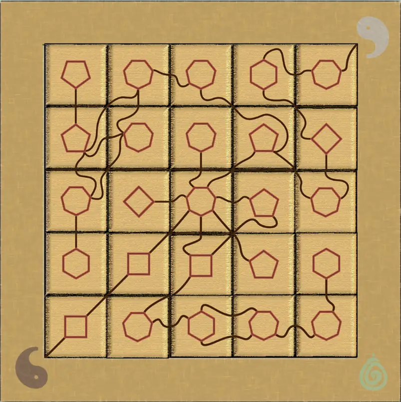
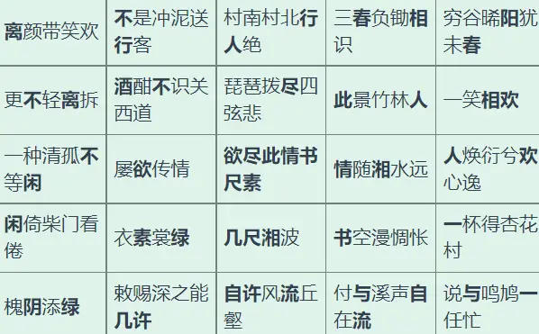

# Meta：春之秘语

## 题面

:::info
[P&KU2：Meta：春之秘语](https://pnku2.pkupuzzle.art/#/game/miyu/first_meta)
:::

_答案降临于阴阳之间……_

> 该题目含有一个交互的拼图组件。可以前往原题链接查看。

## 答案

欲尽此情书尺素

## 解析

一点进去，解题者就能看见一个拼图盘上面有 25 块拼图。点击任意两块拼图就可以将其交换位置。提交框内写着“欲尽此情书尺素”，且无法改动。玩家可以选择提交，但只会显示“"欲尽此情书尺素"的确是答案……但知道了答案又有什么意义呢？”

注意到左下右上的阴阳鱼，再加上给出的答案里恰好有一个“阴”一个“阳”；除此之外，中间的七边形既然一开始就在题版上，那么应该就对应着这道题的预设答案“欲尽此情书尺素”。而这七个字都在做出的答案里出现过！

所以，我们可以大胆猜测，每个多边形都是一句诗句（也即 24 个答案和“欲尽此情书尺素”），每个字占据了一个顶点。并且黑色的连线暗示着连线两端的汉字是相同的。

总之，通过推理，我们可以得到如下的正确拼盘：

## 作者

Winfrid（设计）；Potto（美工）；kinami（部署）

## 附言

### Winfrid

简单来说，这道题是故意营造“赛前就知道答案”的噱头加上“答案没有意义”的理念而存在的。

另外这道题也能看出 P&KU2 的（除了 PV meta 之外的） meta 的设计思路：理解 meta 的机制非常简单，但是随着拿到的答案越来越多，meta 的难度会指数型下降。说到底，meta 本来就应该只是一个检查小题做了多少的 checker，本质上和“做了八成的小题就放你进下一个区”应当没有区别。

“欲尽此情书尺素”这句诗当时是在写 P&KU2 的宣传文案的时候发现的，一看到就觉得“太合适了吧！”于是打算拿它作为一道关键谜题的答案。
