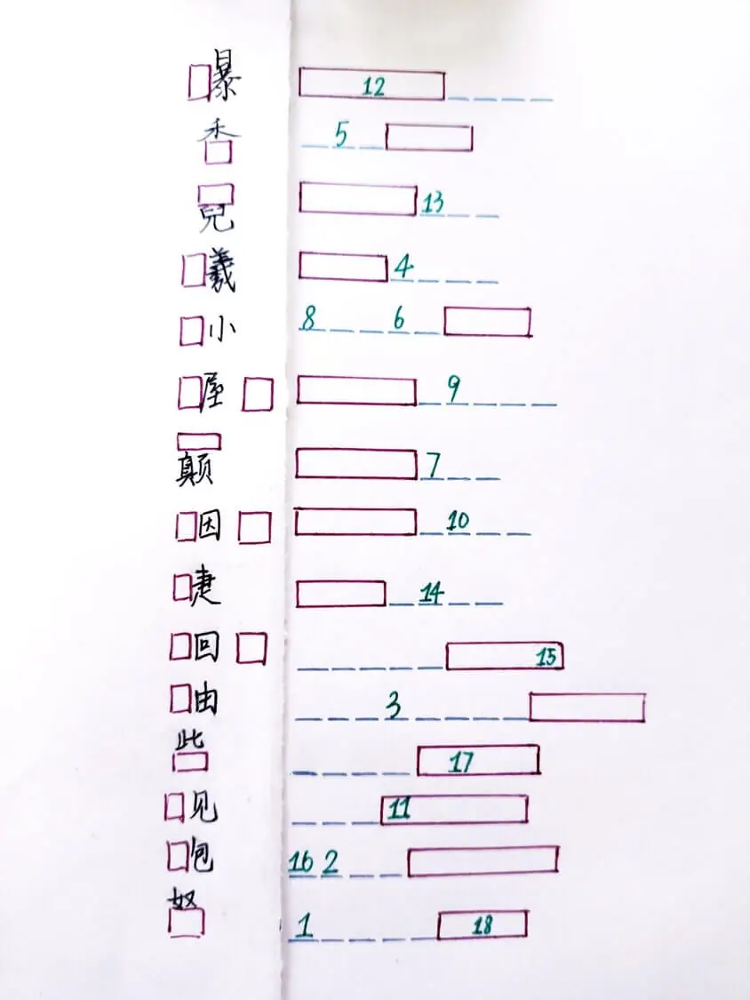
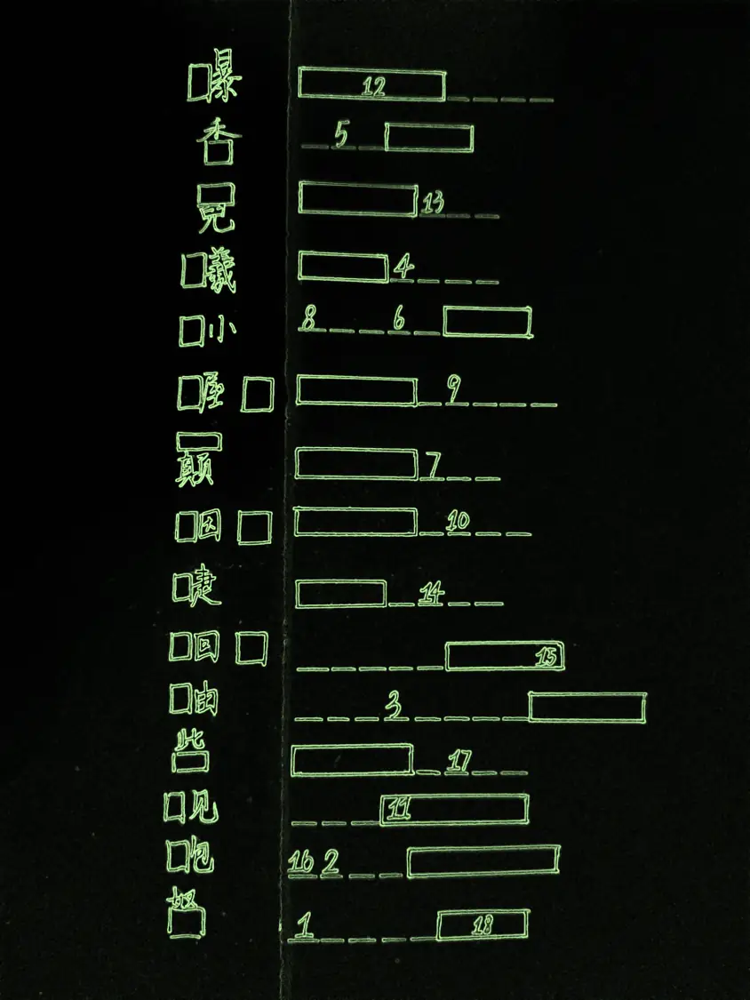

# 即兴

## 题面

:::info
[P&KU2：即兴](https://pnku2.pkupuzzle.art/#/game/miyue/winter_03)
:::
_午后的第三节课，无聊的人还在讲台上喋喋不休，吵闹。_
_草稿纸上，不知何时又落了几行文字。_

## 答案

CURRENT GHOST BAMBOO

## 解析

这道题的核心在于，每一行左侧的中文翻译成右侧的英文后，还能够在中文里拆字得到与右侧英文的其中一部分有着相同含义的构件（也就是每行的红框），而核心突破口之一则是 **睫=EYELASH，**而其中**目=EYE**。所有内容如下：

- 瀑=WATERFALL
- 季=SEASON
- 霓=RAINBOW
- 曦=SUNRISE
- 孙=GRANDSON
- 握手=HANDSHAKE
- 巅=HILLTOP
- 烟火=FIREWORK
- 睫=EYELASH
- 蛔虫=ROUNDWORM
- 鲉=SCORPIONFISH
- 柴=FIREWOOD
- 砚=INKSTONE
- 龅=BUCKTOOTH
- 弩=CROSSBOW

因此，找到各个数对应的字母，按顺序连在一起就可以得到答案 **CURRENT GHOST BAMBOO**。

## 作者

明夜（设计）；Winfrid（设计与美工）

## 附言

### 明夜

其实没啥好写的XD想说的都在TXT文档里了

怎么说呢，就是有种很奇妙的感觉，这道题原案季=sea+son 是很早以前想到的了，当时是我突然想到一个下联：海子四季春暖花开，是一个英文的拆字联，同时春暖花开也对应了四季，在征求上联（当然后面上联被一位大佬对出来了），后来这个 season 的巧合被我注意到了，就想着拿这个来出题。

当时没找到那么多，只找到了季和霓两个字，其余的都或多或少有点不自然，于是就出了一个 hiddle 形式的小谜题然后就搁置了，看到最后成品里有那么多，还是挺佩服赛事筹备组的

顺带一提，那个上联是： 费佳独别死屋手记（别：farewell）

### Winfrid

别的本事没有，凑的本事一流。毕竟是能凑出 ORME SHOE 这个诡异答案的人啊。

这道题的美工有一个版本是这样的，而对应的标题叫《霓虹色的文艺复兴》：

真丑，幸好没用。

### 生煎

idea 喜欢，但大部分字都是取普通的形旁，希望能找到更多特别一点的字。
