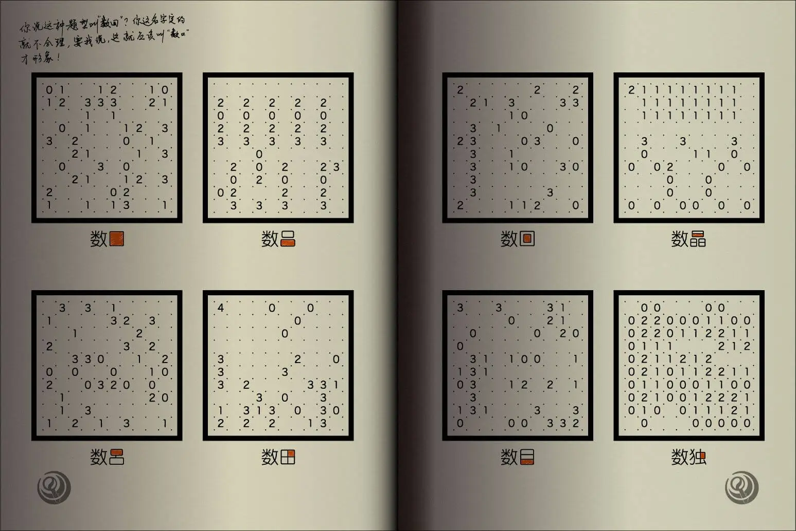
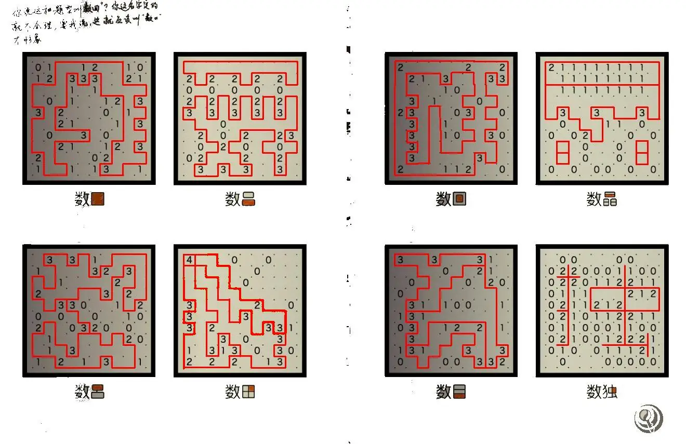

# 命名毋以讹传之

## 题面

:::info
[P&KU2：命名毋以讹传之](https://pnku2.pkupuzzle.art/#/game/miyue/winter_04)
:::

_只有起错的名字，没有叫错的外号。_

## 答案

ORME SHOE

## 解析

标准数回是一种要求玩家绘制回路的谜题。而根据题目，可以得知说话人认为单回路的样子与汉字“口”是（拓扑上）相同的。因此“数回”应该改名叫“数口”。根据以上逻辑，得到八个小题的规则：

- 数口：题目中的数字表示该数字旁的线段数量（下同），绘制单圈回路；
- 数吕：绘制两个不相连的单圈回路；
- 数呂：绘制两个单圈回路，并用一条线相连；
- 数田：绘制一个单圈回路，回路中有十字相交的两条线；
- 数回：绘制一个双圈回路（大圈套小圈）；
- 数晶：绘制三个回路，每个单圈回路中都有一条线段；
- 数目：绘制一个单圈回路，回路中有两条不相交的线段；
- 数独：绘制一个图形，使其为“独”字的拓扑等价图形。

理解八个小题后，可以得到八个题目的解答如下：

完成小题后，注意每个题目中“数X”的第二个字，均有一个闭合区域以高亮标识。在完成题目后，每题用高亮标识指示的区域均包含若干提示数字，取所有区域内数字的和，得到：15 18 13 5 19 8 15 5，转字母得到答案 **ORME SHOE**。

## 作者

五月（设计）；Potto（美工）

## 附言

### 五月

对于这个点子，我们是非常满意的，很有梗，也很容易懂，但逻辑谜题的出题对我们来说是一件很有挑战的事情。最终呈现结果如题目所展示，**以逻辑谜题的标准来要求，我自认是不够美观优雅的，但能力确实有限，请大家见谅。**

提几个自认比较有趣的小题，一个是数吕，出发点是以【2023】为主要元素出一个小题，废了挺大力气，但打补丁之后可能也不太容易看出2023了，只好在这里强行自己cue一下。

另一个就是“数独”了。一方面我对这个题目中小题设置的理解是：题目的设置应该是从“基础规则”到“似是而非”到“根本就是完全不同的东西”；另一方面想着玩家们做了7个小题后应该精神上已经很疲劳了，因此搞出了一个让玩家可以吐槽“这啥玩意啊！”的小题，希望玩家做到这里的时候可以会心一笑:)

另外，原本计划使用“数凸”，意在让玩家绘制一个凸多边形，但最终因为“凸”这个字本身不是个凸多边形而作罢。

### Winfrid

> 以逻辑谜题的标准来要求，我自认是不够美观优雅的，但能力确实有限，请大家见谅。

放心好了，毕竟还有更不美观优雅的答案。

其实 ORME SHOE 这个答案，发在别的题里估计是可以接受的，放在这里确实让玩家感觉很难受。但其实，五月当时一眼相中了这个只有八个字母的答案，于是悲剧就此发生。

### Potto

画这个图的时候抬头看到架子上放着的很久以前买的一本数独书，然后就直接参照那本书的排版了。我很喜欢这个题的点子，把数回的线与它名字的字形结合了起来，在改变原有的规则同时又让人觉得十分河里。另外也成功诞生了ormeshoe这个典，可喜可贺。
