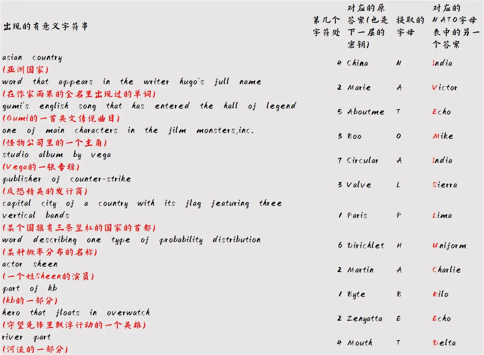

# 小谜题

## 题面

“它”发来的信笺。似乎是用古典的加密方式编织成的神秘谜题。

yhukwgkrayyldvwohtymekvuwrpettqlendtdkwzleadlrplemxodyhbeykgfdgtchdyknbdtchiqsmhiaxadorqjombonftckjdskvopxxvbygx
wjxyguqvcnrufcwocesoeiqheyfenjgqirnbvwiupirbwgwktypzntsamdrckotwestltlnhgulkvvjrvahafpvzuifdpcfoikloviplbjnixmix
ebreszjxdzrmvjyqmhrhtzexiiuezuwljgsaokcnhzzaxukybwjzqtuotphfbtynjtgtwfqqryytwupphkkjerewwrrpsrxhniuedpjfjrcbvewa
lifscjowlkduauxixgvasjasjvjfjivafyixzclbxjpjeqhmlzlljxtmyuqhlmptvekksqbkmoivvednowrkkrmozximyvykzzkzbtrgnxnmgcccum

<table>
    <thead>
    <tr>
        <th width="158">key</th>
        <th>←从这里开始</th>
    </tr>
    </thead>
    <tbody>
    <tr>
        <td>C_ _ _ _</td>
        <td>( _ _ _ _ _ _ _ _ _ _ _ _ )</td>
    </tr>
    <tr>
        <td>M _ _ _ _</td>
        <td>( _ _ _ _ _ _ _ _ _ _ _ _ _ _ _ _ _ _ _ _ _ _ _ _ _ _ _ _ _ _' _ _ _ _ _ _ _ _ _ )</td>
    </tr>
    <tr>
        <td>A _ _ _ _ _ _</td>
        <td>( _ _ _ _' _ _ _ _ _ _ _ _ _ _ _ _ _ _ _ _ _ _ _ _ _ _ _ _ _ _ _ _ _ _ _ _ _ _ _ _ _ _ _ _ _ )</td>
    </tr>
    <tr>
        <td>B _ _</td>
        <td>( _ _ _ _ _ _ _ _ _ _ _ _ _ _ _ _ _ _ _ _ _ _ _ _ _ _ _ _ _ _ _ _ _ _ _ _, _ _ _. )</td>
    </tr>
    <tr>
        <td>C _ _ _ _ _ _ _</td>
        <td>( _ _ _ _ _ _ _ _ _ _ _ _ _ _ _ _ _ )</td>
    </tr>
    <tr>
        <td>V _ _ _ _</td>
        <td>( _ _ _ _ _ _ _ _ _ _ _ _ _ _ _ _ _ _ - _ _ _ _ _ _ )</td>
    </tr>
    <tr>
        <td>P_ _ _ _</td>
        <td>
            {
                '( _ _ _ _ _ _ _ _ _ _ _ _ _ _ _ _ _ _ _ _ _ _ _ _ _ _ _ _ _ _ _ _ _ _ _ _ _ _ _ _ _ _ _ _ _ _ _ _ _ _ _ _ _ _ _ _ _ _ _ )'
            }
        </td>
    </tr>
    <tr>
        <td>D _ _ _ _ _ _ _ _</td>
        <td>( _ _ _ _ _ _ _ _ _ _ _ _ _ _ _ _ _ _ _ _ _ _ _ _ _ _ _ _ _ _ _ _ _ _ _ _ _ _ _ _ _ _ _ _ _ _ )</td>
    </tr>
    <tr>
        <td>M _ _ _ _ _</td>
        <td>( _ _ _ _ _ _ _ _ _ _ )</td>
    </tr>
    <tr>
        <td>b _ _ _</td>
        <td>{'( _ _ _ _ _ _ "_ _" )'}</td>
    </tr>
    <tr>
        <td>Z _ _ _ _ _ _ _</td>
        <td>( _ _ _ _ _ _ _ _ _ _ _ _ _ _ _ _ _ _ _ _ _ _ _ _ _ )</td>
    </tr>
    <tr>
        <td>m _ _ _ _</td>
        <td>( _ _ _ _ _ _ _ _ _ )</td>
    </tr>
    </tbody>
</table>

## 答案

I'VE MISLUCKED

## 解析

不难看出这道题的核心加密方式是维吉尼亚。使用key作为密钥之后，发现第一层会在第四个字符处出现有意义的短语asiancountry，正好能够填入表格第二行右侧的内容。于是根据左侧的C开头的提示，尝试用China作为下一层密钥，并删除asiancountry。

于是，下一层又可以得到新的描述……循环不断地解出最后的密文（每一层的密钥可以在下表找到），显示“well done now you can extract one letter from each key according to some details to get a clue. After that revisit the descriptions you have met.”——我们需要根据一些细节从每一个密钥里提取出一个字母，拼成一个线索，并借此去重新光顾我们遇到的这些描述。

其实，这里的细节就是“有意义的字符串”出现在上一层密钥解密完的的第几个字母。于是用有意义字符串的位置与密钥相匹配提取字母，得到NATOALPHABET，即北约字母表。

联系起之前解答过程中因为多解带来的明显的诡异感，一切都能解释得通了：其实之前的描述是双解描述，除了左侧标出的内容外，还能在北约字母表里有对应的答案。

找到新的答案，取代表的字母拼起来得到I've mislucked。

## 作者

Winfrid
