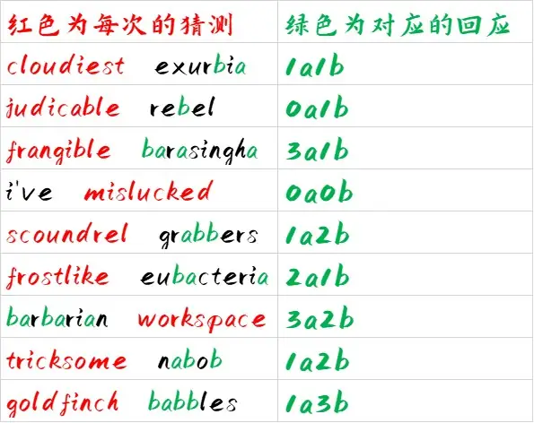
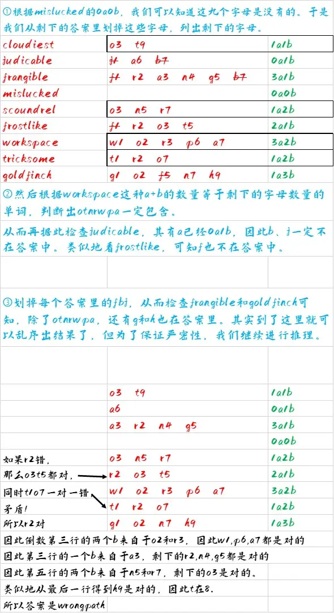

# Meta：荒岛

## 题面

荒岛的路标刻有模糊的一群字母，但我知道已有的回溯已足以斩断剩下的**1133836703999**种可能。

毕竟，每一次进行猜测，我都会得到一句来自于“它”的、正好能和猜测相配对的回应。

话说回来，它的回应里，bulls和cows是不等价的，**b**ears和ze**b**ras是等价的……

## 答案

WRONG PATH

## 解析

bulls and cows是一个游戏的名字，它最常见的名称是“1A2B”，规则是“答案是一个各位不相同的数，每次给出猜测，给出A和B的数量，其中A代表猜测里在正确位置上的数字的个数，B代表猜测里不在正确位置上、但出现在答案里的数字的个数。”

1133836703999=26\*25\*…\*19\*18-1，这代表着实际上答案和猜测都是互不相同的九位字母。

同时，注意到在之前的答案里，每个小题答案都有两个词语构成，而其中一个是各位不相同的九位单词，能够对得上这个游戏里每次给出的“猜测”。那么相对地，另外的单词就应该是“与猜测相匹配的回应”

而bears和zebras等价，根据给出的加粗和下划线可以看出，是因为它们a和b的数量各自一样，都是1A1B。根据这样的想法，我们整理出九次猜测与对应的回应。

根据上述信息，可以得到答案是wrongpath。具体推理过程的一种如下：

## 作者

Winfrid
