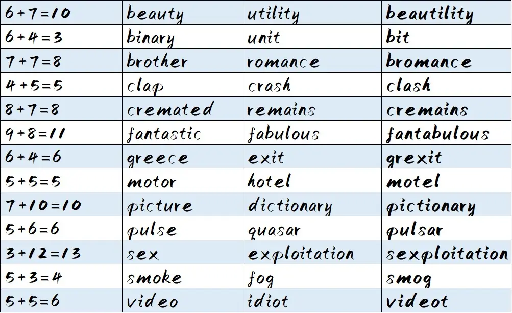
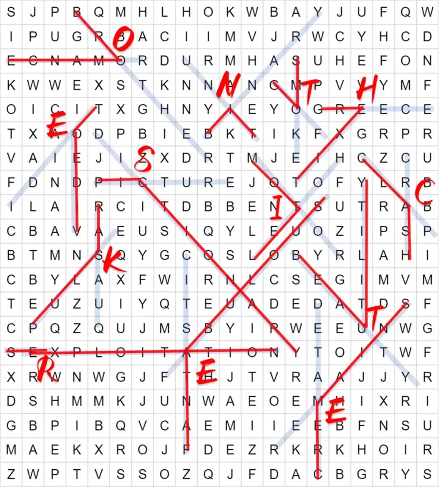

# 9+5=6

## 题面

这是……数学笔记？上面写的算式全是错的就不说了，更可恶的是居然还残留着早午饭的痕迹——依稀还能分辨出杂糅起来的究竟是什么味道……

<table>
    <thead>
    <tr>
        <th width="19">S</th>
        <th width="21">J</th>
        <th width="21">P</th>
        <th width="19">B</th>
        <th width="21">Q</th>
        <th width="19">M</th>
        <th width="19">H</th>
        <th width="21">L</th>
        <th width="18">H</th>
        <th width="21">O</th>
        <th width="19">K</th>
        <th width="21">W</th>
        <th width="19">B</th>
        <th width="21">A</th>
        <th width="21">Y</th>
        <th width="19">J</th>
        <th width="19">U</th>
        <th width="19">F</th>
        <th width="21">Q</th>
        <th width="21">W</th>
    </tr>
    </thead>
    <tbody>
    <tr>
        <td>I</td>
        <td>P</td>
        <td>U</td>
        <td>G</td>
        <td>R</td>
        <td>B</td>
        <td>A</td>
        <td>C</td>
        <td>I</td>
        <td>I</td>
        <td>M</td>
        <td>V</td>
        <td>J</td>
        <td>R</td>
        <td>W</td>
        <td>C</td>
        <td>Y</td>
        <td>H</td>
        <td>C</td>
        <td>D</td>
    </tr>
    <tr>
        <td>E</td>
        <td>C</td>
        <td>N</td>
        <td>A</td>
        <td>M</td>
        <td>O</td>
        <td>R</td>
        <td>D</td>
        <td>U</td>
        <td>R</td>
        <td>M</td>
        <td>H</td>
        <td>A</td>
        <td>S</td>
        <td>U</td>
        <td>H</td>
        <td>E</td>
        <td>F</td>
        <td>O</td>
        <td>N</td>
    </tr>
    <tr>
        <td>K</td>
        <td>W</td>
        <td>W</td>
        <td>E</td>
        <td>X</td>
        <td>S</td>
        <td>T</td>
        <td>K</td>
        <td>N</td>
        <td>N</td>
        <td>A</td>
        <td>N</td>
        <td>G</td>
        <td>M</td>
        <td>P</td>
        <td>V</td>
        <td>V</td>
        <td>Y</td>
        <td>M</td>
        <td>F</td>
    </tr>
    <tr>
        <td>O</td>
        <td>I</td>
        <td>C</td>
        <td>I</td>
        <td>T</td>
        <td>X</td>
        <td>G</td>
        <td>H</td>
        <td>N</td>
        <td>Y</td>
        <td>I</td>
        <td>E</td>
        <td>Y</td>
        <td>O</td>
        <td>G</td>
        <td>R</td>
        <td>E</td>
        <td>E</td>
        <td>C</td>
        <td>E</td>
    </tr>
    <tr>
        <td>T</td>
        <td>X</td>
        <td>A</td>
        <td>O</td>
        <td>D</td>
        <td>P</td>
        <td>B</td>
        <td>I</td>
        <td>E</td>
        <td>B</td>
        <td>K</td>
        <td>T</td>
        <td>L</td>
        <td>K</td>
        <td>F</td>
        <td>X</td>
        <td>G</td>
        <td>R</td>
        <td>P</td>
        <td>R</td>
    </tr>
    <tr>
        <td>V</td>
        <td>A</td>
        <td>I</td>
        <td>E</td>
        <td>J</td>
        <td>I</td>
        <td>Z</td>
        <td>X</td>
        <td>D</td>
        <td>R</td>
        <td>T</td>
        <td>M</td>
        <td>J</td>
        <td>E</td>
        <td>I</td>
        <td>H</td>
        <td>C</td>
        <td>Z</td>
        <td>C</td>
        <td>U</td>
    </tr>
    <tr>
        <td>F</td>
        <td>D</td>
        <td>N</td>
        <td>D</td>
        <td>P</td>
        <td>I</td>
        <td>C</td>
        <td>T</td>
        <td>U</td>
        <td>R</td>
        <td>E</td>
        <td>J</td>
        <td>O</td>
        <td>T</td>
        <td>O</td>
        <td>F</td>
        <td>Y</td>
        <td>L</td>
        <td>R</td>
        <td>B</td>
    </tr>
    <tr>
        <td>I</td>
        <td>L</td>
        <td>A</td>
        <td>I</td>
        <td>R</td>
        <td>C</td>
        <td>I</td>
        <td>T</td>
        <td>D</td>
        <td>B</td>
        <td>B</td>
        <td>E</td>
        <td>N</td>
        <td>T</td>
        <td>S</td>
        <td>U</td>
        <td>T</td>
        <td>R</td>
        <td>A</td>
        <td>B</td>
    </tr>
    <tr>
        <td>C</td>
        <td>B</td>
        <td>A</td>
        <td>V</td>
        <td>A</td>
        <td>E</td>
        <td>U</td>
        <td>S</td>
        <td>I</td>
        <td>Q</td>
        <td>Y</td>
        <td>L</td>
        <td>E</td>
        <td>U</td>
        <td>O</td>
        <td>Z</td>
        <td>I</td>
        <td>P</td>
        <td>S</td>
        <td>P</td>
    </tr>
    <tr>
        <td>B</td>
        <td>P</td>
        <td>K</td>
        <td>U</td>
        <td>S</td>
        <td>Q</td>
        <td>Y</td>
        <td>G</td>
        <td>C</td>
        <td>O</td>
        <td>S</td>
        <td>L</td>
        <td>O</td>
        <td>B</td>
        <td>Y</td>
        <td>R</td>
        <td>L</td>
        <td>A</td>
        <td>H</td>
        <td>I</td>
    </tr>
    <tr>
        <td>C</td>
        <td>B</td>
        <td>Y</td>
        <td>L</td>
        <td>A</td>
        <td>X</td>
        <td>F</td>
        <td>W</td>
        <td>I</td>
        <td>R</td>
        <td>N</td>
        <td>L</td>
        <td>C</td>
        <td>S</td>
        <td>E</td>
        <td>G</td>
        <td>I</td>
        <td>M</td>
        <td>V</td>
        <td>M</td>
    </tr>
    <tr>
        <td>T</td>
        <td>E</td>
        <td>U</td>
        <td>Z</td>
        <td>U</td>
        <td>I</td>
        <td>Y</td>
        <td>Q</td>
        <td>T</td>
        <td>E</td>
        <td>U</td>
        <td>A</td>
        <td>D</td>
        <td>E</td>
        <td>D</td>
        <td>A</td>
        <td>T</td>
        <td>D</td>
        <td>S</td>
        <td>F</td>
    </tr>
    <tr>
        <td>C</td>
        <td>P</td>
        <td>Q</td>
        <td>Z</td>
        <td>Q</td>
        <td>U</td>
        <td>J</td>
        <td>M</td>
        <td>S</td>
        <td>B</td>
        <td>Y</td>
        <td>I</td>
        <td>R</td>
        <td>W</td>
        <td>E</td>
        <td>E</td>
        <td>U</td>
        <td>N</td>
        <td>W</td>
        <td>G</td>
    </tr>
    <tr>
        <td>S</td>
        <td>E</td>
        <td>X</td>
        <td>P</td>
        <td>L</td>
        <td>O</td>
        <td>I</td>
        <td>T</td>
        <td>A</td>
        <td>T</td>
        <td>I</td>
        <td>O</td>
        <td>N</td>
        <td>Y</td>
        <td>T</td>
        <td>O</td>
        <td>I</td>
        <td>T</td>
        <td>W</td>
        <td>F</td>
    </tr>
    <tr>
        <td>X</td>
        <td>R</td>
        <td>W</td>
        <td>N</td>
        <td>W</td>
        <td>G</td>
        <td>J</td>
        <td>F</td>
        <td>T</td>
        <td>H</td>
        <td>J</td>
        <td>T</td>
        <td>V</td>
        <td>R</td>
        <td>A</td>
        <td>A</td>
        <td>J</td>
        <td>J</td>
        <td>Y</td>
        <td>R</td>
    </tr>
    <tr>
        <td>D</td>
        <td>S</td>
        <td>H</td>
        <td>M</td>
        <td>M</td>
        <td>K</td>
        <td>J</td>
        <td>U</td>
        <td>N</td>
        <td>W</td>
        <td>A</td>
        <td>E</td>
        <td>O</td>
        <td>E</td>
        <td>M</td>
        <td>H</td>
        <td>I</td>
        <td>X</td>
        <td>R</td>
        <td>I</td>
    </tr>
    <tr>
        <td>G</td>
        <td>B</td>
        <td>P</td>
        <td>I</td>
        <td>B</td>
        <td>Q</td>
        <td>V</td>
        <td>C</td>
        <td>A</td>
        <td>E</td>
        <td>M</td>
        <td>I</td>
        <td>I</td>
        <td>E</td>
        <td>E</td>
        <td>B</td>
        <td>F</td>
        <td>N</td>
        <td>S</td>
        <td>U</td>
    </tr>
    <tr>
        <td>M</td>
        <td>A</td>
        <td>E</td>
        <td>K</td>
        <td>X</td>
        <td>R</td>
        <td>O</td>
        <td>J</td>
        <td>F</td>
        <td>D</td>
        <td>E</td>
        <td>Z</td>
        <td>R</td>
        <td>K</td>
        <td>R</td>
        <td>K</td>
        <td>H</td>
        <td>O</td>
        <td>I</td>
        <td>R</td>
    </tr>
    <tr>
        <td>Z</td>
        <td>W</td>
        <td>P</td>
        <td>T</td>
        <td>V</td>
        <td>S</td>
        <td>S</td>
        <td>O</td>
        <td>Z</td>
        <td>Q</td>
        <td>J</td>
        <td>F</td>
        <td>D</td>
        <td>A</td>
        <td>C</td>
        <td>B</td>
        <td>G</td>
        <td>R</td>
        <td>Y</td>
        <td>S</td>
    </tr>
    </tbody>
</table>

6+7≠13
6+4≠10
7+7≠14
4+5≠9
8+7≠15
9+8≠17
6+4≠10
5+5≠10
7+10≠17
5+6≠11
3+12≠15
5+3≠8
5+5≠10

## 答案

ON THE SICK TREE

## 解析

“早午饭”暗示了这是一个blend主题的题目，其构词breakfast+lunch=brunch对应了标题9+5=6。于是能够发现，下面的算式其实是在暗示blendword的两个词的长度，而且其顺序是按照blendword首字母排序的。

带着这样的想法去wordsearch，我们发现找到的交叉的两个词语正好可以组成一个blending词语。

可以发现两个交叉的词语的交叉形状大相径庭，所以可以联想到旗语。按照顶点的从上到下、从左到右的顺序排列，得到on the sick tree。

## 作者

Winfrid
