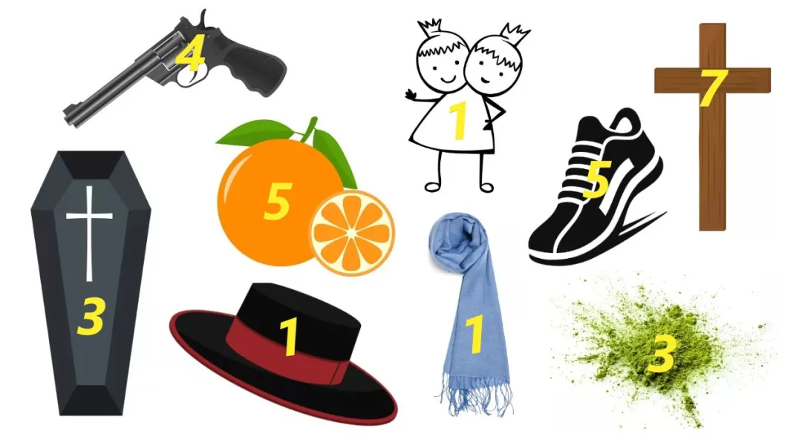
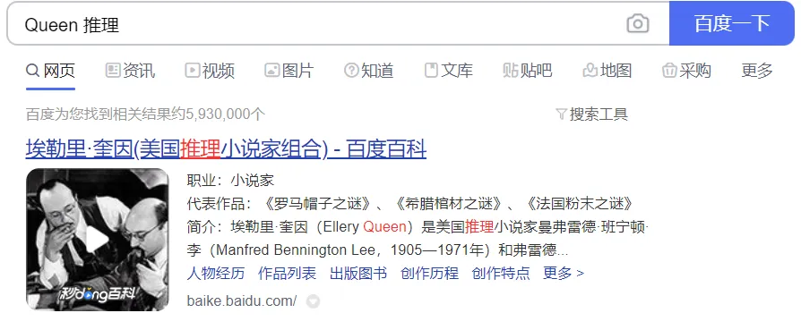
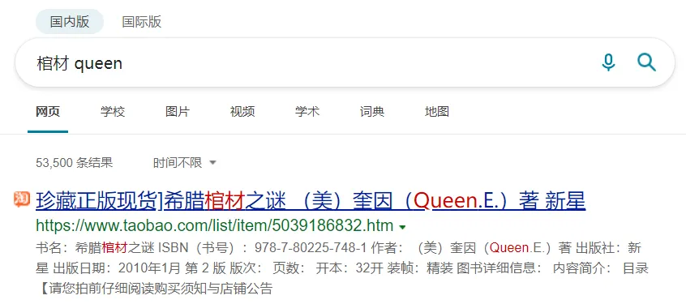

# A5

## 题面

“下午，你到了推理协会的摊位上。桌子上来自不同国家的物品显得很神秘。旁边一行小字介绍道：Maybe They Are Queen's Works…

## 答案

<AnswerBlock>REHEARSES</AnswerBlock>

## 解析

首先要确定这些物体到底是怎么和“不同国家”挂上钩的。每种物品对应的单词不是固定的，那么至少不是 wordplay。

联系“推理协会”和“Queen”，无论是什么搜索引擎，反复搜索“推理+Queen”、“Queen+棺材“、”棺材+橘子”等都可以得到正确的信息。

最后比对得到：

- The **R**oman Hat Mystery--1929《罗马帽子之谜》**（1）**

- The Fr**e**nch Powder Mystery--1930《法国粉末之谜》**（3）**

- The Dutc**h** Shoe Mystery--1931《荷兰鞋之谜》**（5）**

- The Gr**e**ek Coffin Mystery--1932《希腊棺材之谜》**（3）**

- The Egypti**a**n Cross Mystery--1932《埃及十字架之谜》**（7）**

- The Ame**r**ican Gun Mystery--1933《美国枪之谜》**（4）**

- The **S**iamese Twin Mystery--1933《暹罗连体人之谜》**（1）**

- The Chin**e**se Orange Mystery--1934《中国橘子之谜》**（5）**

- The **S**panish Cape Mystery--1935《西班牙披肩之谜》**（1）**

按标注的数字取对应国名的字母，按照出版时间顺序排列，得到答案 **【REHEARSES】**

（这道题最常见的误入歧途的方法是把Queen理解为皇后乐队，但问题是就和推理完全不沾边了；理解成“女王”也是一样。**这道题完全不需要预先知道奎因这个人，尽管他在推理小说界相当有名。**）
