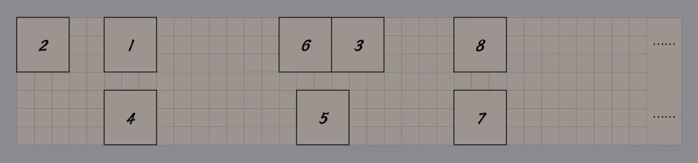
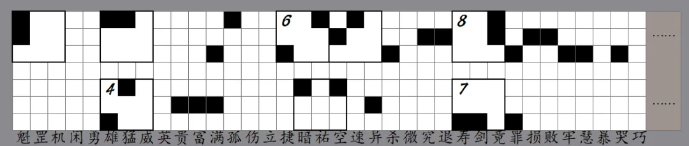
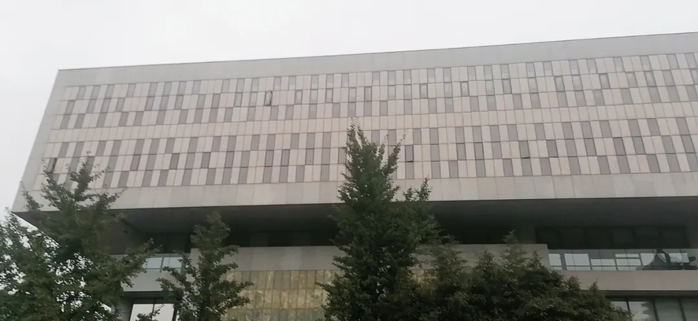
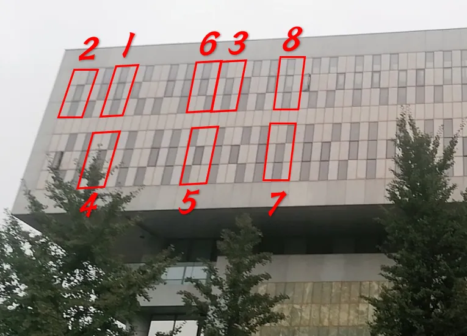

# D4

## 题面

“……到达指定地点后向东看它，旗子指示的内容即为答案。”

这里哪有点标旗啊，不是只有一张画有方格子的纸吗？还有……一首词？——拆开信封的你看到写的内容，自言自语着。

事到如今，毫无头绪的你在被逼上梁山之际，应该会像智取生辰纲那样灵光乍现吧。

---

    猛速孤祐竟雄魁

    魁空竟损败究退

    牢哭罪捷杀损慧

     

    暗空猛微

    异满富贵

    雄剑寿罪

## 答案

<AnswerBlock>DECEIVED</AnswerBlock>

## 解析

通过最后一句话的强烈暗示能够知道这首词和水浒传有关，随后搜索即可发现是 36 天罡。而下面的方格是 36\*7，中间有一行空白。所以能够发现只需要根据上面的词把下面的格子染色即可。

具体方法为：如果词里的某一行出现了某个 36 天罡星的一个，那么需要把下方对应行的对应位置的格子染黑。例如，第一行出现了“魁”，那么需要把下面第一行的第一个方格染黑。

 

（这一步主要问题在于大家没意识到上面的词实际上是7行而非6行）

根据“旗子”的暗示，转旗语，按数字排序即可。得到 topkulaw。

作为答案输入，会发现答案不对。这时候再次读题，发现可能要实景前往（校外组的等价方案是用百度地图的实景功能）。

 

“向东看它”，这句话暗示了要观察凯原楼的西立面。但大多数选手都找了半天旗子，事实上，真正的信息是凯原楼西立面的窗户。
它的配色风格和方格纸的配色风格形成了 crosscheck，也解释了最右侧的省略号的含义。

再次旗语。这次的旗语带有九宫格中间的方格。答案是【deceived】。

## 作者的话

本题是这次比赛里难度最高也是质量最好的题目。虽然卡人的显性时间不及 metaC 和 finalmeta，但也耗费了选手的很多脑细胞。

法院窗户的选材主要脱胎于城市定向第二季的终极谜题，不过这次采用的是把窗户作为密文而不是加密方法。

然后，起初这道题是盲文题材，后来觉得太受限制，就改为了旗语。一开始只有第二层一层，被某个 staff 批评了之后多加了一层，让这道题变得更加有“柳暗花明又一村”之感。

然后这道题原先的校外组等价提示计划是直接给一个法学院的图片。但这样就让这道题掉价了，直到比赛开赛前前几天笔者才敲定了这个提示方法。
