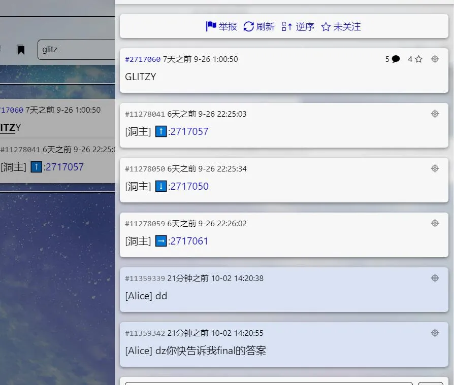
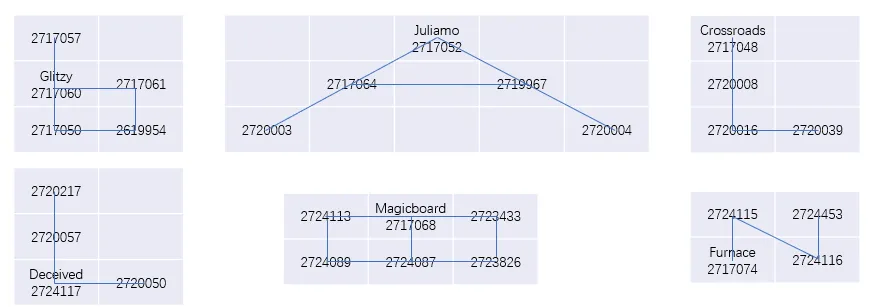

# metaD

## 题面

你终于步出意识的思流，但，接下来要去哪里把这些纷乱断裂的链条接起来呢？

你望了望四周。戎马关山，佳期堤下，野旷天低，遥望、庭山水色。你似乎知道应该去哪里找到最后的答案了。

## 答案

<AnswerBlock>BALLOON</AnswerBlock>

## 解析

戎马关山（北），佳期（大）堤下，野旷天低（树），遥望（洞）庭山水色，连起来就是北大树洞（北大的一个匿名论坛）。那显然，直接在树洞里直接搜索各小题单词即可。

不难发现可以通过位置关系得到树洞间的隧道的图。

一开始设计的时候觉得用树洞间的引用关系模拟树洞间的地下通道，如是探索非常炫酷。但是由于没有注意分散树洞，很容易被反推，就很麻。（幸而对fm没有影响，但是如果D4放在D5的位置，就更能防爆了）

 

象形得到【balloon】
