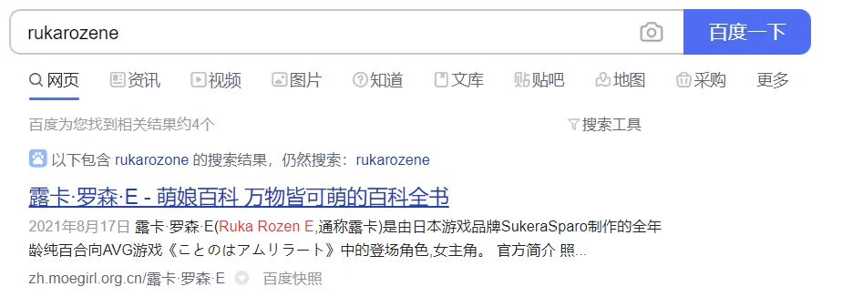
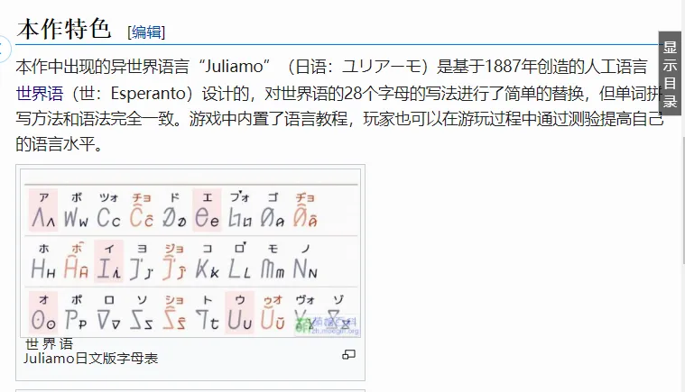

# D2

## 题面

“天哪，这是什么语言……不对，怎么看起来还不止一种？”

“这是我送给你的礼物哦。**虽然包装上沾上了一点莫名其妙的东西——可能里面也沾上了——但不用管它。快把这个礼物拆开来吧。**”

    泰分豪hh萨维吾部一尔海地克第里准奥hh标尔比哈码尔编亚言hh美语尼亚织俄格组鲁吉hh化亚准罗马hh尼亚标汉hh希伯际来尼hh泊尔国

## 答案

<AnswerBlock>JULIAMO</AnswerBlock>

## 解析

红字暗示了答案是一种语言。

粗体部分暗示了这道题的解法。首先先不用管“莫名其妙的东西”（也就是hh），然后把它“拆开来”。

 

泰分豪萨维吾部一尔海地克第里准奥标尔比哈码尔编亚言美语尼亚织俄格组鲁吉化亚准罗马尼亚标汉希伯际来尼泊尔国

 

红字部分倒序暗示了ISO639-1，查阅发现是一个把语言用双字母代码表示的标准。于是注意到剩下的部分都指代了一种语言。进行转换。

 

- th泰语
- ha豪萨语
- ug维吾尔语
- ht海地克里奥尔语
- bh比哈尔语
- hy亚美尼亚语
- ru俄语
- ka格鲁吉亚语
- ro罗马尼亚语
- zh汉语
- he希伯来语
- ne尼泊尔语

 

得到一句话：**thhaughtbhhyrukarozhhene**

 

联系题干的“可能里面也沾上了”，再重复一边操作把hh划去。得到：**taughtbyrukarozene**

这时候查询rukarozene（这次只有万能的度娘能出结果XD，当然也要归功于萌百）

发现是全年龄百合向AVG游戏《恋语 Juliamo -amrilata lingvo-》的女主。阅读词条：

得到答案【Juliamo】
