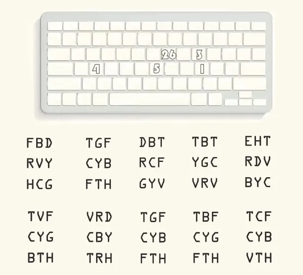
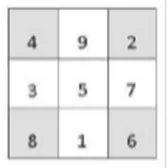
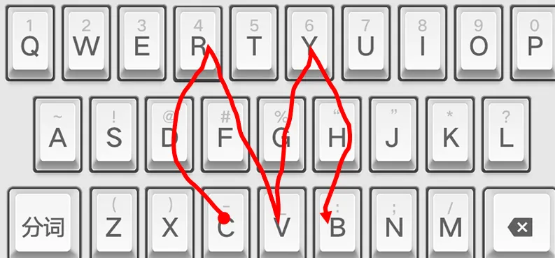

# D5

## 题面

<span className="text-red-600">你的脑海里飞快闪过许多字符乱码。</span>
幸而，你眼前的键盘上还残留着上一个人于其上留下的痕迹。



## 答案

<AnswerBlock>MAGICBOARD</AnswerBlock>

## 解析

首先，按数字顺序提取键盘上的字母，得到 LUOSHU，从而得到关于洛书的一个幻方。



然后就是按数字顺序提取宫格内的字母，得到 10 个长度为 9 的字符串。（事实上，据本题出题人所说，这一步和上一步实质是相同的，都是按数字顺序给对应位置的字母排序。但很难让人 get 到）

```
CDRFVGYHB
TFCTYHBFG
YTRDCVFGB
RTYTGVCVB
YTREDCVBH
TFCTYHGBV
RDCVBHYTR
TFCTYHBFG
TFCTYHGFB
TFCTYHBVC
```

最后利用第一步的突兀的键盘、字符串中字母都是大写、字符串都挤在一起且字母大多相邻可知，在键盘上把每个字符串按顺序划线，以画出 10 个字母的形状。



最后得到答案【magicboard】。
