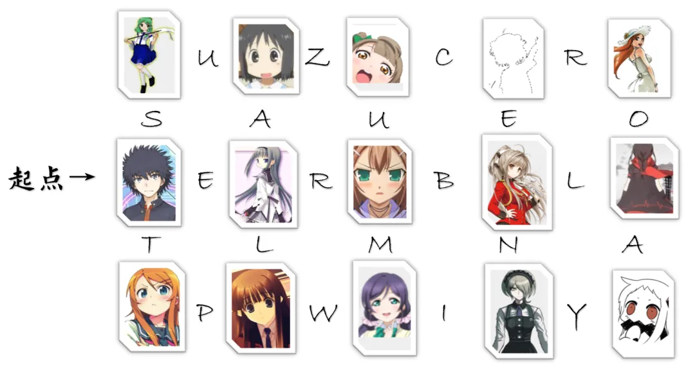
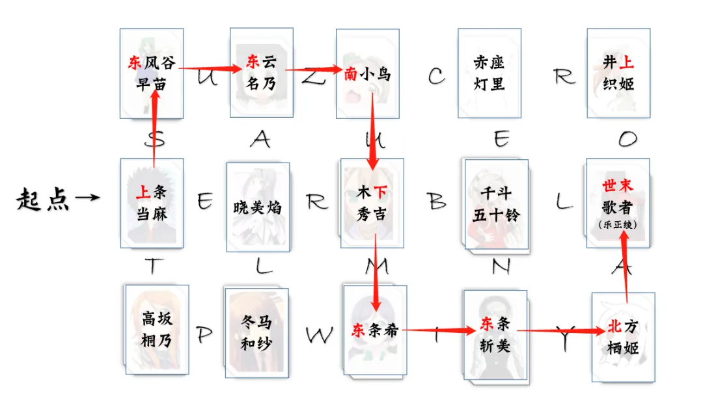

# A2

## 题面

清晨时分，各个摊位上还冷冷清清地没几个人。你向一个摊位上随便看了一眼，发现它桌子上摆着一张打印了许多字母和可爱的图像的纸。

你翻开它，纸的背面写着：“听从遇到的NPC的指示，从起点走到世界的末端吧。”

## 答案

<AnswerBlock>SUZUMIYA</AnswerBlock>

## 解析

用搜索引擎识图或用强大的肉眼鉴别识别出名字，发现每个人物的中文译名都含有**方位词**。而终点是《世末歌者》的封面图。

取路径上的字母得到答案 **【SUZUMIYA】**，是**凉宫**春日。

（这种题目恰好是会在元火的春晚/社庆上出现的那种互动题——上次有一道斐波那契数列的题还挺令人印象深刻的。）
