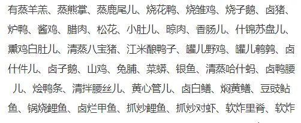

# A4

## 题面

_“我听说您最近出趟门儿，我请您吃个便饭。您想吃什么？”_ 
_“香肠儿、什锦苏盘儿、烧花鸭、江米酿鸭子、酱鸡、香肠儿、松花、罐儿野鸡——”_ 
_“够了够了，您别说了，我这就去操办。”_

还没吃午饭的你听到这段对话，更加饥肠辘辘了。不过，**你却发现了这段对话的端倪……**

## 答案

<AnswerBlock>NODRINKS</AnswerBlock>

## 解析

把那串奇怪的话丢进搜索引擎，发现是经典贯口《报菜名》。它有很多版本，而 “我听说您最近出趟门儿，我请您吃个便饭。”能够确定是**郭启儒**版本的。

对照上述贯口得到顺序是“14、15、4、18、9、14、11、19”。

数字转字母（A1Z26）得到 **【NODRINKS】**。端倪是“没有喝的”，也算是一个恶趣味。
