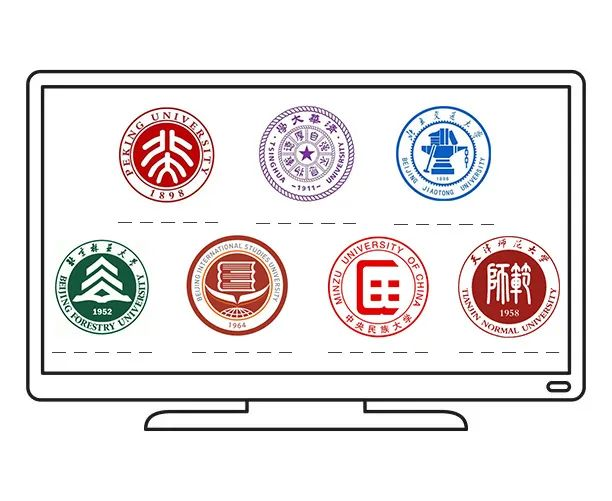
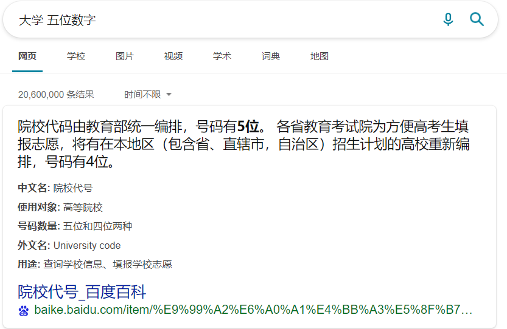

# B1

## 题面

电脑屏幕上的都是你心仪的院校，可惜都离最好的专业**差了几分**，大概率是要去学化学了吧。不过如何在招生手册上找到它们呢？

## 答案

{' '}
<AnswerBlock>BARIUM</AnswerBlock>

## 解析

对于经历过中国高考填完了志愿的人而言，非常简单就可以意识到每个校徽下的五个空格就是院校代号。当然也可以通过搜索引擎完成这一点。

查找得到：北京大学（10001），清华大学（10003），北京交通大学（10004），北京林业大学（10022），北京第二外国语学校（10031），中央民族大学（10052），天津师范大学（10065）

由于65等数字已经大于26，所以直接取最后两位转字母的做法是不可行的。事实上对于较大数字的常见处理方法是差分，当然题干里的“**差了几分**”也暗示了这一点。差分得到数串“2,1,18,9,21,13”，转字母得到答案 **【BARIUM】**
