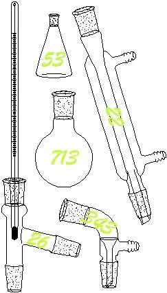
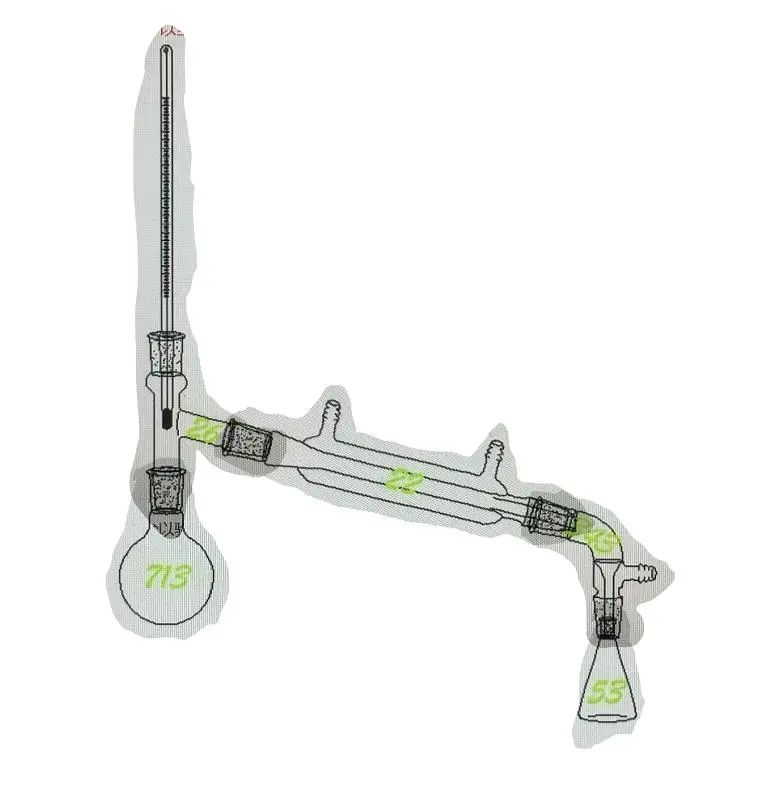

# B2

## 题面

**放下手机**，你发现实验台杂乱至极，以至于你忘了你正在寻找的东西在哪里。

## 答案

<AnswerBlock>PENCIL</AnswerBlock>

## 解析

是出现在高一化学的蒸馏装置。先搭好。

搭好后从左到右（气流顺序）得到一串数字：713 26 22 343 53

根据题目里的“放下手机”意识到是九键密码，故重组为：71 32 62 23 43 53，转字母得到答案 **【PENCIL】**
