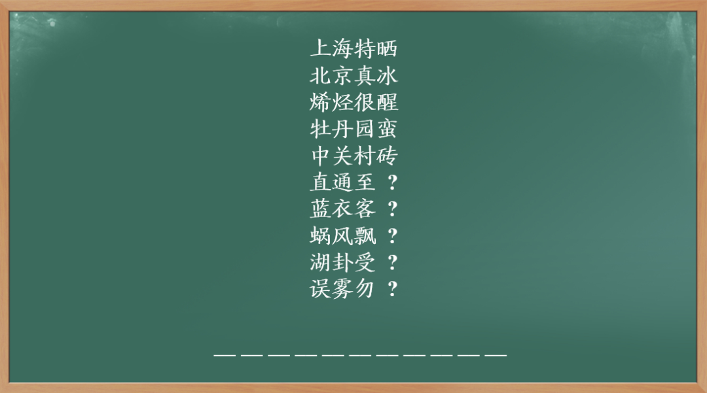
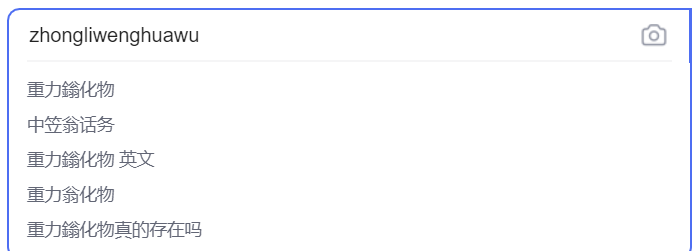
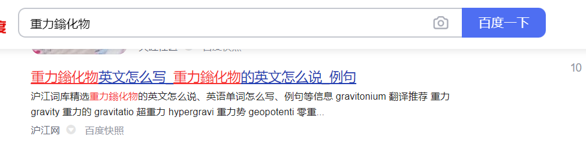

# B4

## 题面

组会开始前，黑板上的字迹。不知道这是哪个组研究的奇怪东西。

## 答案

<AnswerBlock>GRAVITONIUM</AnswerBlock>

## 解答

根据前几行字能够意识到是读音上的规律（最后一行更印证了这一点）。细究发现，最后一个字的声母和第一个字相同，韵母和第二个字相同，声调和第三个字相同，也就是**“反切”**的一种形式。

据此得到五个汉字是“重力鎓化物”，或者可以让搜索引擎自动联想。

去寻找翻译。发现这个物质对应的元素是《神盾局特工》虚构的，元素符号是Gr。

得到答案 **【GRAVITONIUM】**，也就是这个组在研究这么个东西。
