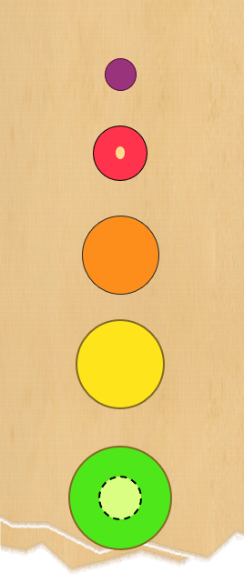
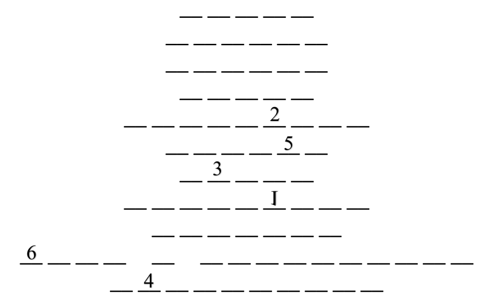

# B5

## 题面

实验室抽屉里混进了奇怪的纸片，上面画着很多圆。

## 答案

<AnswerBlock>BREATH</AnswerBlock>

## 解析

尽管忽略了很多细节，但还是能够看出这是2021上半年比较流行的H5小游戏**合成大西瓜**。

而下面有十行，也对应了游戏里的十个物体。

（本题采取的是看起来最对的一种说法：葡萄而非山竹、樱桃而非苹果、橘子而非南瓜、桃子而非木瓜，具体可以上网搜索一些考据文章观看）

- grape

- cherry

- orange

- lemon

- kiwifruit

- tomato

- peach

- pineapple

- coconut

- half a watermelon

- watermelon

注意到“1”是垂直翻转的，按标注的顺序取字母，可以得到最后的答案 **【BREATH】**
