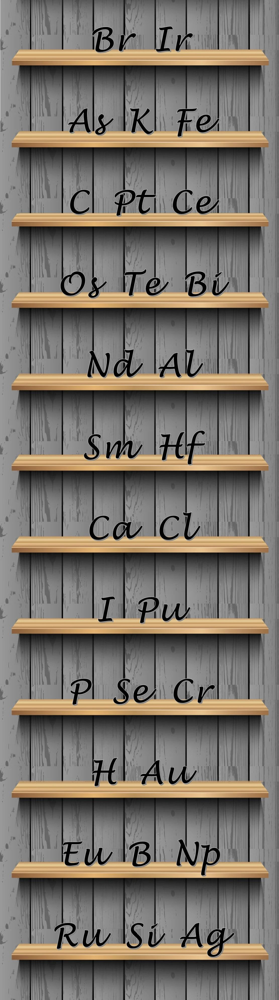
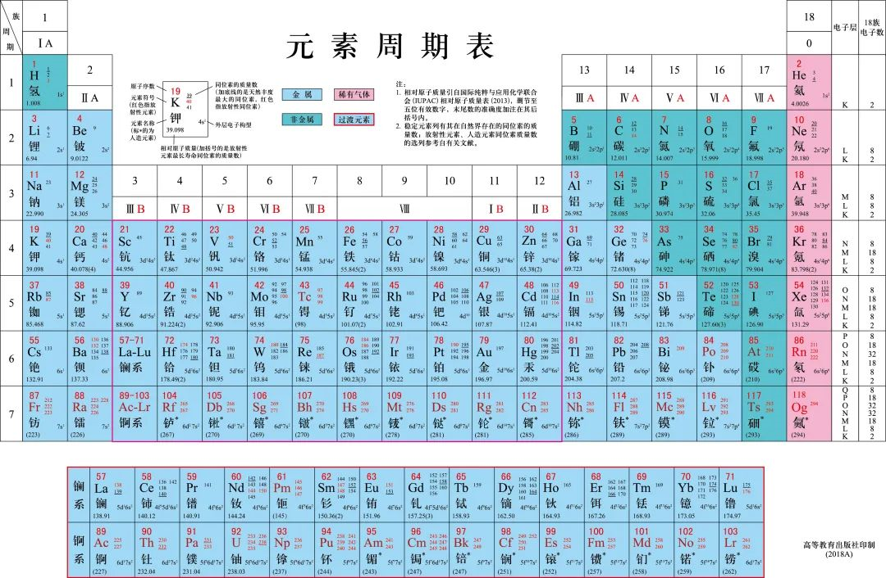
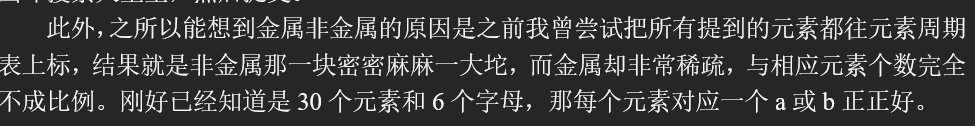

# B6

## 题面

在化学药品储存室的墙上贴着如下的图片。

## 答案

<AnswerBlock>URANUS</AnswerBlock>

## 解析

本题的关键在于取每行的首字母得到key hint**【Bacon's Cipher】**，也就是培根密码。培根密码需要一种对立的分类方式，对于元素而言，几种常见的分类方式是主族副族，还有就是**金属非金属**（它们甚至就是元素周期表的底色）。

如果按照大小写字母对字母划分，发现不是5的倍数，得出来的答案也没有意义。

如果按主族为A，副族为B，会发现“C Pt Ce Os Te”是ABBBA，超出了范围。反过来就更超过范围了。

如果按单双字母来划分，只能是双字母A，单字母B。这就可以得到crafer，输入进去能够得到一个提示“有没有更化学的方法呢？”

所以殊途同归，最终唯一的道路，也是最明显的道路就是按金属非金属划分。

- BABAA (U)

- BAAAB (R)

- AAAAA (A)

- ABBAB (N)

- BABAA (U)

- BAABA (S)

答案是 **【URANUS】**

另外，有一个队伍给出了非常精妙的逻辑推理：

