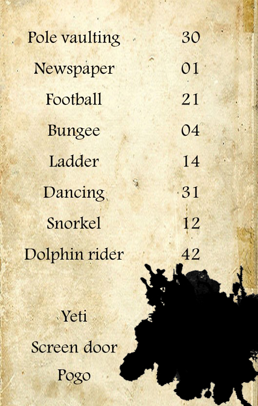
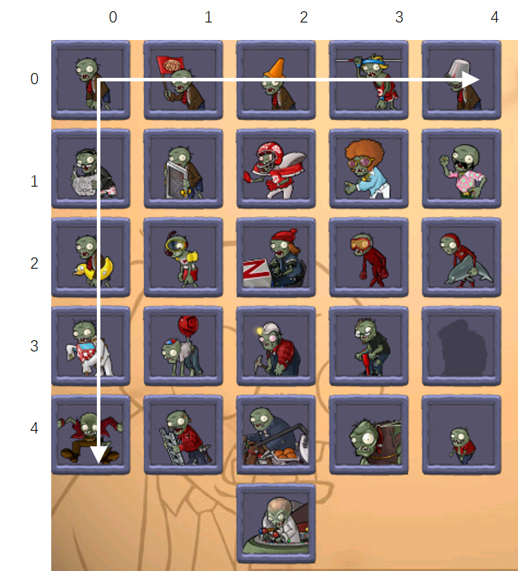

# C3

## 题面

你在一个不知道是上什么课的教室外捡到了一张满是墨水的牛皮纸。Snorkel, bungee, pole vaulting... 最左边一列列出来的活动也太后浪了一些吧。等等……ladder又是什么？

不过你此刻更关心的其实是被墨水挡住的数，它们会是什么呢？

## 答案

<AnswerBlock>00431133</AnswerBlock>

## 解析

随便翻译一些出来，尤其是dophin rider，很容易能发现实际上是植物大战僵尸里僵尸的职业，比如dancing实际上是dancing zombie。

下面要处理的就是那些数字。注意到数字都在0-4的范围，于是猜测是5*5的一个方阵，于是如果接触过植物大战僵尸，可以根据自己的经验发现是僵尸图鉴。

以此类推，三个僵尸对应的数字分别就是：雪人僵尸（43），铁纱门僵尸（11），跳跳僵尸（33）。另一陷阱是这里的空格实际上也表示僵尸，是普通僵尸（zombie，00）

得到答案 **【00431133】**