# metaC

## 题面

第一次有了喜欢的课，第一次尝试着给它投意愿点。双重的快乐交织在一起，而它们，又指引给我更多的课……

所以接下来我该去哪呢？

## 答案

<AnswerBlock>FALLING OUT</AnswerBlock>

## 解析

显然这个区域的题目都和校内课程有关，能够意识到八位数指的是课号。去选课网/教务查询系统能够找到对应的课程——像这样：

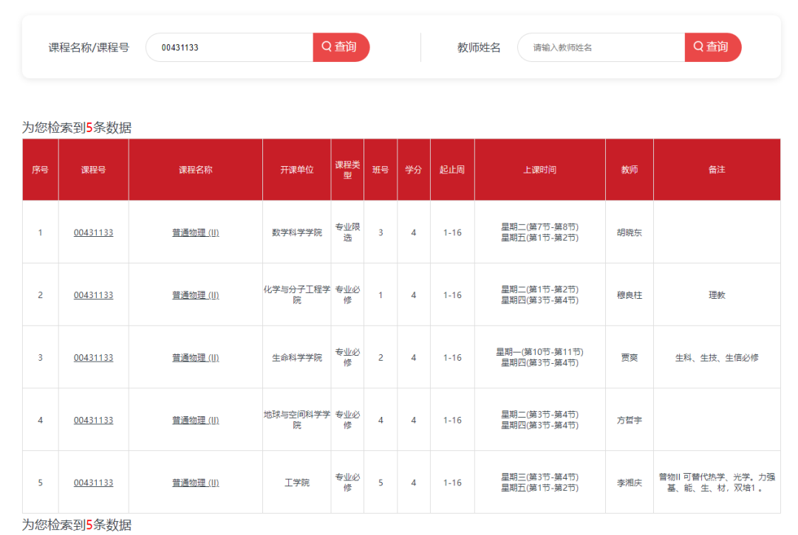

课程如下：

- 伦理学原理著作选读

- 教育理论与教育实践

- 普通物理（II）

- 太阳大气层与日球层物理学

下一步当然是利用“双重”。但是如何使用呢？

大家第一时间想到的是去取课名里重复的字眼，但**发现《普通物理》没有**后都放弃了。转而产生了很多种方案——有的尝试着找不同课之间的重复字眼，比如“教育”、“物理”，有的尝试着找开课院系的连线交点（如果取普通物理在化院，交点正好在博雅塔），有的尝试在课表上排课……

但真的没有吗？

- 伦理学原理著作选读

- 教育理论与教育实践

- 普通物理（II）

- 太阳大气层与日球层物理学

校内的同学可以意识到是“理教一层”，校外的同学在查询过程中也见过“理教”这个词（见上图的第二行最右列）。即便没有意识到，输入“理教育I层”也能得到自动回复的提示。

得到答案 **【理教一/I/1层】**

输入会触发下一步。

 

里层题：

你到了那里，尝试着把每一个你要找的东西的痕迹**收集相加**，拼凑成你试图发现的真相。

（图片的上方是西）

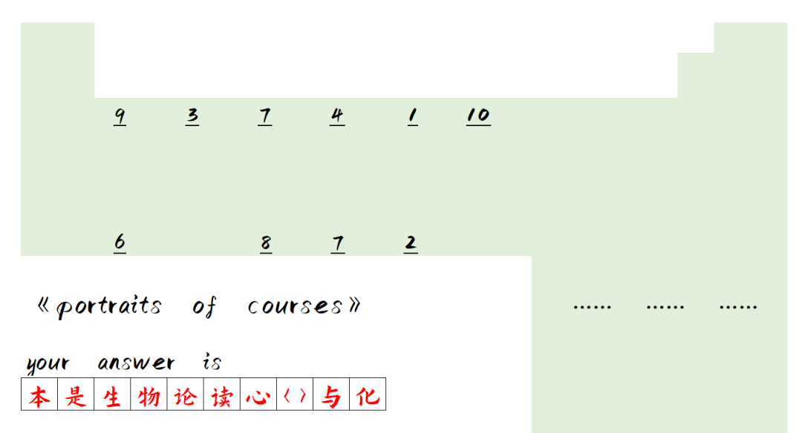

**校内组：**

需要到达理教一层找到地图上的地方，对照这张图根据标题的暗示发现每个数字标注的地方都有一块肖像，每个肖像右下角都有介绍，介绍了这个老师所任教的**通识核心课**的课程。

整理如下：

- 《普通生物学》：9

- 《生物进化论》：3

- 《化学与社会》：上侧的7

- 《影像与社会》：4

- 《尼采〈查拉图斯特拉如是说〉》：1

- 《中国古代政治与文化》：10

- 《〈资本论〉选读》：6

- 《〈四书〉精读》：8

- 《实验心理学》：下侧的7

- 《西方美术史》：2

根据“收集相加”的暗示，把每个字出现过的课程的对应数字相加，转字母。

- 本：6=f

- 是：1=a

- 生：9+3=12=l

- 物：9+3=12=l

- 论：3+6=9=i

- 读：6+8=14=n

- 心：7=g

- 〈〉：1+6+8=15=o

- 与：7+4+10=21=u

- 化：3+7+10=20=t

得到答案 **【FALLING OUT】**

---

**校外组的等价部分：**

校外组和校内组的不同在于无法实景解谜，是通过37张照片复刻出这个场景的。首先校外组会经历一个漫长的百度网盘下载过程（orz）。

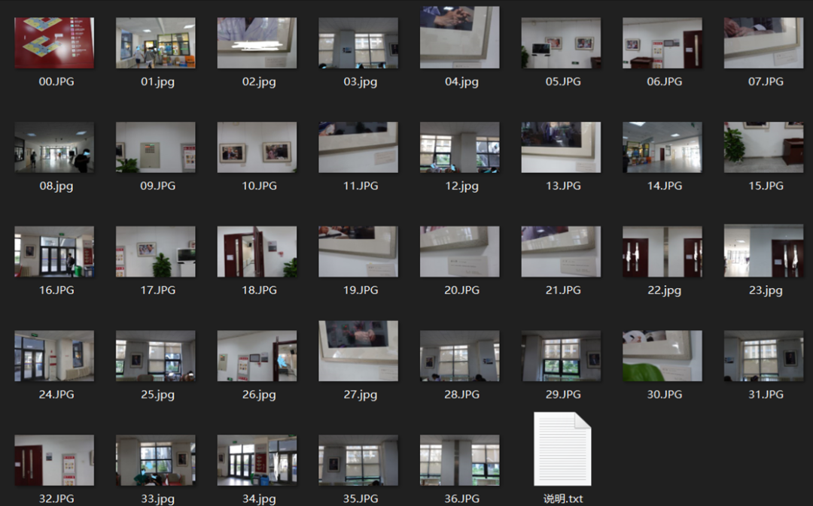

这37张图片除了第一张图的地图外，还可以大致分为两类。一类是细节（B），一类是大致的轮廓（A）。

A类是用来了解每个肖像所处的位置及位置关系，完全看不清细节（大多数针对像素太低的吐槽都是在说这个——但是我们完全没有想要让选手从这类照片看出具体标牌信息）。

B类是用来了解每个肖像右下角的具体介绍的，照片上往往有**肖像的一角+课程信息**。因此能够和肖像勾连起来。

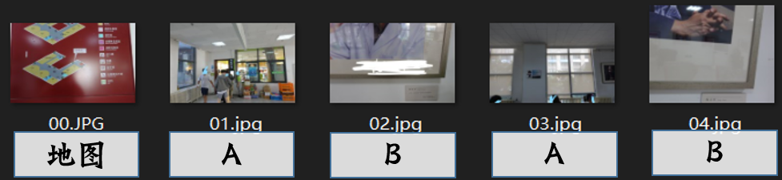

**于是正确的思路是先通过A类图找到大致的位置关系，确认肖像-题图数字的关系。**再用B类图确认肖像-课程的关系。借用一个dalao队的草稿——

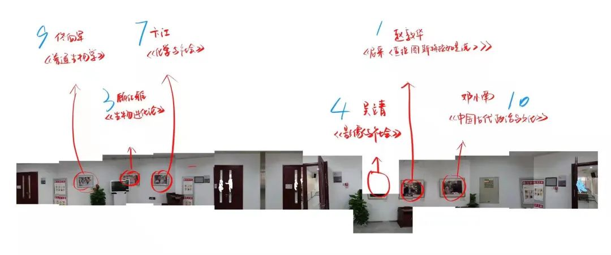

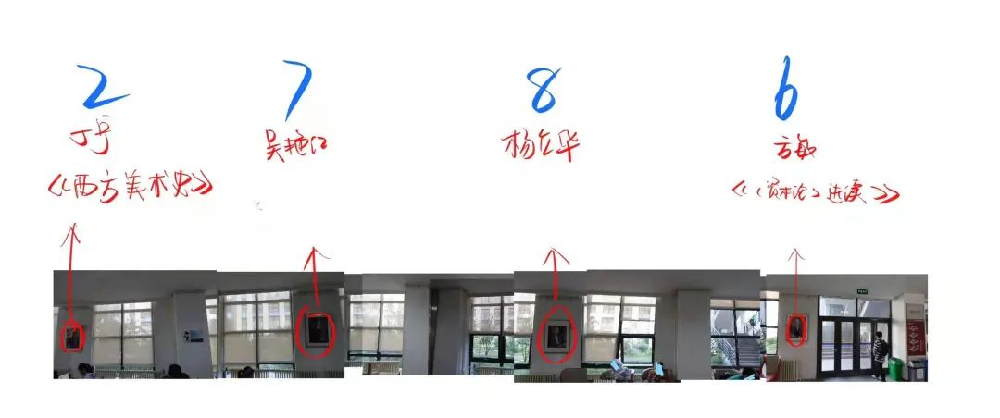

接下来的一个问题在于吴艳红和杨立华的课程信息是不全的。

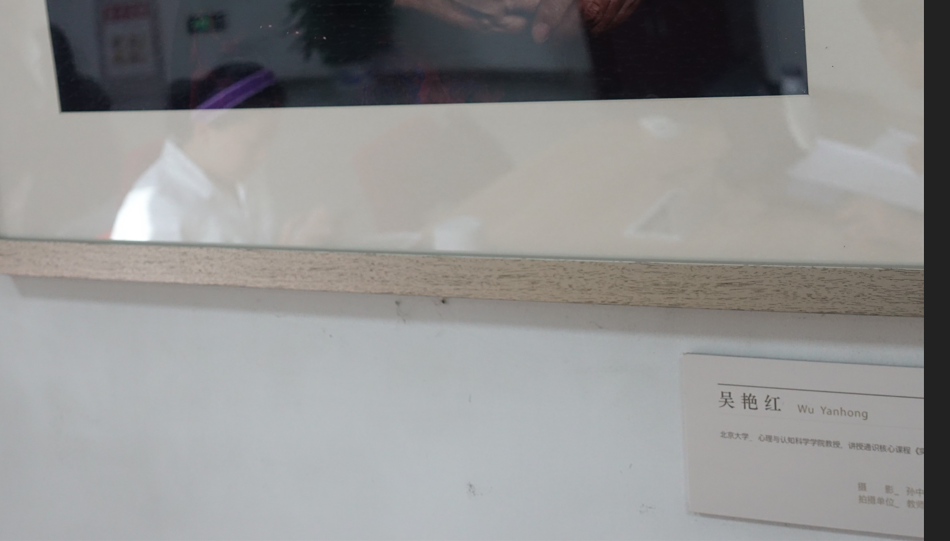

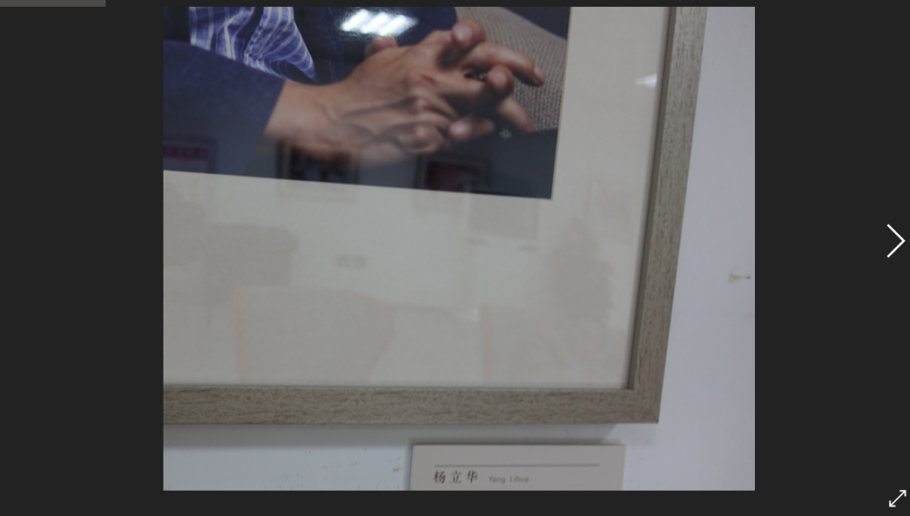

但这可以用表层题目的课程查询系统解决。记得勾选“通识核心课”。

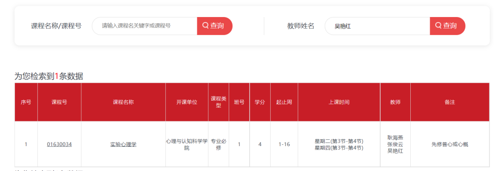

对于杨立华老师的课，在默认的21-22学年第1学期查不到，需要尝试别的学期。

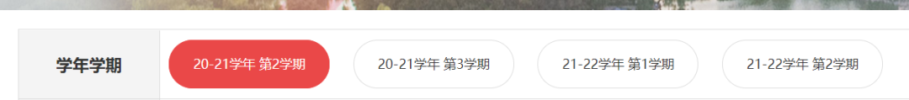

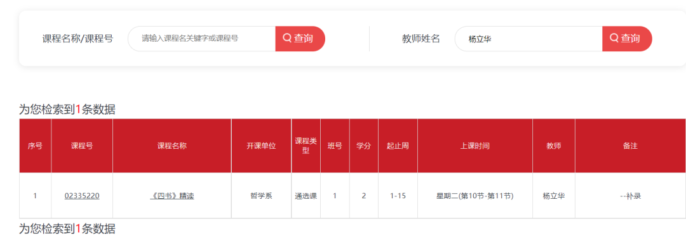

从而就能得到缺失的两门课程。下同校内组。

（可能当时出的时候真的加大了校内组保护吧Orz）
