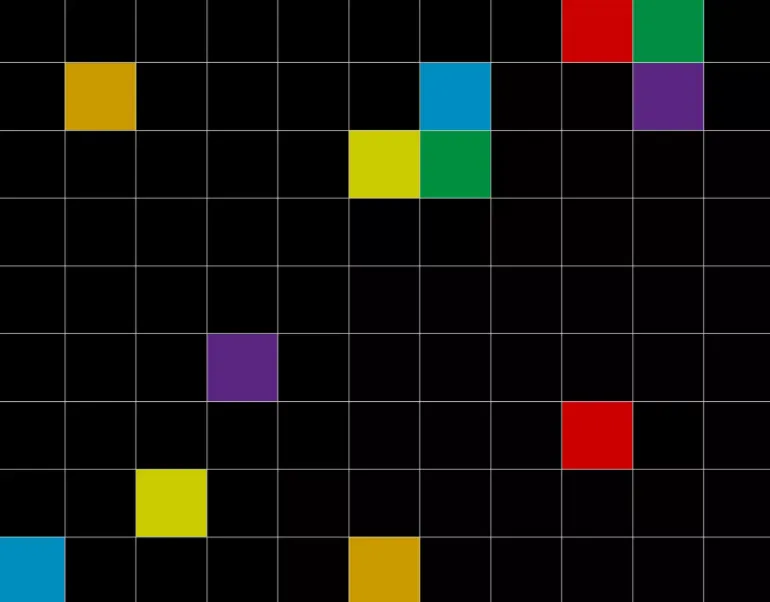
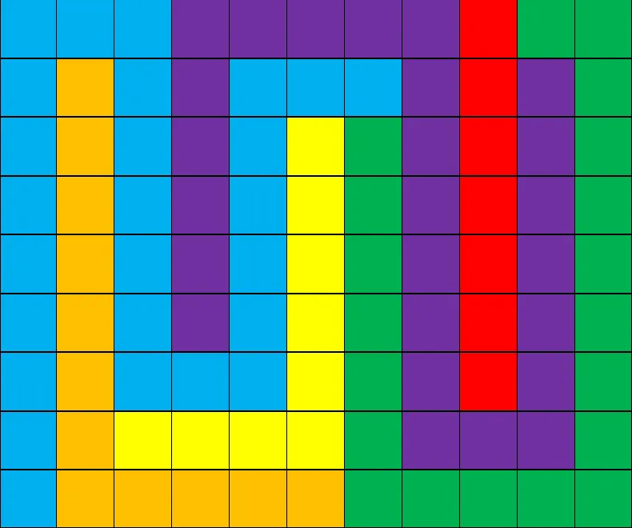

# D1

## 题面

思绪里出现中学时代的草稿本。就是会在让人昏昏欲睡的课上在上面写东西强振精神的草稿本。第一页上画有一些彩色方块，还有一些话……

 

“到头来，还是要不断重复寻找和移动，也就是说，这段旅途就是我们的家吧！”

在下面有一行批注，是你的字迹：

“——写有起点和终点的故事很多，但距离有多远那又是另一个话题了……”

在下面有一行批注，不知道是谁的字迹：

“但是正是这些故事让大家的本来黯淡的人生得以饱和呀。”

这本草稿本或许承载着你当时对未来所有绮丽的、不切实际的幻想呢。

## 答案

<AnswerBlock>GLITZY</AnswerBlock>

## 解析

如果不知道这个 logic puzzle 的规则的话，那么关键在于解读隐晦的提示：

**写有起点和终点的故事很多，但距离有多远那又是另一个话题了……**

按照相同色块不交叉连线嘛，然后提取距离作为答案。

**但是正是这些故事让大家的本来黯淡的人生得以饱和呀。**

也就是说连线的路径是要通过全部的格子的。

上述为唯一解。按彩虹色取距离数转字母得到答案【glitzy】（唯一性可以利用最优情况下的距离最小值等于99证明）
