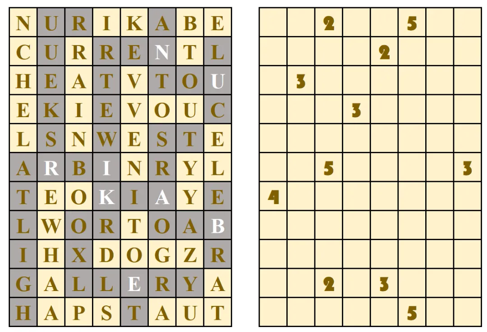
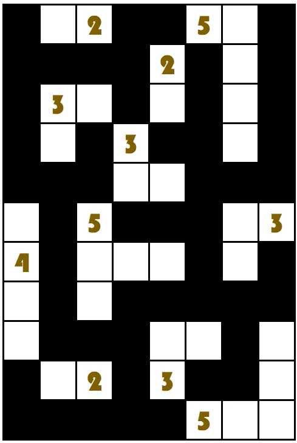
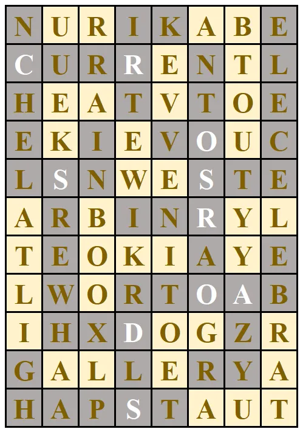

# D3

## 题面

思绪被一面诡异的墙堵住了。仿佛是见到你来了，墙上的白色字样慢慢褪色、黑色印记也逐渐消失，随后，墙上的字母化成了数字。

这面墙后面难道有什么吗？

## 答案

<AnswerBlock>CROSSROADS</AnswerBlock>

## 解析

通过左侧的第一行字/白色字母得到 nurikabe（数墙），也就是这一题的游戏规则。

答案如上。于是关键在于如何提取。左侧提取的都是三岔路口的字母，这里也是。

得到答案【crossroads】
