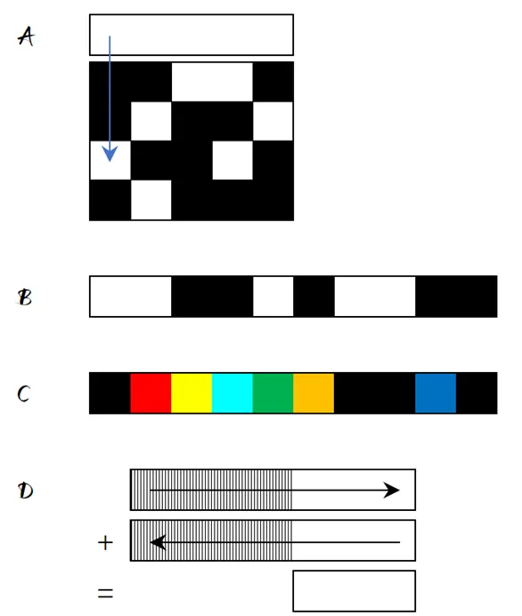
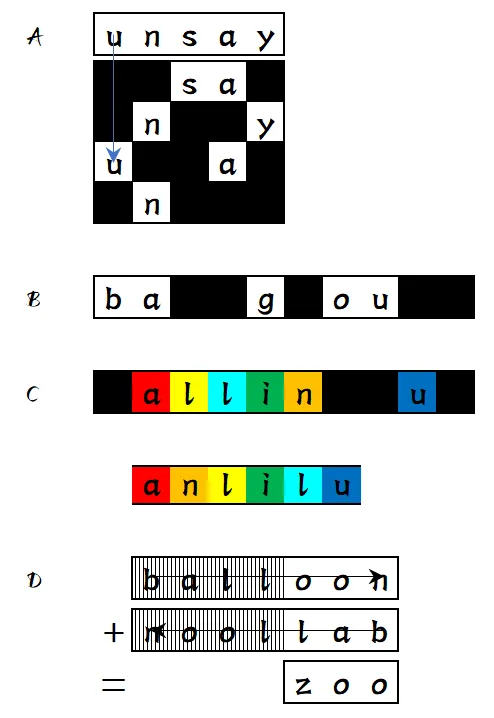
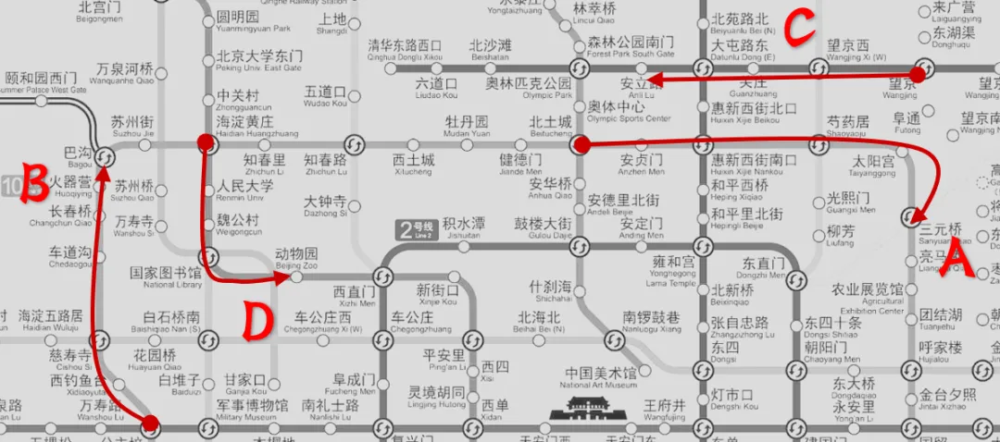

# Finalmeta

## 题面

四个要去的站点都已经去遍了，那张用于指示的便签也瞬间化为泡沫。

隐约间，你又看到那个你不认识的人站在前方。但上次遇见的时候，她说了一句话，所以你能够从声音辨别出是一位女性。你只能看得到她披着风衣的背影。

“你还记得我吗？”

良久的沉默。

“抛开故事的开始和结局，行路中途我们也会遇到各种各样的人。跟他们在一起的时间有别——有主角、有配角，却共同汇聚成了舞台上的点点滴滴。当初我们分别时，我就意识到自己不过是你生命中的一个与你相处不久的配角，而且注定会是。界限隔阂、环境差异，随即而来的就是共同话题的缺失，最后就会是我们的感情在每一次无力的搭话中被反复消磨。——我知道的……因为我之前经历过的所有的友谊都是这样。

她依旧在自顾自地说着。

“与其见证它最后被时间折磨得奄奄一息，不如我们亲自来终结它。所以我当时选择了那么做。而现在，我也达到了我预期的目的呢。

“我送给了你一个礼物，但是礼物是什么呢？——这就是我的最后一个谜题哦，而答案就藏在之前你到达终点的四段旅途之中。”

 

“如果你成功了的话，你就可以永远不再记得我的存在了，如你所愿。”

## 答案

<AnswerBlock>P&KU</AnswerBlock>

## 解析

根据剧情信息，可以知道应该先顺着主角的思路找到这四个终点地铁站。

把四个meta的答案分别填进去，A 是 sanyuan，B 是 bagou，C 是 anlilu（彩虹色），D 是 zoo
（A=0 指代维吉尼亚，不管这一点直接计算也毫无问题）。
得到四个终点站是【三元桥】【巴沟】【安立路】【动物园】。

然后在地图上把这四段路给标出来。注意到 intro-D 的线路是十号线，无法确定起终点（官方设定的三个路线有三个不同的起点终点），所以这提示着只需要考虑从第一条线出来的那段路程。

 

便签的部分分析完了，下面要分析文字部分。

“**抛开故事的开始和结局**，行路中途我们也会遇到各种各样的人。跟他们在一起的**时间有别**——有主角、有配角，却共同汇聚成了舞台上的**点点滴滴**。”

 

时间有别，而之前 introC 里也提过时间。

望京。不用多说，是个门口排队都要排很长的大站。地铁足足在这里停了九十秒，才依依不舍地离开。

东湖渠。由于在望京的相邻站，在列车停靠的半分钟里，你看见有不少人试图从这一站上车以在望京站到达前获得一个座位——不过是那是对向的地铁站台的情形。只停靠半分钟，是不是因为不是换乘站呢？

来广营。列车枯燥乏味地停了下来，如机械程式般地又僵硬地等了半分钟，宛如一成不变的器械。不过，车里的人和这辆车又有什么区别呢？你不也是日复一日地在进行着对你而言并无意义的每一天吗……

90s 和 30s，3:1 的关系，再加上“点点滴滴”，可以联想到 morse code（crosscheck）。而在这里也暗示了是用换乘车站进行 morse。同时“抛开故事的开始和结局”暗示要去掉首尾。

 

这是 finalmeta 比较卡的地方。而经过了这个之后，下一个问题在于B段有五站，超过了一般的 morse 的字符范围。但事实上，这是有对应符号的，是“&”。

得到答案【P&KU】。

## 作者的话

这次用推理小说的埋暗示的风格出了一道 puzzle，还不错。
