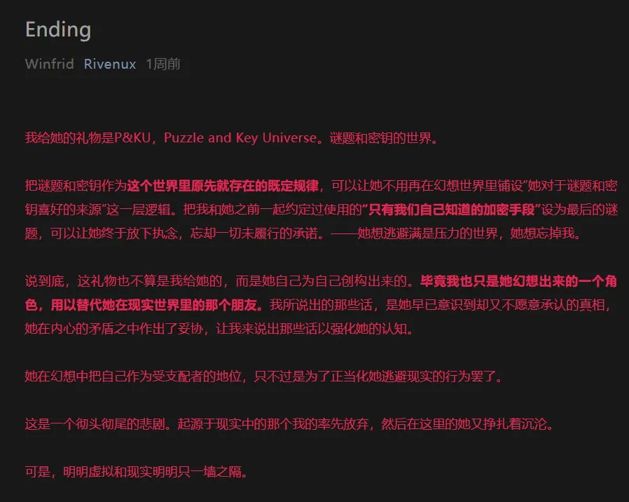
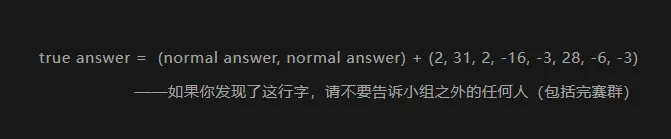

# True Ending

让我们先看一下 Ending 的结局。

最后一句话起到了晦涩的暗示——Ending 是女主选择“虚拟”，那么“现实”在哪里呢？

答案是“阅读原文”，新时代的隐写术。

（当然几乎没人是根据上面这行暗示了解的，甚至有一个是直接根据 Finalmeta 的文本蒙出来的）

 

点击“阅读原文”，跳转的文章的最下方有一行字。

## 题面

## 答案

<AnswerBlock>REMEMBER</AnswerBlock>

## 解析

true answer=(P&KUP&KU)+(2,31,2,-16,-3,28,-6,-3)

能包含“&”这个符号的表，当然是 ASCII 啦。得到答案【REMEMBER】，
这也呼应了对方提出的“如果你成功了的话，你就可以永远不再记得我的存在了，如你所愿。”

 

——你既然让我遗忘，那么我也有记得的权利。

## True Ending 剧情

    在她出现之前，我就早已知道了她的礼物是什么，毕竟我可一直还记得我们之间的那个加密手段。只是，我却不知道站在我面前的那个人就是她。

    当我终于从她冰冷的叙述中了解她的身份时，她却说：“如果你成功了的话，你就可以永远不再记得我的存在了，如你所愿。”

    把自己曾经最好的一段回忆抹掉，去投身于被虚假的快意充斥的虚幻世界，真的是我想要的吗？而你为什么一定要像这样用自我残害的方式去遏制对于情感的需求呢？

    “我解出来了，但比起你的礼物，我更需要你。”

