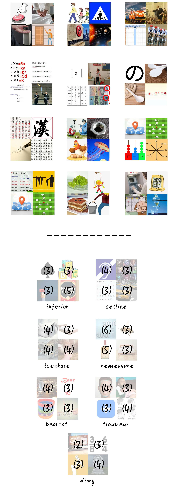
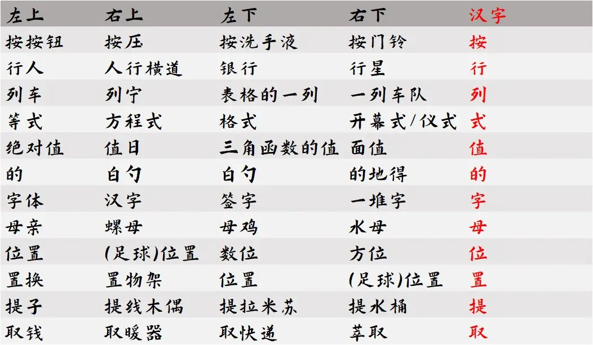
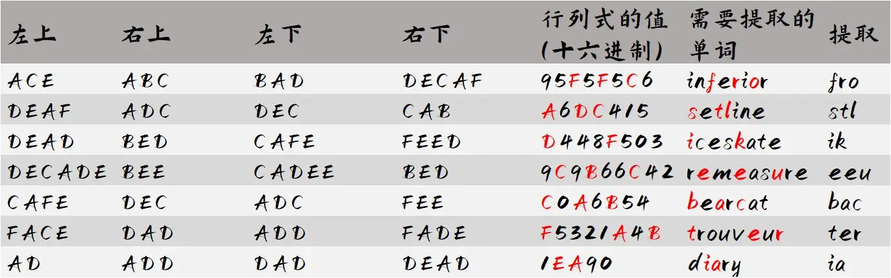

# 海克斯科技灰烬作画师

## 题面

这好像是“它”用海克斯科技作画得到的图画墙。要怎么评价它的画作呢？

## 答案

FROSTLIKE EUBACTERIA

## 解析

第一页是一个非常经典的游戏“四图猜一词”，four pictures one word，一组四张图都是对于同一个单词的描述，或者描述相关联的内容。不难看出，这里实际上是每张图都是某个字所组的词，具体如下：

“按行列式的字母位置提取”……我们需要先知道“行列式”是什么。大致猜测是在说这7个2\*2的图片矩阵。

开始寻找2\*2图片中的单词，无论如何，有一些总能比较简单地推出来，例如bed、adc、bee、abc等。它们的显著特征是只用到字母表前几个字母。联系Hex的十六进制背景，不难想到这里面每个单词都是由A-F的字母组成，因此能够作为十六进制下的数存在。因此在十六进制下，计算出这七个行列式的值。

得到答案frostlike eubacteria。

## 作者

Winfrid
