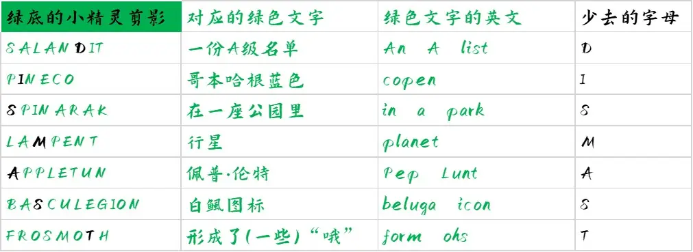

# 照片上的留白

## 题面

对着这些**已获**得的照片……我望着层层叠叠的它们，以期从其中窥见一丝真相。

## 答案

DISMAST

## 解析

下载幻灯片后，里面有七个绿色背景上的黑色剪影，明显是仿照宝可梦里的中场环节“我是谁”。而在后面，又有着七个透明背景上的绿色文字，它们是按照中文音序排序的，因此其顺序没有任何信息。

事实上，我们可以找到这些宝可梦的英文名，然后可以发现正好有一张绿色文字的英文翻译与其相比，恰好少了一个字母。具体如下：

于是可以得到答案dismast。

事实上，这种“少了一个字母”是和文本的“层层叠叠”相对应的。如果将对应的图片叠在一起，如：

这样的话，黑色部分表示的内容就是“SALANDIT”-“an A list”=D。

（从异或角度来考虑，大概就是每个字母串都可以表示成有一个有26n个仅可以取值0或1的元素构成的集合，
第1-26个元素代表这个里面有没有第一个a-z，第27-52个元素代表这个里面有没有第二个a-z，以此类推。这么两个集合之间进行异或，
得到的就是\{0,0,0,1,0,……\}，也就代表着单一的字母D。
当然，这只是说明这个意义上的“减法”也可以写成“异或”的形式，仅仅是补充说明，并不意味着解题时需要从这个角度进行思考）

## 作者

Winfrid
