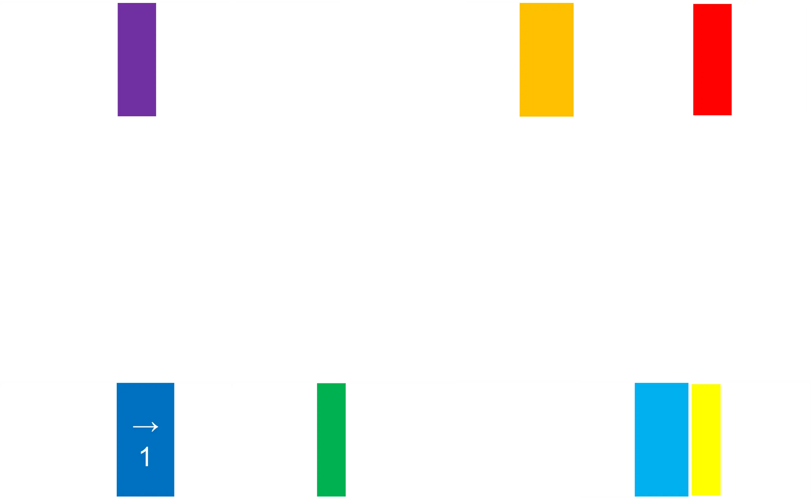

# emoji家谱

## 题面

遵循“相似性原则”，我将信笺里的八张卡片重叠在四幅画之上，稍稍**疑惑**后，我看见了它们飞入字里行间，趋之若鹜。

（也可以前往[腾讯文档](https://docs.qq.com/sheet/DVXNDYUp2dUhwUGJw?tab=BB08J2)获得题目内容）

（补丁：该题中同一片区域的emoji是相同的，例如，如果发现有多个种类的🏃‍♂️，请都视作同一种🏃‍♂️处理）

## 答案

<AnswerBlock>DIGNITY</AnswerBlock>

## 解析

“相似性原则”，以及“趋之若鹜”，都是对于“比喻”的提示。仔细审视，可以发现给出的四个正方形里的八种emoji分别可以和下面的某一种形成一个对应的成语。

而这八组分别是（按照四个正方形的顺序）：呆若木鸡、鼾声如雷、趋之若鹜、目光如豆、守口如瓶、光阴似箭、思如泉涌、白发如新。将对应的部分进行异或，得到四个象形图案——

这是一种像素画，而不难看出这四个分别是风、剪刀、月、弓，于是把对应的内容填入下方的加粗的方格内，得到“xxx风x剪刀/xxxx月x弓”

根据文本中“四幅画飞入字里行间”的提示，联系“比喻”的主题，很容易联想到这其实是两句用了比喻修辞的诗“二月春风似剪刀”和“露似真珠月似弓”。

而彩虹色部分覆盖的面积正好是对应的拼音长度（2、3、4）分之一，根据彩虹色按序提取拼音中的字母（蓝色部分的“→1”是指取s的下一位t），最终得到dignity。
