# 赛博电子艺术家

## 题面

这里是[赛博电子艺术家的主页](http://lab.maxxsoft.net/puzzle/cyberelec/)。

## 答案

<AnswerBlock>CLOUDIEST EXURBIA</AnswerBlock>

## 解析

这道题作为第二个区域的第一题，充满着浓郁的ctf风格，颇有一种“恭喜你走出新手村”的感觉。

## 一

首先点击链接进入赛博电子艺术家的主页，隔了一秒之后右边被一个巨大的黑色矩形覆盖了。与此同时，页面上的大多数的按钮都会指向[Never Gonna Give You Up](https://www.bilibili.com/video/BV1GJ411x7h7)这个标志着“你被骗了”的歌曲（赛博时代的红鲱鱼），既点明了这个网站是被黑掉的网站，也说明了这些地方点进去是没什么用的。只有“后台”是可以点击的，但进入又需要密码。

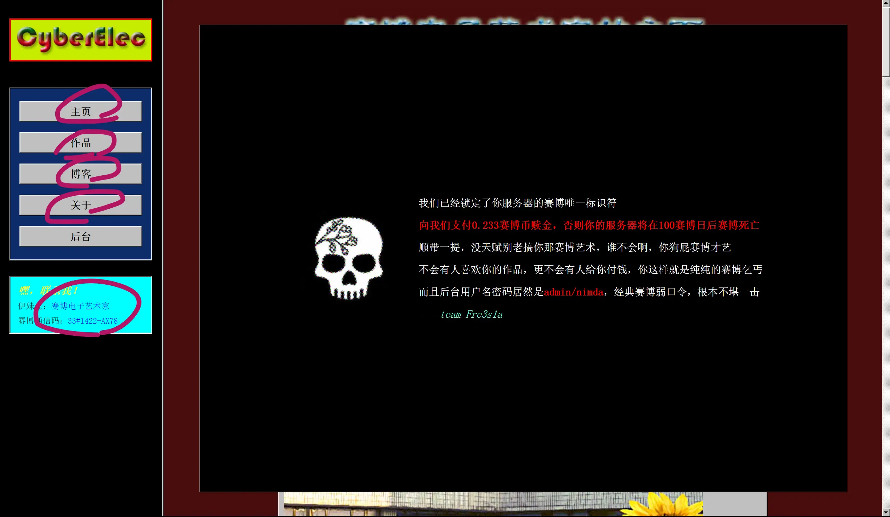

按照右边的提示输入admin和nimda，可以得到一个后台。不过里面好像还暂时没有更进一步的内容。
于是我们还是先退出来对付一下右边挡住了画面的东西。
简单地摁F12，删除/隐藏这个对应的元素就可以了。

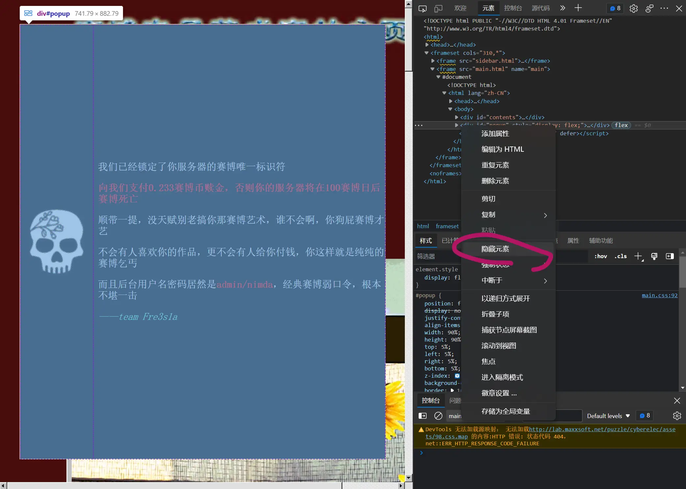

映入眼帘的是好多帖子，里面有八张有点超现实风格的图片和一个“音乐网站推荐”。音乐网站和图片可以说是没有什么关系，简直莫名其妙。
但是我们可以先注意到网页上除开八张图片之外的内容——一首藏头诗，和一个来自其他用户的评论。而藏头诗连起来是“秘密在图里”。
与此同时，藏头诗和评论都有斜体存在，而第三个斜体在最后一张照片的引言里出现：“白天和夜晚”。

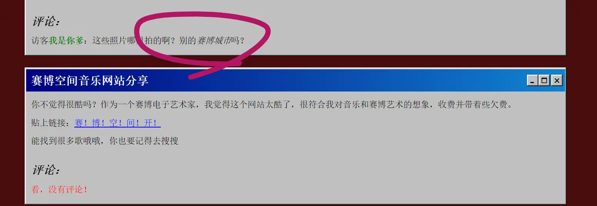

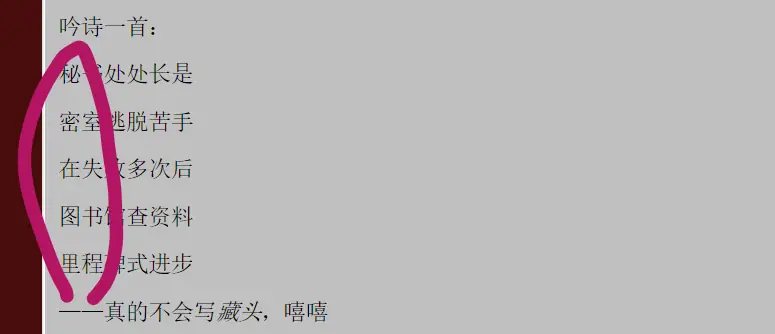

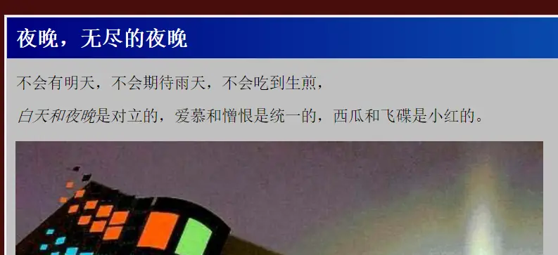

这些都引导着我们先要去看看这些照片究竟是在哪拍的，也就是找到图里的秘密。这就需要一种比较常见的找到图片GPS信息的工具：exif。
把第一张图片丢进去，可以发现很容易就能找到其GPS信息：

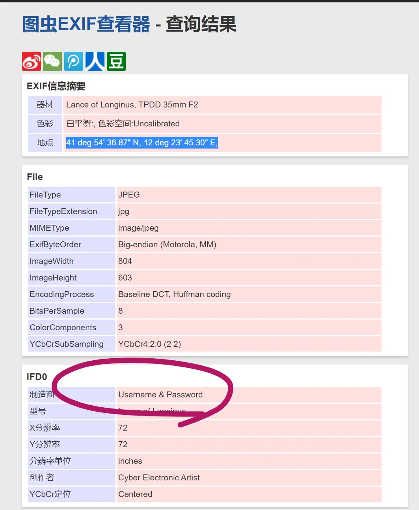

再把这个坐标喂给谷歌/度娘，注意把deg写成°，就能发现实际上这张照片是在罗马Roma拍的。

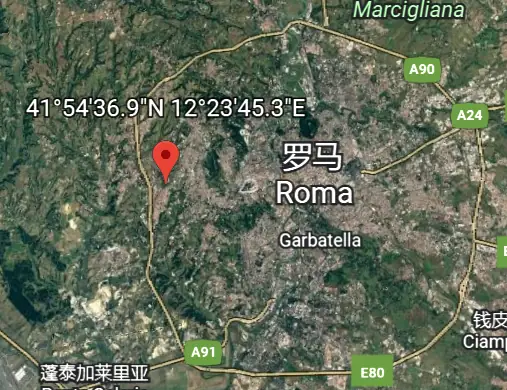

类似地，收集所有的图片信息，按照“白天和夜晚”分开，再根据“藏头”指示取首字母，就能得到Rose和Iris：

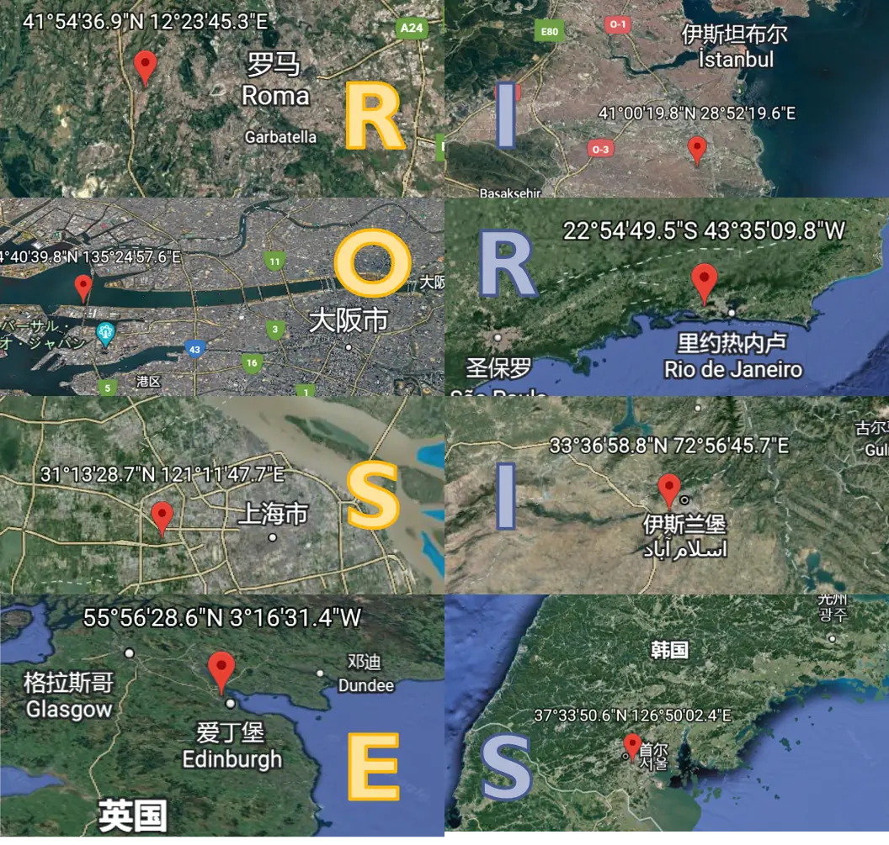

与此同时，刚刚在exif信息中，能够发现每个图片的“制造商”信息都是“Username & Password”,这也对应着“白天和黑夜”，提示我们Username填入Rose，Password填入Iris（大小写均可）。
就这样，我们能看到另一个后台。

## 二

并不意外地，后台里的所有链接全都是[Never Gonna Give You Up](https://www.bilibili.com/video/BV1GJ411x7h7)。
值得注意的是“被删除的评论”的部分，通过用假后台的emoji提取出真后台里的信息，可以得到“月亮是生物是秘密是阴谋”。

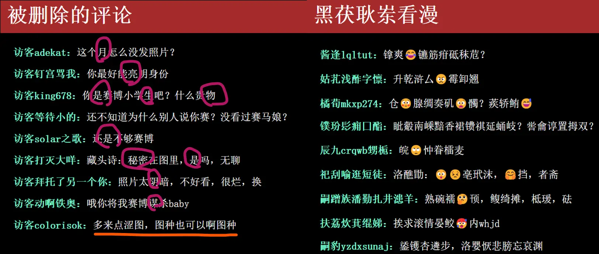

而这让我们联想到八张图里的这张图——
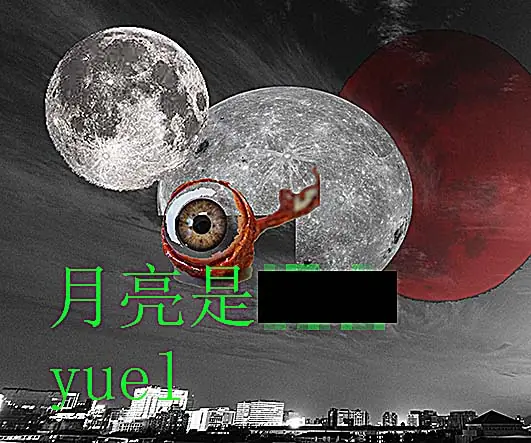

值得注意的是被删除的评论里的另一条消息“多来点涩图，图种也可以啊图种”。因此我们去看看“图种”是个什么——这是一种把rar文件藏在jpg里的东西。
总之，我们下载对应的“月亮是……”的图片，并且改扩展名为rar，解压，可以发现需要一个密码。

填入“生物秘密阴谋”，就得到了一个文本文档——一篇精彩的小说，精彩到完全看不出来其实是由彩云小梦生成的。

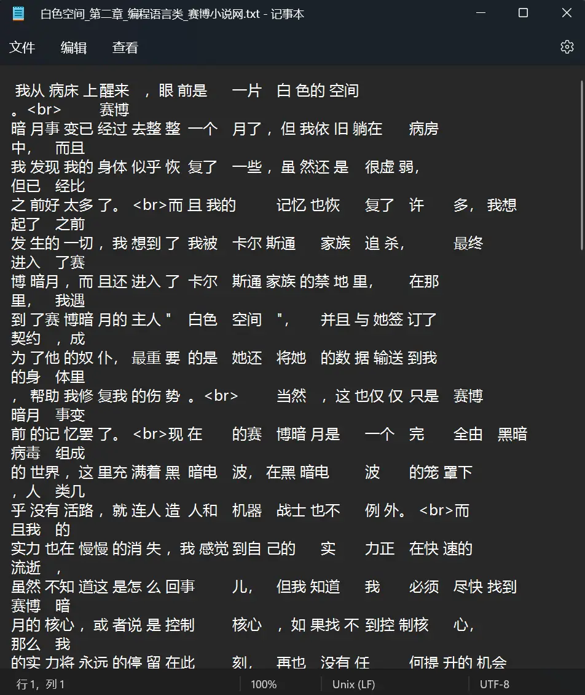

非常值得注意的是这个文本文档里奇怪的空格、tab和换行。
联系标题里的“白色空间”和“编程语言”，可以通过搜索得到一种奇怪的、只由空格、tab、换行得到的编程语言Whitespace：

搜索"whitespace decoder"，找到一个用于解密的网站。

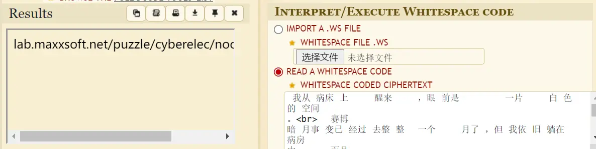

把文本文档直接丢进去，解密得到一个[网址](http://lab-maxxsoft-net-static.smartgslb.com/puzzle/cyberelec/noom_krad.mp3)。

## 三

听这首歌，不难发现这首歌简直正常得不能再正常了，就是流星P在2009年2月5日发布的由初音和巡音演唱的远古百合神曲[magnet](https://www.nicovideo.jp/watch/sm6909505?ref=search_key_video&playlist=eyJ0eXBlIjoic2VhcmNoIiwiY29udGV4dCI6eyJrZXl3b3JkIjoibWFnbmV0Iiwic29ydEtleSI6ImhvdCIsInNvcnRPcmRlciI6Im5vbmUiLCJwYWdlIjoxLCJwYWdlU2l6ZSI6MzJ9fQ&ss_pos=1&ss_id=5640228e-41c7-4e13-aacd-21ffd6434328)（b站搬运的可以[看这里](https://www.bilibili.com/video/BV1xx411c7UF&vd_source=88cf0454fc7f6f440fd8e75f180f5eb2)）——除了第30秒开始有大约五秒的杂音。

用诸如audacity等软件分析一下这段诡异的杂音的频谱：

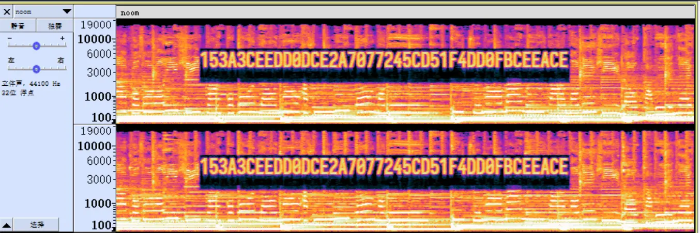

居然是40位十六进制数！联系magnet，不难想到这实际上是40位磁链。
搭好magnet:?xt=urn:btih:153A3CEEDD0DCE2A7077245CD51F4DD0FBCEEACE 这个磁链之后，丢到随便一个能下载磁链的地方，得到一首名叫Cyper Space的歌：

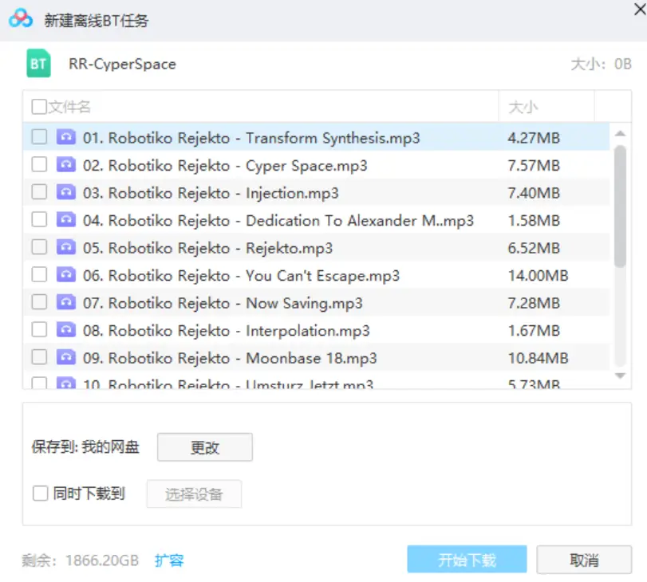

这个时候联想到迟迟不知用处的“赛博音乐网站分享”，以及那个指向qq音乐官网的“赛！博！空！间！开！”超链接（对应了cyper space），还有“能搜到很多歌哦，你也记得要去搜搜”：

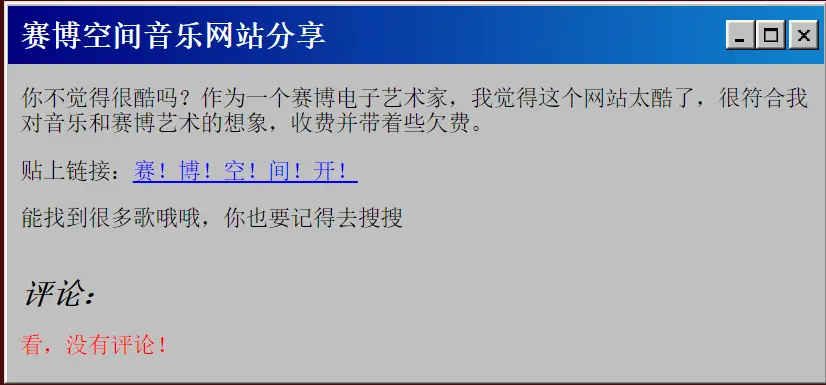

都在暗示着要去qq音乐上搜到[这首歌](https://y.qq.com/n/ryqq/songDetail/001ADyKr46L6SS)（当然，如果你找错了找到[这里](https://y.qq.com/n/ryqq/songDetail/001aHZdQ10K2fZ)，也是一样的）。
人烟稀少的评论区里漂浮着的评论是“Zit qflvtk ol esgxrotlz tbxkwoq.”和回复这条的“这种基于电脑键盘的加密方式还真是好用啊。”
于是非常简单地用qwe解密就能得到答案“The answer is cloudiest exurbia”。

## 作者

MaxXing
