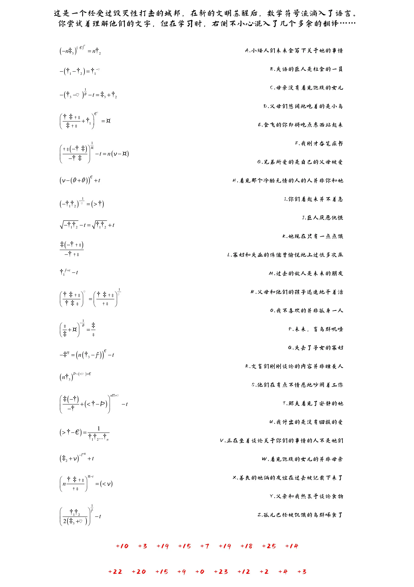
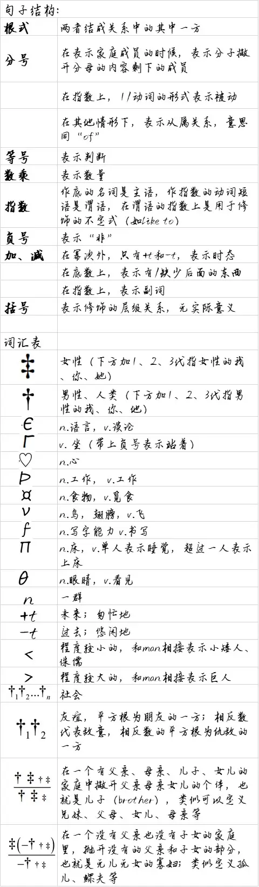
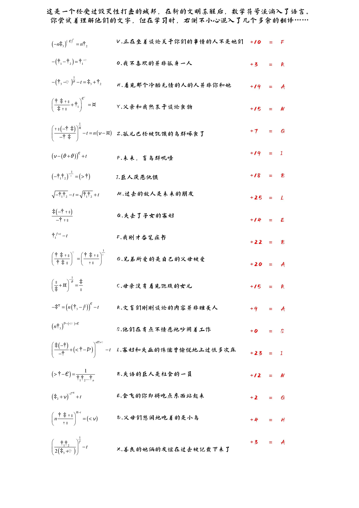

# 爱慕猫体林国斯必克儿

## 题面

找到了一份语言学习笔记。

## 答案

<AnswerBlock>FRANGIBLE BARASINGHA</AnswerBlock>

## 解析

pdf给出了19句话和他们的中文翻译，但是有多余的翻译。我们需要一一匹配得到19个字母的字符串，然后联系红色信息进行位移得到答案。

另外我们还能够发觉其中有两种字体，用非手写体书写的t、n、1、2、>表示承自数学体系，可能表达着与科学体系中常用义项相同的意思，用手写体书写的，如❤和v等，则多象形自现实生活。

除此之外，这里的“句子”都是用数学符号作为骨架的，例如+、-、分号、乘、、幂次、等号等。

通过各种途径，我们能确认以下规则：

因此，我们得到如下对应关系，再通过下方的红色数字的提示，得到位移后的结果。

答案为frangible barasingha。

顺带一提，这题是一种现实中的人造语言的魔改版本。你可以在[这里](https://tck.mn/transalg)看到对它的大致介绍。

## 作者

Winfrid
