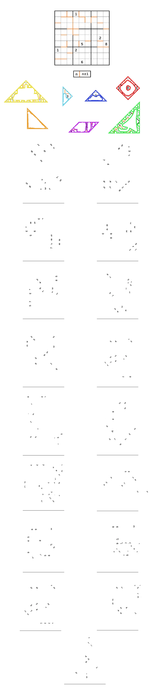

# 支离、破碎、以及落英

## 题面

我看了看这个……

总不会是有人在手工课上出了岔子，不小心把作为教学材料的东西洒落在了地上吧？真的会有这样的人吗？

## 答案

<AnswerBlock>SCOUNDREL GRABBERS</AnswerBlock>

## 解析

首先，完成这个变种数独：除了数独规则外，还有着“竖线隔开的是两个相邻的数”的规则（同时，后面的部分也是约束条件）

然后，发现这个数独实际上可以拆成七巧板。于是通过这一点，了解到每个七巧板上有什么文字内容。

最后，后面给出了很多由七巧板拼成的形状，但是每块只保留了一些信息，需要推断出每个形状是如何构成的。最后象形即可。

详细的过程见如下PDF。

一个彩蛋——题目的文案“总不会是有人在手工课上出了岔子，不小心把作为教学材料的东西洒落在了地上吧？真的会有这样的人吗？”是在neta前作Zero的[这一题](https://mp.weixin.qq.com/s?__biz=Mzg2NjY2NTE0Mg==&mid=2247483718&idx=1&sn=f567d6d84acfb094820a1274eb040773&chksm=ce46169ff9319f8942d49886f2fddc6ffb1057dace3f6c6b6998853fdc0f2ac35bf606a29ff5&scene=20&xtrack=1&key=12703ed085009c6f4082ca206bdedf2a8de26b4ad7f5c5af0c77d381e9f718739609208fc1bce108f1eee7b4998fdd526877c5ae75c92ac81eaaf8cf0b891ac70a58137cd3945feadd7eb93dcfb219d526dd5c575a710630163a3ef28acbf0b7dcea562fe59e300689389efc24813b13bf6fa8caf848cd66686c18c3b9cfd2da&ascene=1&uin=Mjc0MjI3NDAzMg%3D%3D&devicetype=Windows+10+x64&version=6300002f&lang=zh_CN&exportkey=A29Wnrc7yolGZnmg3ZoCLgg%3D&acctmode=0&pass_ticket=2QZ%2Bmouu2eG8mPkTh3YioM9BH%2FGeRmUjawd7g8qIFhGUWCBb8MiqHi%2BGGAvXi8M7&wx_header=0)。

## 作者

ShawnShe
