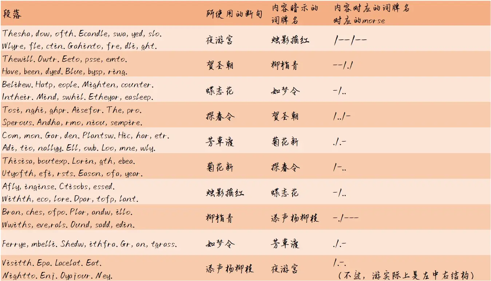

# 繁华唱遍

## 题面

“路再远再蜿蜒仍是个圈，怕泪点不争气飞成雨线……”

清脆的女声响起。我试图寻找声音的源头。

## 答案

<AnswerBlock>ENORMOUS RADIO</AnswerBlock>

## 解析

首先，由《繁华唱遍》的歌词“擎了这一枝花招来离亭燕，我此生不肯解连环”，或者通过解题途中可知，与词牌名/曲牌名有关——

每段话去掉逗号句号重新断句之后都是一段有意义的英文，并且是在诠释一种词牌名的名字（字数和对应图片的空格数相等）。与此同时，每段话的断句方式也符合一种词牌名的正体。巧合的是，断句方式的十种词牌名的集合正好就是这十段话内容对应的词牌名的集合。

根据“点”和“线”的图案，可以知道每个词牌名都可以转换成点和线，同时，是按上下/左右结构划分。

然后根据“路再远再蜿蜒仍是个圈”可知，需要将这十二个morse根据内容词牌名与结构词牌名的对应关系拼接成一个大循环，而并非按照原有的顺序排列（其实原顺序就是字母表顺序，是没有信息的）。不过，有两种拼接方式。一种是“…夜游宫→烛影摇红→蝶恋花→如梦令→芳草渡→…”（上一个的断句是下一个的内容），一种是“…蝶恋花→烛影摇红→夜游宫→添声杨柳枝→…”（上一个的内容是下一个的断句）。但是后者会出现一个会出现一段morse中有5个字符的情况发生，因此采用前者。

能够得到首尾拼接的“/.-./--/---/..-/.../.-./.-/-../../---/./-./---”转字母（当然也可以倒着转，但是得不出有意义的内容），得到首尾拼接的“rmousradioeno”，因为是循环，所以调整初始点得到enormous radio.

## 作者

Winfrid
