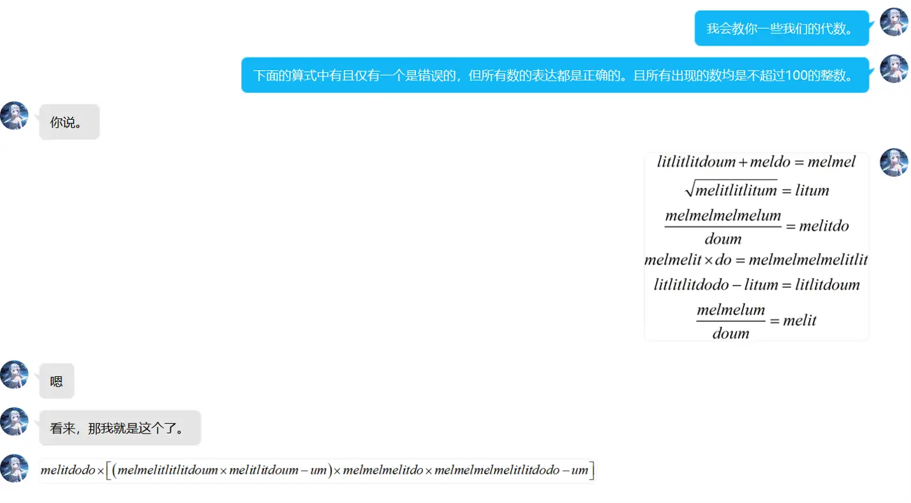
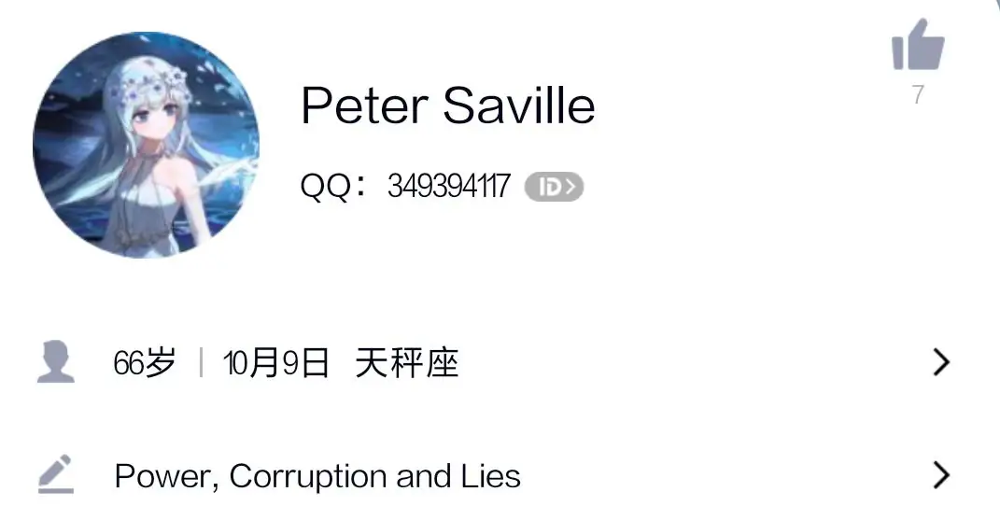
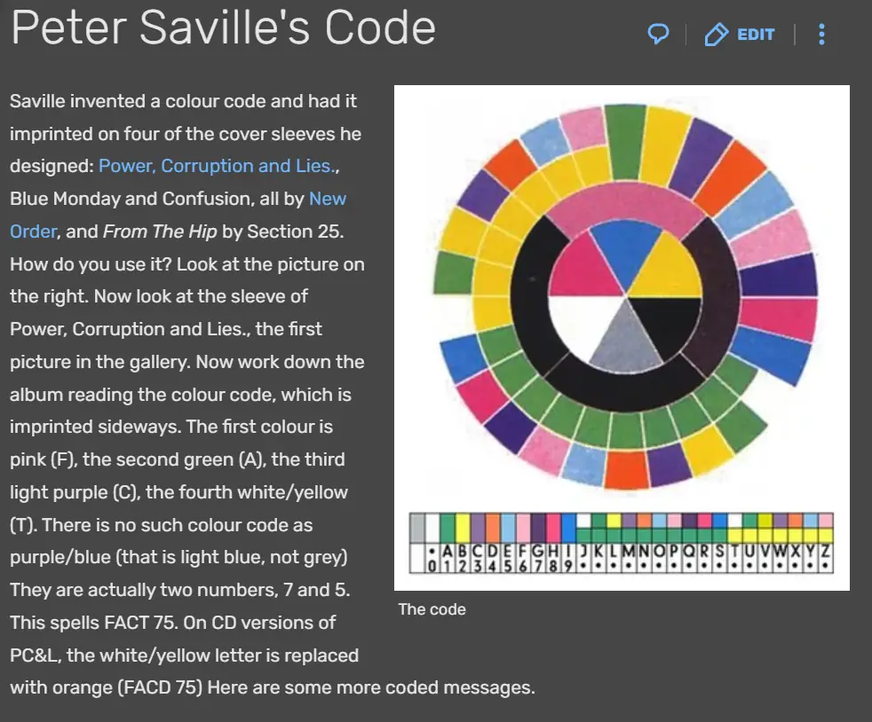

# 自导自演

## 题面

QQ的聊天记录里也会有玄机吗？

## 答案

<AnswerBlock>SWINGING HEART</AnswerBlock>

## 解析

这种语言表示数的规则为：um=1, do=2, lit=5, mel=20，大的写在左侧，小的写在右侧，然后把所有数加起来。例如melmeldoum就是20+20+2+1=43。除此之外，会省略mel和lit之间的l.错误的式子是最后一个。

于是能算出结果是349394117，注意到对话是在qq进行的，因此用qq号搜索，能找到一个名为Peter Saville的人。

通过这里的个性签名Power, Corruption and Lies和昵称Peter Saville，可以发现这个设计师在前者这张专辑上设计了一种密码。

非常有趣，但是问题在于：我们还没找到我们的密文在哪里。——实际上，是在头像的全图中。点进头像观察其全图，可以发现在其角落有一些色块。

解码得到swinging heart.

## 作者

Winfrid
